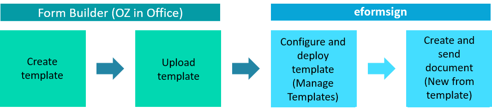
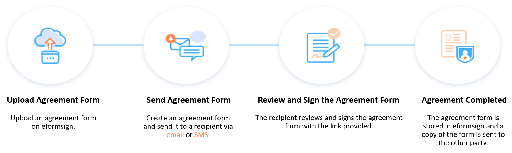

Introduction to eformsign
=============================

Overview

eformsign is an electronic document solution that allows anyone to
easily create electronic documents from paper documents and utilize
various data stored in electronic documents. You can easily create
electronic documents by uploading your files onto eformsign and
converting the files to electronic forms via eformsign's Web Form
Designer feature. You can also use eformsign's Microsoft Office add-in
to create electronic forms from documents created using Microsoft Office
programs including Word, Excel, and PowerPoint.

eformsign allows you to create a workflow for each template according to
your company's business process. You can flexibly set a document signing
process for internal documents requiring approvals as well as for
external documents such as contracts, agreements, and applications.
Furthermore, detailed configurations such as notifications and required
input fields can be set for each workflow step or recipient, and the
progress status of documents is logged as history. Moreover, an audit
trail certificate is provided for the prevention of document forgery and
falsification.

eformsign also provides a bulk send feature, by which users can create
and send multiple documents at once and can minimize repetitive input
with the auto-fill feature. Also, by adding and configuring custom
fields, fields in documents such as company information, group and
member information, recent input value, and date can be automatically
filled in. Furthermore, eformsign allows users to easily manage
companies' members and their permissions, configure detailed
notification settings for documents, and manage and utilize data
entered in documents by extracting input data.

The eformsign solution also provides an electronic signature feature which
allows you to sign e-signatures on electronic documents.

An electronic signature is a signature in electronic form that replaces the
traditional wet-ink signature. Just as when signing a signature on
paper, you need to prove that the signer is you and this is done by
going through an identity verification step. Personal information such
as email, social security number, password, phone number, certificate,
etc. can be used to verify identity.

Electronic signatures have become legally binding in phases in the vast majority of countries around the world. eformsign's e-signature is legally-binding for individual-to-individual and corporation-to-individual contracts. As well, it provides various additional features for non-repudiation.

.. note::

   The following describes the legal effect of electronic signatures signatures of
   some regions.

   -  USA: Through the Uniform Electronic Transactions Act (UETA) enacted in 1999 and the Electronic Signature in Global and National Commerce Act (ESIGN) enacted in 2000, electronic signatures that meet specific requirements are recognized to have the same legal effect as wet signatures. There are four main requirements that must be met in order for an electronic signature to be legally binding: the intention of signing (signer certification), the intention and consent, the record of the signing process, and the preservation of the signature. Currently, 48 states in the United States have adopted electronic signature acts, and as a result, electronic signatures are recognized as having the same legal effect as handwritten signatures in almost all transactions.

   -  EU: In accordance with eIDAS (Electronic Identification and Trust Services) regulations, all types of electronic signatures are recognized as legally effective and binding. They are categorized into Qualified Electronic Signatures (QES), Advanced Electronic Signatures (AdES), and general Electronic signatures, and their legal status is applied accordingly, corresponding to the characteristics of each type of document.

   -  Korea: According to the Digital Signature Act, the legality of an electronic document or signature is not denied because it is in an electronic format. As well, the monopolistic status of the certificate authority has been abolished and the same legal effect is given to a variety of commercial electronic signature services. In addition, the monopoly status of accredited certificates has been abolished and the same legal effect is given to a variety of private digital signature services.

   -  Japan: The legal effect of electronic signatures is recognized in accordance with laws on electronic signature and certification services.

[Disclaimer]
Information related to the legal effect of electronic contracts and electronic signatures provided by eformsign is for general information purposes only. All information is used at your own risk and is not a substitute for professional legal advice. For legal advice and defense, please consult a qualified attorney in your area. Since eformsign cannot guarantee that all legal information of electronic contracts by country/region/technology provided by eformsign is up-to-date or accurate, eformsign makes no warranty, express or implied, as to the completeness of the legal information.

Basic Terms
---------------

The following are some basic terms you should be familiar with before
using eformsign.

-  **Web Form Designer**

   Web form designer is a tool for quickly and easily
   creating electronic forms by uploading existing document files onto
   eformsign. You can create templates by adding components such as
   signature, text box, and check box to documents such as agreements,
   applications, and contracts. You can then create
   documents from templates and send them to recipients to be reviewed
   and signed.

-  **Form Builder**

   Form builder is a tool used to create electronic forms
   by converting Microsoft Office files such as applications, contracts,
   and agreements into electronic forms that contain components such as
   signature and text box. Form builder also uploads the converted
   electronic forms onto eformsign. Form builder is an Microsoft Office
   add-in, and it is shown as a ribbon menu which is called **OZ in Office**.

-  **Dashboard**

   This is the main screen shown when logging into eformsign.
   You can access the sidebar menu by clicking the menu icon(|image1|)
   on the left side of the screen. Each menu may appear differently
   depending on the permissions you have. (The Company administrator can
   access all the menus.)

   .. figure:: resources/dashboard.png
      :alt: eformsign Dashboard Screen
      :width: 700px

-  **Templates**

   Templates This is an electronic form that serves as a starting point
   for a new document. With a template, you can create many documents
   from it. You can create templates by converting existing Microsoft
   Office files using Form builder or by uploading files directly
   onto eformsign.

-  **Document**

   A document can be an electronic document you create and send
   for a signature by using a template or an electronic document you
   create and send by uploading your file. A document can be created and sent
   for a signature by using either one of the **New from my file** menu or
   the **New from template** menu. Any document created like this counts
   as a document created in eformsign.

-  This is a cloud space for storing and viewing documents. It consists of the following three menus according to the
   document status:

   -  **Action required:** Shows the list of documents
      that you need to sign, approve, or send.

   -  **In progress:** Shows the list of documents you have
      created or processed but are incomplete.

   -  **Completed:** Shows the list of all the completed
      documents you have created or participated in.

   -  **Bulk send:** Shows the list of all the document you have sent in bulk.

-  **Drafts**

   Shows the list of documents saved as draft when creating a
   document by accessing the **New from my file** menu.

-  **Workflow**

   A workflow refers to the entire document process from when a
   document is created to when it is completed. Template managers can
   create the workflow steps for each template. All workflows have two
   default steps, **Start – Complete**, and can add
   three more types of steps as shown below:

   -  **Participant:** The step for requesting a person to fill out and sign a document.

   -  **Reviewer:** The step for requesting a person to review a document. A reviewer cannot fill in fields and can only approve or reject documents.

   .. figure:: resources/workflow_new.png
      :alt: Workflow Steps
      :width: 400px

-  **Company Administrator**

   The representative of a company and has full permission to use eformsign.

-  **Company manager**

   Members with company management permission can access company
   management menus, and can manage the company, groups, and members.

-  **Template manager**

   With this permission, a member can access the **Manage templates**
   menu and can manage templates. Managing templates includes creating,
   deploying, editing, and deleting eformsign templates.

-  **Document creator**

   With this permission, a member can can create documents from a template. You can grant this permission for each template. When the permission for a template is granted to a member, the member can create documents from that template in the New from template page.

-  **Template editor**

   With this permission, a member who is a template editor of a template can edit the template. You can grant this permission for each template.

-  **Document manager**

   With this permission, a member can access the **Manage documents**
   menu to view the documents created from each template, approve
   documents requested to be voided, or permanently remove documents
   from the system. Note that the document management permission can be
   set for each separate template.

eformsign Usage Flow
------------------------

To use eformsign, you can either upload a file onto eformsign and
create an electronic form online, or create a form using Microsoft Word,
Excel, or PowerPoint and then upload it to eformsign.

New from my file
~~~~~~~~~~~~~~~~~~~~

You can upload a file onto eformsign and then
create and send a document by adding components such as text, signature,
and date. You can easily and freely send a document by uploading a file,
without the need to create a template. Just simply add the participants who can fill in the document and add components to the uploaded document in the **Design form** step, set the workflow in the **Add recipients** step, set options in the **Options step**, and then press the **Start Now** button to send.

Also, before sending a document to recipients, you can temporarily save
it as a draft and then send it later.

.. figure:: resources/use_flow_web.png
   :alt: Usage Flow of eformsign using New from my file
   :width: 700px

Create from template
~~~~~~~~~~~~~~~~~~~~~~~

There are two ways to create a document from a template: uploading a
file on eformsign and creating a template using Web Form Designer, and
creating a template using Microsoft Office using Form Builder and
uploading it on eformsign.

1. **Using Web Form Designer**

   You can create a template by uploading a document
   file (PDF, Word, Excel, PowerPoint, or image files) on eformsign and then adding the participants who can fill in the document and adding components to the uploaded document in the **Design form** step. Then, configure settings including General, Set permissions, Workflow, Field, and Notification settings in the **Configure step**. Then, you can save and deploy the template for use. Finally, you can go to **New from template**, select a template you want to create a document from, and then send the document to recipients.

   .. figure:: resources/use_flow.png
      :alt: Usage Flow of eformsign Using Web Form Designer
      :width: 700px

2. **Using Form Builder**

   You can create a template by creating or opening a
   document file in Microsoft Office (Word, Excel, and PowerPoint), and
   then using the ribbon menu (named OZ in Office) to add the components
   you want such as text, signature, and date onto the document. Then,
   you can upload the template you created onto eformsign by clicking
   the Upload button in the ribbon menu.

   After uploading the template, set General, Set permissions, Workflow, Field, and Notification settings, and then save and deploy the template.

   You can then go to **New from template** to create a document from a
   deployed template and send it to recipients.

Minimum System Requirements
--------------------------------

The minimum system requirements for Form builder and eformsign are as
follows:

-  **Form builder (OZ in Office)**

   -  **OS:** Windows 7 and later

   -  **MS Office:** Microsoft Office 2010 and later

-  **eformsign and Web form designer**

   -  **OS:** Windows 7 and later, OS X Mavericks and later

   -  **Browser:** Internet Explorer 11 and later, Chrome 49 and later,
      Safari 9 and later

   -  **Mobile OS:** iOS: 6.1.6 and later, Android: 5.0 (Lollipop) and
      later

   .. note::

      Installing the mobile eformsign app is not a mandatory requirement
      to use eformsign.

Use Cases
------------

eformsign can be used for many different cases, including creating
contract, agreement, and application forms. All documents are encrypted
(AES-256 method) and stored in the PDF/A format, which is the
international standard for long-term storage of documents.

Contract Forms
~~~~~~~~~~~~~~~~

Electronic documents can be used to sign various types of contracts
including employment contracts, purchase/rental contracts, maintenance
contracts, and franchising contracts. By using eformsign, you can record
the history of contract processes, prevent the forgery of documents
through audit trail certificates, and sign hundreds of contracts without
meeting face-to-face with customers or contracting parties.

The e-contract process using eformsign is as follows:

.. figure:: resources/contract_ex1.png
   :alt: E-Contract Process
   :width: 700px

Agreement Forms
~~~~~~~~~~~~~~~~~~

Electronic documents can be used to sign various types of agreements
including privacy policy and consent forms, medical informed consent
forms, parental consent forms, and sublease agreement forms. You can use
various types of devices including smartphones, tablets, and computers
to create and send thousands of agreement forms to recipients at once.

The e-agreement process using eformsign is as follows:

Application Forms
~~~~~~~~~~~~~~~~~~~~

Electronic documents can be used to sign various types of applications
including application forms for registrations, quotations, medical
treatments, and purchases. eformsign's workflow feature allows you to
easily send application forms even when an application needs to go
through multiple departments in an organization as well as forwarding
the document to the correct department. You can also send the copy of a
completed document to the parties involved immediately after the
document is completed.

The e-application process using eformsign is as follows:

.. figure:: resources/application_ex1.png
   :alt: E-Application Process
   :width: 700px

.. |image1| image:: resources/menu_icon.png
