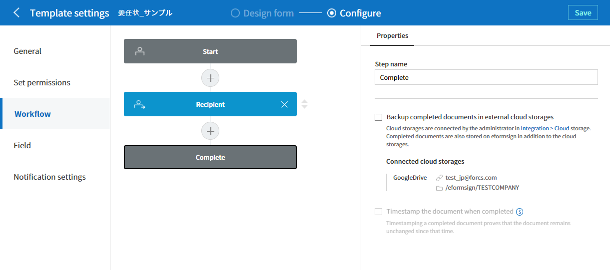
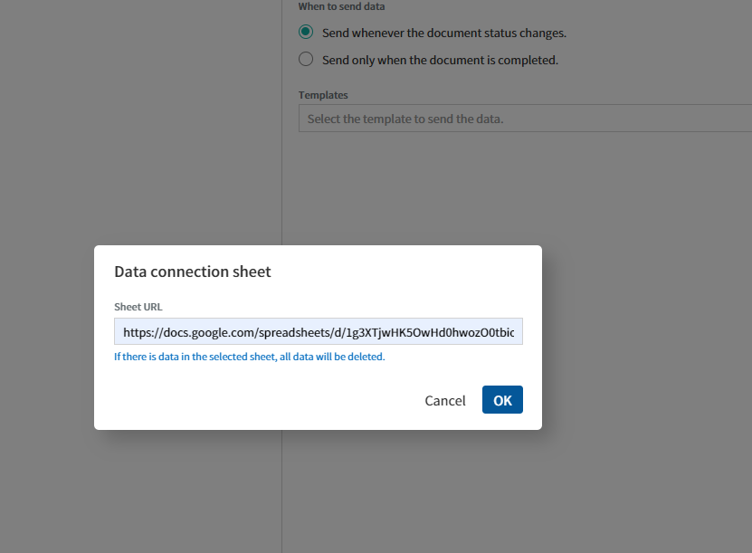

Connecting with External Services
=====================================

How to Connect with External Cloud Storages
---------------------------------------------

eformsign can automatically save completed documents in external cloud storage services. Currently, Dropbox, Google Drive, OneDrive, and box are supported.

.. note::

   Only the company administrator can connect eformsign with external cloud storages.

1. Go to the **Integration > Cloud storage** menu.

.. figure:: resources/connect_1.png
   :alt: Cloud Storage Screen
   :width: 750px

2. Select the cloud storage where you want to save completed documents, and then click the **Connect** button to log in.

3. After logging in, the **Disconnect** button and the **Storage path settings** button will be displayed. If you need to save the storage path, click the **Storage path settings** button.

.. figure:: resources/connect_2.png
   :alt: Connecting and Disconnecting File Storage Accounts
   :width: 750px

4. Go to the **Manage templates** menu.

5. Click the template you want to save the documents (created from the template) to the cloud storages, and then go to the **Template settings** screen.

6. Go to the **Workflow** menu.

7. In the **Properties** tab of the **Complete** step, tick the **Backup completed documents in external cloud storages** checkbox. You can check whether the cloud storages set in the **Cloud storage** menu are connected. When a document is completed, it will be automatically saved in the connected cloud storage as well as in eformsign.

.. figure:: resources/connect_5.png
   :alt: The Backup Completed Documents in External Cloud Storages
   Checkbox
   :width: 750px

Analytics and Reporting
--------------------------

If you find it cumbersome and repetitive to download a CSV file every time a new document is added, using this feature is recommended. You can set the entered data to be automatically saved in a sheet in Google Sheets and Excel of Microsoft Office 365.

.. note::

   **Analytics and reporting** can be set only by the company administrator.

.. figure:: resources/analytic_1.png
   :alt: Analytics and Reporting Menu Screen
   :width: 750px

1. Go to the **Integration > Analytics and reporting** menu.

2. Select either Google Sheets or Microsoft Office 365, and then click the **Connect account** button to log in.

.. figure:: resources/analytic_2.png
   :alt: Analytics and Reporting Menu Screen
   :width: 750px

3. Click the **Manage data connections** button.

.. figure:: resources/analytic_3.png
   :alt: Manage Data Connections Screen
   :width: 750px

4. Click the **Add data connection** button in the center of the screen or at the top right corner of the screen.

.. figure:: resources/analytic_4.png
   :alt: Manage Data Connections Screen
   :width: 750px

5. Set items such as the Connection name, Data connection sheet, When to send data, and Templates, and then click the **Save** button.

.. note::

   A data connection sheet corresponds to the URL of a sheet in Google Sheets.

6. Data connection sheets are displayed in the **Manage data connections** screen.

.. figure:: resources/analytic_7.png
   :alt: Manage Data Connections Screen
   :width: 750px

7. If you select a connected sheet, you can see the columns in which field data will be automatically imported from eformsign.

