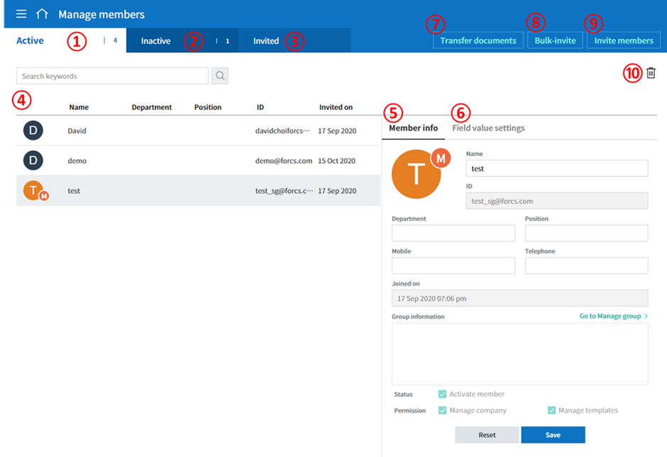

Basic Info
=============

Dashboard
------------

Menu
~~~~~~~

After logging into the eformsign dashboard, click the menu
icon (|image1|) at the top left corner of the screen. The sidebar menu
will be displayed as shown below.

.. note::

   Each menu may appear differently depending on the permissions you
   have. The company administrator can access all the menus and have all
   the permissions.

The description of each menu is as follows:

-  **New document:** Shows the menus in which you can
   create a document by uploading a file from your computer or selecting
   a template uploaded to eformsign.

   -  **New from my file:** You create a document even when there is no
      template. Simply upload a file (pdf, doc, docx, xls, xlsx, ppt, pptx, odt, jpg, png, gif, and tiff) from your computer and then
      upload it to eformsign. Then, add components onto the document and
      send it to recipients for signature.

   -  **New from template:** Views the list of templates in which you
      can create documents from. You can select a template and then
      create a document.

-  **Drafts**: Shows the list of documents saved as draft when creating
   a document by accessing the **New from my file** menu.

-  **Documents:** Shows the menus in which documents are stored.

   -  **Action required:** Shows the list of documents
      that you need to sign, approve, or send.

   -  **In progress:** Shows the list of documents you have
      created or processed but are incomplete.

   -  **Completed:** Shows the list of all the completed
      documents you have created or participated in.

   -  **Bulk send:** Shows the list of all the document you have sent in bulk.

-  **Manage documents:** Only document managers can
   access this menu. Document managers can view all documents created
   from a template that they have permission to access.The company
   administrator can view and manage all documents.

-  **My signature:** You can create and register your
   signature to be used when signing a document.

-  **Manage templates:** Only template managers can
   access this menu. You can view the template list and configure the
   template settings.

-  **Manage company:** Only company managers can access
   this menu. You can view and edit company information.

   -  **Company profile:** You can view and edit company
      information

   -  **Manage groups:** You can create groups or edit
      group information.

   -  **Manage members:** You can invite members or edit
      member information.

   -  **Manage company stamp** You can grant stamp use permissions and view stamp use history, as well as adding and managing company stamps.

   -  **Signature settings:** Select the signature types that can be
      used when signing directly on documents.

   -  **Notification template management:** You can view and edit email and SMS notification
      templates.

   -  **Manage custom fields:** You can add and
      configure custom fields such as company, group, and member
      information.

-  **Integration:** Only the company administrator can
   access this menu.You can connect eformsign with external services.

   -  **Cloud storage:** You can connect your Dropbox,
      Google Drive, or Box accounts to store completed documents in
      external cloud storages.

   -  **Analytics & reporting:** You can connect
      sheets in Google Sheets or Microsoft Office 365's Excel with
      eformsign to store the data entered in eformsign documents to the
      sheets.

   -  **API / Webhook:** You can create, edit, or delete API
      and webhook keys to use the eformsign API.

-  **Billing:** You can view your plan and payment history, change your
   plan, or change the payment method.

   -  **Change plan:** You can change the plan you are using.

   -  **Real-time billing:** You can view your usage and billing status
      in real-time.

   -  **Payment method settings:** You can add the credit card
      information for payment.

-  **Usage status:** You can monitor weekly, monthly, and annual service
   usage status.

-  **Download eformsign Form Builder:** You can download the Form Builder executable file. By using the Form Builder
   add-in feature, you can create electronic forms using Microsoft Office files.

Dashboard
~~~~~~~~~~~

The dashboard is the main page displayed when logging into eformsign. In the dashboard, you can view documents that are in progress, require your action, etc., and use shortcuts to go to the main menus including **New document**.

.. figure:: resources/en-dashboard-main.png
   :alt: eformsign Dashboard Screen
   :width: 800px

**① New from template**
   Displays the **New from template** page where you can create new documents from saved templates.

**② New from my file**
   Displays the **New from my file** page where you can create new documents by upload your files from your computer.

**⑧ Favorites**
   Displays the templates you added as your Favorites. If you click a template in the Favorites list, you can go to the page where you can create a new document using that template. You can add a template to your Favorites by clicking the Add icon (|image2|). You can delete a template from the Favorites list by clicking the Edit icon (|image3|).

.. tip::

   **Adding templates to Favorites!**

   You can add a template you use frequently to the Favorites list to create documents easily using that template. You can add your favorite ones on the dashboard.

   1. Click the Add icon (|image4|) in the Favorites list on the dashboard.

   2. The list of templates that are not added to your Favorites will be displayed in the pop-up window.

   3. Tick the checkboxes of the templates you want to add to the Favorites.

      |image5|

   4. The templates will be added to the Favorites.

**④ Action required**
   Shows the number of documents you received from members or non-members that you need to sign, approve, or send. When it clicked the **Action required** is displayed.

**⑤ In progress**
   Shows the number of documents that are in progress. When clicked, the **In progress** page is displayed.

**⑥ Completed**
   Shows the number of all the completed documents you created or participatedin. When clicked, the **Completed** page is displayed.

**⑦ Drafts**
   Shows the number of documents saved temporarily before clicking the **Start now** button when creating a document from **New from my file**. When clicked, the **Drafts** page is displayed.

**⑧ Action required**
   Shows the list of the three most recent documents that require your action and the number of documents requiring your action. You can click on the name of a document in the list to open the document. Also, you can click the more **(+)** button in the dashboard next to **Action required** to go to the **Action required** page.

**⑨ Saved draft**
   Shows the number of documents saved in **Drafts** and the three most
   recent ones. You can click on a document name in the list to go to
   the document and can click the more **(+)** button in the dashboard next to **Saved draft** to go to the
   **Drafts** page.

**⑩ In progress**
   Shows the number of documents in progress. You can click on the name of a
   document in the list to open the document. Also, you can click the
   more **(+)** button in the dashboard next to **In progress** to go to the **In progress** page.

**⑪ Completed**
   Shows the list of the three most recently completed documents. You
   can click on a document name to open the document. Also, you can
   click the more **(+)** button in the dashboard next to **Completed** to go to the **Completed** page.

View and Change Basic Information
---------------------------------

To view your personal information you entered when signing up
for the eformsign service and the company information, click the see
more icon (|image6|) at the top right corner of the sidebar menu.

.. figure:: resources/en-dashboard-side-menu-icon.png
   :alt: Location of the Menu Icon for Accessing Personal and Company Info
   :width: 1500px

If you click the (|image7|) icon in the sidebar, the following menu is
displayed.

.. figure:: resources/en-dashboard-side-menu-icon-drop-down.png
   :alt: View and Edit My Profile
   :width: 1500px

-  **Change company:** If you are a member of multiple companies, click the **Change company** menu to view the list of your
   companies and select a company to switch to.

-  **My profile:** You can view and edit your personal information you entered when signing up for the eformsign service. You can also view the information of the company you are a member of.

-  **Logout:** You can log out of the eformsign service.

My Profile
~~~~~~~~~~

**My profile > Personal**

.. figure:: resources/en-myprofile-personal.png
   :alt: My Profile > Personal
   :width: 700px

**Account information**
   You can view and edit the name, email or ID, password, and contact number of your eformsign account.

**Link social accounts**
   You can link or unlink your Google and Facebook social accounts.

**Notification**
   You can view whether you agreed to receive marketing emails. You can also change your selection.

**Delete the eformsign account**
   You can delete your eformsign account by clicking the **Delete the eformsign account** button.

**My profile > Company**

.. figure:: resources/en-myprofile-company.png
   :alt: My Profile > Company
   :width: 700px

**Basic information**
   You can view basic information about your company including the
   company name, country, language, and contact number.

**Detailed information**
   You can view detailed information about your company including the
   company address, company registration number, homepage URL, and
   company administrator’s email.

   .. note::

      You can only view company information in this page. If you want to edit the information, go to the **Manage company > Company profile** menu. Only the company administrator or company managers can edit company information.

**Withdraw from this company**
   If you want to withdraw from the company, click the **Withdraw from this company** button. Then, the list of companies that you are a member of will be displayed and you can select a company that you want to withdraw from.

   .. important::

      Even if a member withdraws from a company, the member can still
      use the eformsign account and join another company or create a new
      company.

      However, if the company administrator withdraws from the company, the company will also be deleted. If the administrator wants to withdraw from the company without deleting the company, then the administrator needs to delegate permission to another member, and then withdraw from the company. You can delegate the company administrator permission in **Manage company > Company profile > Basic information**.

Edit and Add Company Information
~~~~~~~~~~~~~~~~~~~~~~~~~~~~~~~~

The company information displayed in the **My profile > company** menu can be edited in the **Manage company > Company profile** menu.

.. note::

   You need to have either the company administrator or company manager permission to perform this action.

.. figure:: resources/en-manage-company-profile.png
   :alt: Manage Company > Company profile
   :width: 700px

**Editing Company Profile**

1. Click the sidebar menu icon, and go to the **Manage company > Company profile** menu.

   .. figure:: resources/en-manage-company-profile-edit.png
      :alt: Company Profile
      :width: 700px

2. Edit the information you want to change in the **Company profile > Basic information** tab.

3. Save the edited information by clicking the **Save** button.

|image8|

.. _brand:

Company Brand
~~~~~~~~~~~~~

You can replace the eformsign logo and symbol with your company logo and symbol by registering them in the **Company profile >Company brand** tab.

.. note::

   **The difference between a logo and symbol**

   Both a logo and symbol are representative images of a company.
   Usually, a logo has a long horizontal format that includes its brand name and a symbol only has a square image.

   On eformsign, a 512 pixel X 128 pixel horizontal image size is recommended for logos, and a 120 pixel X 120 pixel square image size is recommended for symbols.

**Registering the Company Logo and Symbol**

.. figure:: resources/en-manage-company-brand.png
   :alt: Company Profile > Brand image
   :width: 700px

   Company Profile > Brand image

1. Click the sidebar menu icon, and go to the **Manage company > Company profile** menu.

2. Click the **Company brand** tab.

3. Click the image in the **Brand image > Logo** box.

4. Select and upload a logo image file from your PC.                                      

   -  Image size: A 512 pixel x 128 pixel image size recommended

   -  File size: Up to a maximum 300 KB

   -  File format: PNG, JPG, JPEG, and GIF

   .. figure:: resources/en-manage-company-brand-logo-popup.png
      :alt: Pop-up Screen for Image Upload
      :width: 650px

5. Apply your changes by clicking the **Save** button.

6. Check whether the new logo was applied to the dashboard.

   .. figure:: resources/en-manage-company-brand-logo-changed.png
      :alt: Dashboard with the Logo Changed
      :width: 700px

Permissions
-----------

Permissions can be granted to each member. In eformsign, there are many different permissions. The company admin has access to all.

-  **Company administrator**

   The company administrator is the representative of the company and has access to all menus. The company administrator can open, create, and manage all documents, as well as having the ability to transfer the company administrator role to another member.

-  **Company manager**

   Company managers have the ability to access the **Manage company** menu. Company managers can view and edit company, group, and member information and grant permissions to members as well as having the ability to edit messages in eformsign email and SMS notification templates.

-  **Template manager**

   Template managers have the permission to access the **Manage template** menu. Template managers can create new templates by using Form Builder or Web Form Designer, and can also edit, deploy, and delete templates.

-  **Document creator**

   Document creators can create documents from a template. You can grant this permission for each template. When the permission for a template is granted to a member, the member can create documents from that template in the **New from template** page.

   **Template editor**

   A template editor of a template can edit the template. You can grant this permission for each template.

-  **Document manager**

   Document managers can manage documents created from a template. If a member is assigned as a document manager of a template, then the member can open, delete, download (in PDF & CSV) documents created from that template in the **Manage documents** page.

Company Administrator
~~~~~~~~~~~~~~~~~~~~~~~

The user who created a company is the company administrator by default, and the company administrator is the super administrator having all the permissions to use the eformsign service.

The company administrator

-  Has access to all the menus.

-  Can create, edit, delete, and manage templates.

-  Can create, view, and manage all documents.

-  Can delegate its role to another member when the company administrator needs to be changed.

When the company administrator deletes her/his eformsign account, the
company is also be deleted. If the administrator wants to delete only
the account, then she/he can delegate the administrator permission to
another member, and then delete the account.

**Delegating the Company Administrator Permission**

.. note::

   You need to have the company administrator permission to perform this action.

1. Click the sidebar menu icon, and go to the **Manage company > Company profile** menu.

2. Click the **Edit** button in the **Detailed information** section, and then click the **Delegate role** button on the right side of the **Administrator** item.

   .. figure:: resources/en-manage-company-delegate-admin-role.png
      :alt: Delegate Company Administrator Role
      :width: 700px

3. Select a member to delegate the company administrator role in the **Delegate role** pop-up window.

   .. figure:: resources/en-manage-company-delegate-admin-role-popup.png
      :alt: Delegate Role Pop-up
      :width: 500px

4. Enter the password of the company administrator.

5. Click the **Save** button to save the changes.

Company Manager
~~~~~~~~~~~~~~~

Company managers can access the **Manage company** menu and can view, edit, and delete information regarding the company and
groups/members. The company administrator or company managers can grant the company manager permission to members.

**Granting the Company Manager Permission**

.. note::

   You need to have either the company administrator or template manager permission to perform this action.

1. Click the sidebar menu icon, and go to the **Manage company > Manage members** menu.

2. Select the member in the member list you want to grant the company manager permission.

3. Tick the **Manage company** checkbox in the Permission item displayed at the bottom of the Member info tab located to the right of the member list.

   .. figure:: resources/en-manage-company-member-permission.png
      :alt: Company Manager
      :width: 700px

4. Click the **Save** button.

Template Manager
~~~~~~~~~~~~~~~~~~~~~~~~~~~~~

Template managers can access the **Manage template** menu, and can create, edit, deploy, and delete templates.

The template manager who created a template is the template owner of
that template by default. However, if multiple template managers exist
in a company, a template manager may not necessarily be the template
owner of a template.

If the template manager is not the template owner, the template manager
can only view the template settings and duplicate the template.

**Granting the Template Manager Permission**

.. note::

   You need to have either the company administrator or template manager permission to perform this action.

1. Click the sidebar menu icon, and go to the **Manage company > Manage members** menu.

2. Select the member in the member list you want to grant the permission.

3. Tick the **Manage templates** checkbox in the Permission item displayed at the bottom of the Member info tab to the right of the member list.

   .. figure:: resources/en-manage-company-member-permission-template.png
      :alt: Template Manager Permission
      :width: 700px

4. Click the **Save** button.

Document Creator, Template Editor, and Document Manager
~~~~~~~~~~~~~~~~~~~~~~~~~~~~~~~~~~~~~~~~~~~~~~~~~~~~~~~~~~~~~~~~~~~~~~~~

A document creator can create documents from a template, template editor can edit documents from a template, and document manager can manage documents created from a template and its data.

A document creator for a template can create documents using that template in the **New document** page.

A template editor for a template can edit that template in the **Manage templates** page.

A document manager of a template can view, delete, and download documents created from that template in the **Manage documents** page.

**Granting Document Creator, Template Editor, and Document Manager Permissions**

.. note::

   You need to have either the company administrator or template manager permission to perform this action.

1. Click the sidebar menu icon, and go to the **Manage templates** menu.

2. Click the **Template settings** (|image9|) icon.

   .. figure:: resources/en-manage-template-settings-icon.png
      :alt: Template Settings Icon
      :width: 700px

3. Go to the **Set permissions** tab.

   .. figure:: resources/en-template-setting-set-permissions.png
      :alt: Template Settings > Set Permissions
      :width: 700px

4. Select the groups or members you want to grant permission for the document creator (called **Template usage** here), template editor (called **Template editing** here), and document manager (called **Document management** here). Note that you can only select members as template editors.

5. Click the **Save** button.

Manage Groups and Members
----------------------------

You can invite, delete, and edit members and create, add, and delete groups in the **Manage company** menu.

.. figure:: resources/en-side-menu-manage-group-members.png
   :alt: Manage Company > Manage Groups/Members
   :width: 700px

Manage Members
~~~~~~~~~~~~~~~~

You can invite members to your company or manage invited members in the **Manage members** menu.

**① Active**
   You can view the list of active members in the company and their information.

**② Inactive**
   You can view the list of inactive members in the company and their information.

**③ Invited**
   You can view the list of members invited to the company and their information.

**④ Member list**
   You can view, edit, or delete the information of a member by selecting a member in the member list and then going to the Member
   info tab on the right.

**⑤ Member info**
   You can view the member information, change the member status, and grant permissions including Manage company and Manage templates to members.

**⑥ Field value settings**
   You can set the field values that are related to members.

**⑦ Transfer documents**
   If a member no longer uses the eformsign service, the documents of the member can be transferred to other members.

**⑧ Bulk-invite**
   You can invite multiple members at once.

⑨ Invite members
   You can invite members via email or ID.

⑩ Delete members
   When you click the **Trash** icon, a checkbox will be activated next to each member in the member list. Tick the members you want to delete and click the **Delete** button.

Manage Groups
~~~~~~~~~~~~~~~

You can create groups in the company and view, edit, or delete each group's information.

.. figure:: resources/en-manag-groups-page.png
   :alt: Manage Company > Manage Groups
   :width: 700px

**① Group information**
   When you select a group in the list, you can view the name and description of the group on the right side. You can also edit the group information in the Group information tab.

**② Member list**
   You can view the list of the members in the group and can add or remove members from the group.

**③ Field value settings**
   You can set the field values that are related to the group.

**④ Create a group**
   When you click the **Create a group** button, the **Create a group** pop-up window will be displayed. Create a group by entering the group name and description, and adding members by searching.

**⑤ Delete a group**
   When you click the **Trash** icon, a checkbox will be activated next to each group in the group list. Tick the groups you want to delete and click the **Delete** button.

My Signature
---------------

If you register your signature, initial, and stamp in the **My signature** menu, you can easily use them when signing documents.

**Registering Your Signature and Initial**

.. note::

   You can register your signature and initial in **browsers (PC and** **mobile)** **and apps (mobile).**

1. Click the sidebar menu icon, and go to the **My signature** menu.

   .. figure:: resources/en-side-menu-my-signature.png
      :alt: My Signature Page
      :width: 700px

   .. figure:: resources/en-my-signature-main.png
      :alt: My Signature Page
      :width: 700px

2. Click the **OK** button to add a new signature, initial, or stamp.

   .. figure:: resources/en-my-signature-register.png
      :alt: Register Signature
      :width: 500px

   -  **Draw**

      You can draw your signature on the screen.

   -  **Text**

      Type your name, and then select a signature style.

   -  **QR code**

      If you scan the QR code with your smartphone camera, you can access the sign pad page. Draw your signature on the sign pad.

   -  **Push notification**

      Select a mobile device you want to connect to and click the **Send** button. You can draw your signature using the eformsign app installed on the connected device.

3. Click the **OK** button to save the signature.

4. Click the **Edit** or **Delete** button to edit or delete the signature.

**Adding Your Stamp**

Some documents may require a seal or stamp rather than a signature or initial. You can apply a stamp/seal image to documents after adding the image in the eformsign service.

.. note::

   A stamp/seal image needs to be prepared.

   -  Image type: PNG, JPG

   -  File size: Maximum of 300 KB

1. Click the sidebar menu icon, and go to the **My signature** menu.

2. Click the **Register** button in the Stamp section to add a new stamp.

   .. figure:: resources/en-my-signature-register-stamp.png
      :alt: Register Stamp
      :width: 700px

3. Click the image area. A pop-up window will be displayed where you can upload an image from your PC. Select the image that you want to register.

   .. figure:: resources/en-my-signature-register-stamp-popup.png
      :alt: My signature > Register Stamp Pop-up
      :width: 700px

4. Click the **OK** button to save the stamp.

5. Click the **Edit** or **Delete** button to edit or delete the registered stamp.

.. _scanstamp:

**Life-sized stamp scanning**
~~~~~~~~~~~~~~~~~~~~~~~~~~~~~~~

.. note::

   To scan a stamp, you must have a stamp ready to scan and download and print out the **Scannable paper for stamps** from eformsign. 

- **Scanning a stamp on a PC**

++++++++++++++++++++++++++++++++++

1. Go to the **My signature**\  page -> click the **Register**\  button under **Stamp**\ -> click the **Scan stamp** tab on the pop-up displayed.

   .. figure:: resources/signature-stamp-scan-popup.png
      :alt: Register button
      :width: 300px

2. Download and print out **Scannable paper for stamps**\.

   .. figure:: resources/signature-stamp-scan-paper.png
      :alt: Scannable paper for stamps
      :width: 400px 

3. Apply the stamp in the center of the scan area in **Scannable paper for stamp**\.

4. Use the mobile device's camera app to recognize the QR code. Once recognized, the **Scan stamp**\  screen will be displayed.

5. In the **Scan stamp**\ screen, scan the scan area in which the stamp is applied.

6. Check whether the stamp is properly recognized and touch the **Send**\  button to add the stamp on eformsign.

- **Scanning a stamp on a mobile device**

++++++++++++++++++++++++++++++++++++++++++++++++

1. Go to the **My signature**\  age -> touch the **Register**\  button under **Stamp**\ -> touch the **Scan stamp** tab on the pop-up displayed.

   .. figure:: resources/signature-stamp-scan-popup-mobile.png
      :alt: Scan stamp pop-up
      :width: 300px

2. Download and print out **Scannable paper for stamps**\. 

3. Apply the stamp in the center of the scan area in **Scannable paper for stamp**\.

4. Touch the **Scan** button.

5. Allow camera access in the camera screen.

   .. figure:: resources/stamp-scan-mobile-camera.png
      :alt: Allow camera access
      :width: 300px

6. In the **Scan stamp**\   screen, scan the scan area in which the stamp is applied.

7. Check whether the stamp is properly recognized and touch the **OK**\  button to add the stamp on eformsign.

.. _caution_scanstamp:

**Precautions to take when scanning life-sized stamps**
~~~~~~~~~~~~~~~~~~~~~~~~~~~~~~~~~~~~~~~~~~~~~~~~~~~~~~~~

.. tip::

   **Depending on the device and environment, the stamp may have difficulties in being recognized. In this case, you can take a photo and upload it instead.**

   **Tip 1. If the Open with screen is displayed instead of the stamp scanning screen**
   
   In some Android devices, touching the **Scan**\  button may display the **Open with**\  screen (which allows you to select apps such as camera and gallery) instead of the stamp scanning screen. In this case, you can scan life-sized stamps by taking a photo and uploading it as follows.

   ① Select **Camera**\  in the **Open with**\  screen.

   ② In the camera screen, take a photo making sure that the stamp scanning area is clearly shown.

   ③ A stamp will be automatically recognized from the photo.

   **Tip 2. If it says that the stamp was not recognized**

   Stamps may not be recognized in the camera screen of some mobile browsers due to their low resolution. In this case, you can scan life-sized stamps by taking a photo and uploading it as follows.

   1. Open the mobile device's default camera app.
   2. Take a photo making sure that the stamp scanning area is clearly shown.
   3. Go back to the stamp screen.
   4. Touch the **Upload photo** button.
   5. Select the Gallery app (if needed).
   6. Select the photo you took.
   7. When you upload the photo, the stamp will be automatically recognized.

Manage company stamp
-----------------------

You can add and manage company stamps as well as grant stamp use permissions and view stamp use history in the **Manage company stamp** menu.

.. note::

   Only the company administrator and company managers have access to the Manage company stamp menu. 

**Company stamp tab**
~~~~~~~~~~~~~~~~~~~~~~

In this tab, you can add company stamps by uploading an image or scanning a real life-sized stamps as well as granting stamp use permission to members/groups. Once a company stamp is added, you can edit and delete it, and even view the history of all changes made to the stamp

To add a company stamp, click the  **Add company stamp** button and upload an image or scan a stamp and also set the stamp name and give permission to groups and members to use the stamp.

.. figure:: resources/company-stamp-register.png
   :alt: Add company stamp pop up
   :width: 400px

- **Stamp name**: Enters the name of the stamp.

- **Description**: Enters the description of the stamp.

- **Stamp image**\: You can add a stamp image by uploading a stamp image using the **Upload image**\  button or the scanning a stamp using the **Scan stamp**\  button.

- **Permission to use**: You can grant permission to use stamp to all or specific members/groups.

You can see the history of updates and deletions, and modifications made to a stamp. The following shows the stamp history shown when you click the **History**\  button.

.. figure:: resources/company-stamp-register-history.png
   :alt: Stamp history screen
   :width: 700px

**Stamp history tab**
~~~~~~~~~~~~~~~~~~~~~~

In this tab, you can view the history of all the stamps used. You can view information including each of the stamps that were used, the members that used each stamp, the date each stamp was used, etc. You can also download the stamp history in CSV format.

.. |image1| image:: resources/menu_icon.png
.. |image2| image:: resources/favorites-add.PNG
.. |image3| image:: resources/favorites-edit.PNG
.. |image4| image:: resources/favorites-add.PNG

.. |image6| image:: resources/menu-hamberger-icon.png
.. |image7| image:: resources/menu-hamberger-icon.png
.. |image8| image:: resources/en-manage-company-profile-edit2.png
   :width: 700px
.. |image9| image:: resources/config-icon.PNG
