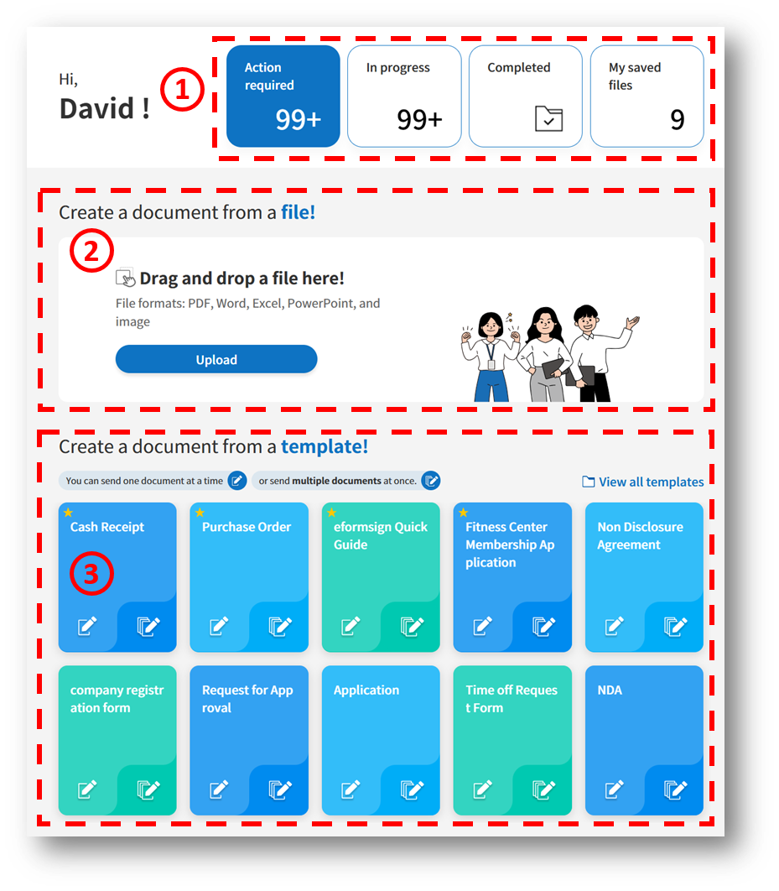
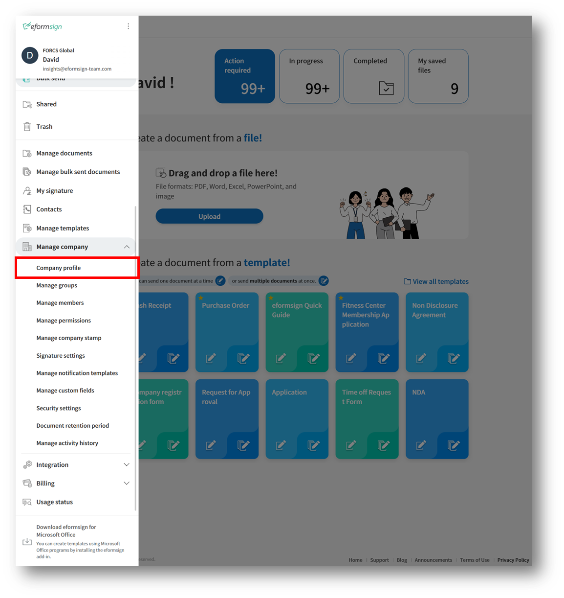
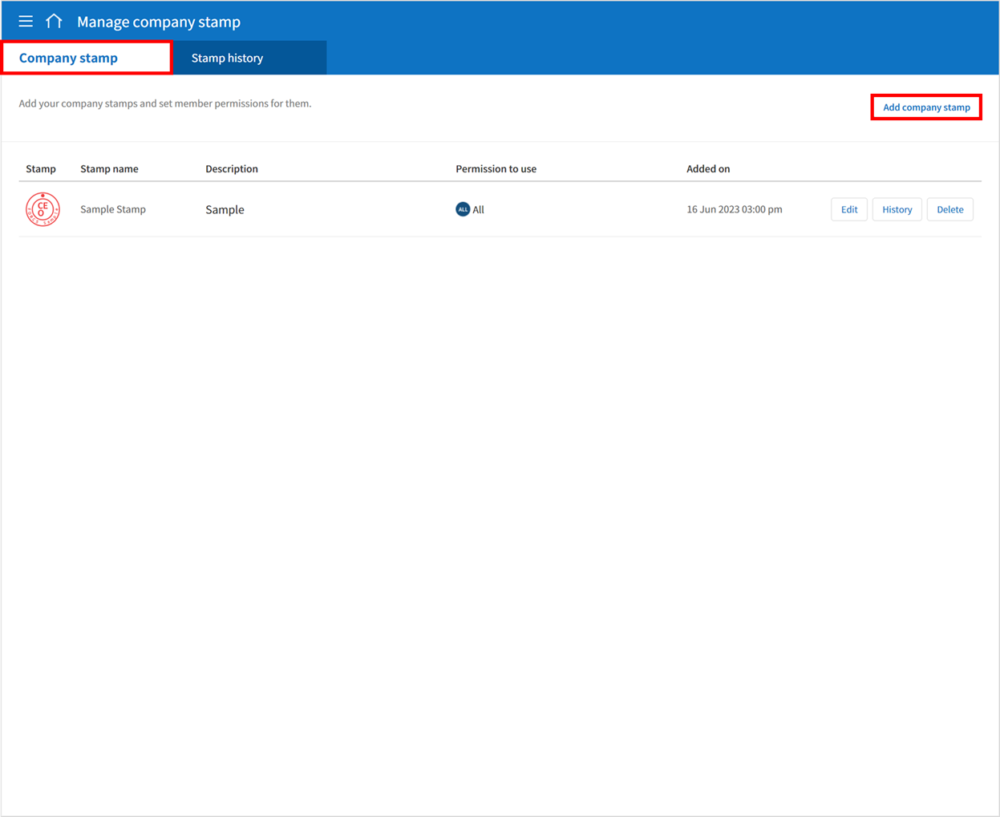
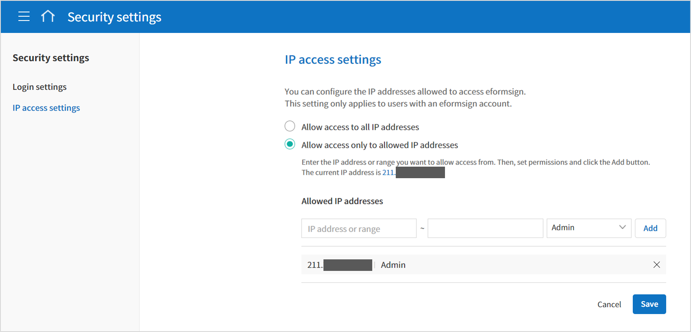
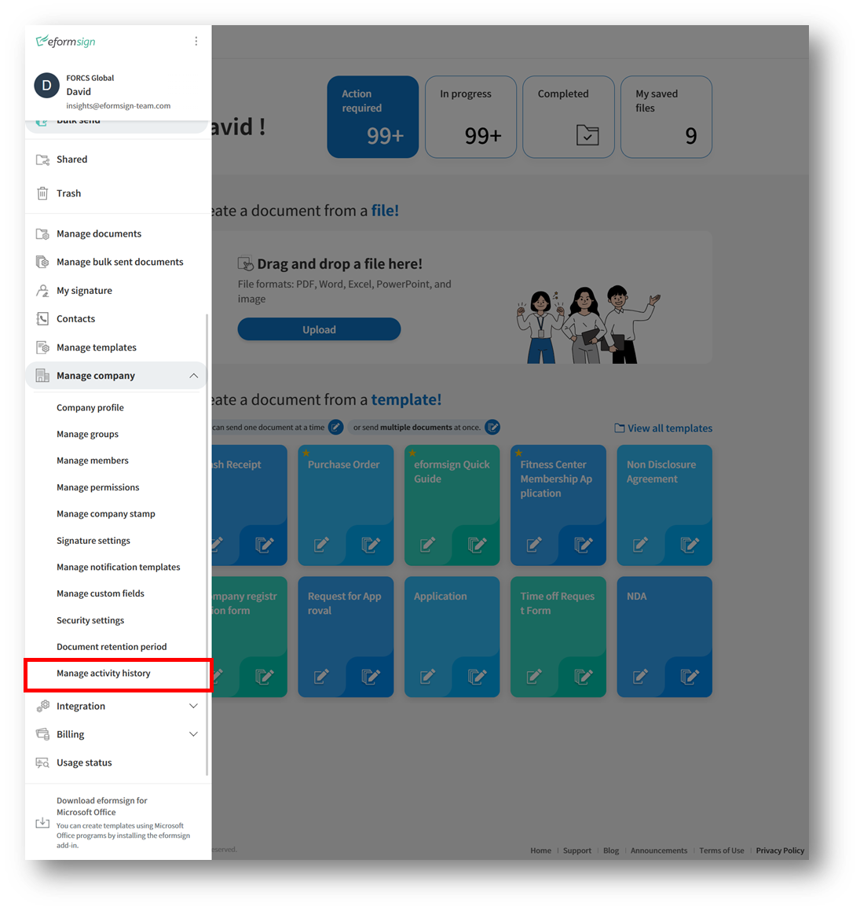
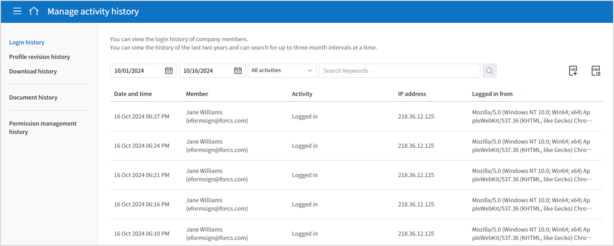

==============
Basic Info
==============

------------
Dashboard
------------

Menu
~~~~~~

After logging into the eformsign dashboard, click the menu icon (|image1|) at the top left corner of the screen. The sidebar menu will be displayed as shown below.

.. note::

   Each menu may appear differently depending on the permissions you have. The company administrator can access all the menus and have all the permissions.

.. figure:: resources/en_dashboard-side-menu.png
   :alt: eformsign Menus
   :width: 700px

The description of each menu is as follows:

-  **New document:** Shows the menus in which you can create a document by uploading a file from your computer or selecting a template uploaded to eformsign.

      -  **New from my file:** Allows you to create a document even when there is no template. Simply upload a file (pdf, doc, docx, xls, xlsx, ppt, pptx, odt, jpg, png, gif, and tiff) from your computer and then upload it to eformsign. Then, add fields onto the document and send it to recipients for signature.

      -  **New from template:** Views the list of templates in which you can create documents from. You can select a template and then create a document.

-  **My saved documents**: Shows the list of documents saved when creating a document by accessing the **New from my file** menu.

-  **Documents:** Shows the menus in which documents are stored.

      -  **Action required:** Shows the list of documents that you need to sign, approve, or send.

      -  **In progress:** Shows the list of documents you have created or processed but are incomplete.

      -  **Completed:** Shows the list of all the completed documents you have created or participated in.

      -  **Bulk send:** Shows the list of all the document you have sent in bulk.

-  **Shared**: Allows you to share your documents with others and view documents others members shared with you.

-  **Trash**: Shows the list of deleted documents that are not deleted permanently.

-  **Manage documents:** Only document managers can access this menu. Document managers can view, download, permanently remove, and void (excluding completed documents) all documents created from a template that they have permission to access. The company administrator by default has permission to do all this for all documents in the company.

-  **Manage bulk sent documents:** Only document managers can access this menu and can view documents bulk created from templates in which you are given permission. However, the company administrator can view and manage all documents.

-  **My signature:** You can create and add your signature to be used when signing a document.

-  **Contacts:** You can add non-member contacts to the contact list and manage them.

-  **Manage templates:** Only template managers can access this menu. You can view the template list and configure the template settings.

-  **Manage company:** Only company managers can access this menu. You can view and edit company information.

      -  **Company profile:** You can view and edit company information

      -  **Manage groups:** You can create groups or edit group information.

      -  **Manage members:** You can invite members or edit member information.

      -  **Manage permissions:** Allows the company administrator to assign members as company managers, template managers, and document managers, as well as manage their permissions.

      -  **Manage company stamp** You can grant stamp use permissions and view stamp use history, as well as adding and managing company stamps.

      -  **Signature settings:** Select the signature types that can be used when signing directly on documents.

      -  **Notification template management:** You can view and edit email and SMS notification templates.

      -  **Manage custom fields:** You can add and configure custom fields such as company, group, and member information.

      -  **Security settings:** You can set security settings including **Login settings** and **IP access settings**. **Login settings** allows you to enable 2-step verification, disable multiple logins, and lock inactive accounts for fortied security. **IP access settings** allows you to set allowed IPs by admin, manager, and member permissions so that only certain IP addresses can log in to eformsign. 

      -  **Document retention period:** You can set the document retention period for all the documents created in the company.

      -  **Manage activity history:** You can view the history of logins, profile revisions, downloads, and permissions, as well as download the history in the CSV format.

-  **Integration:** Only the company administrator can access this menu. You can connect eformsign with external services.

      -  **Cloud storage:** You can connect your Dropbox, Google Drive, or Box accounts to store completed documents in external cloud storages.

      -  **Analytics & reporting:** You can connect sheets in Google Sheets or Microsoft Office 365's Excel with eformsign to store the data entered in eformsign documents to the sheets.

      -  **API / Webhook:** You can create, edit, or delete API and webhook keys to use the eformsign API.

-  **Billing:** You can view your plan and payment history, change your plan, or change the payment method.

      -  **Plan:** You can change the plan you are using.

      -  **Real-time billing:** You can view your usage and billing status in real-time.

      -  **Payment history:** You can view your payment history for the past 1 year.

      -  **Payment method settings:** You can add the credit card information for payment.

-  **Usage status:** You can monitor weekly, monthly, and annual service usage status.

-  **Download eformsign for Microsoft Office:** You can download eformsign for Microsoft Office, which allows you to create electronic forms using Microsoft Office programs.

   
Dashboard
~~~~~~~~~~~

The dashboard is the main page displayed when logging into eformsign. In the dashboard, you can upload a file to create a document as well as create a document from a template you want. Also, you can go directly to a document inbox or view a template in the dashboard.

**① Document inbox shortcut**

   - **Action required**\ : Shows the number of documents you received from members or non-members that you need to sign, approve, or send. When clicked, it opens the **Action required** inbox.

   - **In progress**\ : Shows the number of documents that are in progress. When clicked, it opens the **In progress** inbox.

   - **Completed**\ : When clicked, it opens the **Completed** inbox.

   - **My saved documents**\ : Shows the number of documents saved temporarily before clicking the **Start now** button when creating a document from **New from my file**. When clicked, it opens the **My saved documents** inbox.

**② New from my file**
   
   Opens the **New from my file** page where you can create new documents by uploading your files from your computer.

**③ New from template**

   Opens the **New from template** page where you can create new documents from templates.
   You can create 1 document from a template by clicking the create icon (|image10|), and create multiple documents at once from a template by clicking the bulk icon (|image11|).

   .. tip::

      **How to add template favorites**

      The templates you use most often will appear first in your dashboard when you favourite them. You can add templates as favorites in the **New from template** page.

         .. figure:: resources/template_favorite.png
            :alt: Template favorites
            :width: 500px

         1. Go to the **New from template** menu.
         2. Click the star icon of the template to add it as a favorite. 
         3. In your dashboard, you'll notice that your favourite templates are listed first. 
         4. Click the favorites star icon again to remove the template from the favorites list.

---------------------------------------
View and Change Basic Information
---------------------------------------

To view your personal information you entered when signing up for the eformsign service and the company information, click the see more icon (|image6|) at the top right corner of the sidebar menu.

.. figure:: resources/en_dashboard-side-menu-icon.png
   :alt: Location of the Menu Icon for Accessing Personal and Company Info
   :width: 1500px

If you click the (|image7|) icon in the sidebar, the following menu is displayed.

.. figure:: resources/en_dashboard-side-menu-icon-drop-down.png
   :alt: View and Edit My Profile
   :width: 1500px

-  **Change company:** If you are a member of multiple companies, click the **Change company** menu to view the list of your companies and select a company to switch to.

-  **My profile:** You can view and edit your personal information you entered when signing up for the eformsign service. You can also view the information of the company you are a member of.

-  **Logout:** You can log out of the eformsign service.

My Profile
~~~~~~~~~~~~

**My profile > Personal**

**Account information**
   You can view and edit the name, email or ID, password, and contact number of your eformsign account.

**Security**
   You can set up notifications to be sent to your email when you log in to your account.

**Link social accounts**
   You can link or unlink your Google and Facebook social accounts.

**Notification**
   You can view whether you agreed to receive marketing emails. You can also change your selection.

**Delete my eformsign account**
   You can delete your eformsign account by clicking the **Delete the eformsign account** button.

**My profile > Company**

.. figure:: resources/en-myprofile-company.png
   :alt: My Profile > Company
   :width: 500px

**Basic information**
   You can view basic information about your company including the company name, country, language, and contact number.

**Detailed information**
   You can view detailed information about your company including the company address, company registration number, homepage URL, and company administrator’s email.

   .. note::

      You can only view company information in this page. If you want to edit the information, go to the **Manage company > Company profile** menu. Only the company administrator or company managers can edit company information.

**Withdraw from this company**
   If you want to withdraw from the company, click the **Withdraw from this company** button. Then, the list of companies that you are a member of will be displayed and you can select a company that you want to withdraw from.

   .. important::

      Even if a member withdraws from a company, the member can still use the eformsign account and join another company or create a new
      company.

      However, if the company administrator withdraws from the company, the company will also be deleted. If the administrator wants to withdraw from the company without deleting the company, then the administrator needs to delegate permission to another member, and then withdraw from the company. You can delegate the company administrator permission in **Manage company > Company profile > Basic information**.

Edit and Add Company Information
~~~~~~~~~~~~~~~~~~~~~~~~~~~~~~~~~~~~~

The company information displayed in the **My profile > company** menu can be edited in the **Manage company > Company profile** menu.

.. note::

   You need to have either the company administrator or company manager permission to perform this action.

**Editing Company Profile**

1. Click the sidebar menu icon, and go to the **Manage company > Company profile** menu.

   .. figure:: resources/en-manage-company-profile-edit.png
      :alt: Company Profile
      :width: 1000px

2. Edit the information you want to change in the **Company profile > Basic information** tab.

3. Save the edited information by clicking the **Save** button.

|image8|

.. _brand:

Company Brand
~~~~~~~~~~~~~~~~~

You can replace the eformsign logo and symbol with your company logo and symbol by adding them in the **Company profile > Company brand** tab.

.. note::

   **The difference between a logo and symbol**

   Both a logo and symbol are representative images of a company.
   Usually, a logo has a long horizontal format that includes its brand name and a symbol only has a square image.

   On eformsign, a 512 pixel X 128 pixel horizontal image size is recommended for logos, and a 120 pixel X 120 pixel square image size is recommended for symbols.

**Adding the Company Logo and Symbol**

.. figure:: resources/en-manage-company-brand.png
   :alt: Company Profile > Brand image
   :width: 700px

   Company Profile > Brand image

1. Click the sidebar menu icon, and go to the **Manage company > Company profile** menu.

2. Click the **Company brand** tab.

3. Click the image in the **Brand image > Logo** box.

4. Select and upload a logo image file from your PC.                                      
   -  Image size: A 512 pixel x 128 pixel image size recommended

   -  File size: Up to a maximum 300 KB

   -  File format: PNG, JPG, JPEG, and GIF

5. Apply your changes by clicking the **Save** button.

6. Check whether the new logo was applied to the dashboard.

   .. figure:: resources/en-manage-company-brand-logo-changed.png
      :alt: Dashboard with the Logo Changed
      :width: 700px

.. _permissions:

---------------
Permissions
---------------

Permissions can be granted to each member. In eformsign, there are many different permissions. The company admin has access to all.

-  **Company administrator**

   The company administrator is the representative of the company and has access to all menus. The company administrator can open, create, and manage all documents, as well as having the ability to transfer the company administrator role to another member.

-  **Company manager**

   Company managers have the ability to access the **Manage company** menu. Company managers can view and edit company, group, and member information and grant permissions to members as well as having the ability to edit messages in eformsign email and SMS notification templates.

-  **Template manager**

   Template managers have the permission to access the **Manage template** menu. Template managers can create new templates by using eformsign for Microsoft Office or Web Form Designer, and can also edit, deploy, and delete templates.

-  **Document manager**

   Document managers have permission to access the **Manage documents** menu. They can manage documents created from templates they have access to. If a member is assigned as a document manager of a template, then the member can view, download, permanently remove, and void (excluding completed documents) created from that template.

   .. note::

      Manager permission can be granted only by the company administrator in the **Manage company > Manage permissions** menu.

-  **Template user**

   Template users can create documents from a template. You can grant this permission for each template. When the permission for a template is granted to a member, the member can create documents from that template in the **New from template** page.

-  **Template editor**

   Template editors can edit templates they have permission in.

Company Administrator
~~~~~~~~~~~~~~~~~~~~~~~

The user who created a company is the company administrator by default, and the company administrator is the super administrator having all the permissions to use the eformsign service.

The company administrator:

   -  Has access to all the menus.

   -  Can create, edit, delete, and manage templates.

   -  Can create, view, and manage all documents.

   -  Can grant permissions to each member.

   -  Can delegate its role to another member when the company administrator needs to be changed.

When the company administrator deletes their eformsign account, the company is also deleted. If the administrator wants to delete only the account, then she/he can delegate the administrator permission to another member, and then delete the account.

**Delegating the Company Administrator Permission**

.. note::

   You need to have the company administrator permission to perform this action.

1. Click the sidebar menu icon, and go to the **Manage company > Company profile** menu.

2. Click the **Edit** button in the **Detailed information** section, and then click the **Delegate role** button on the right side of the **Administrator** item.

   .. figure:: resources/en-manage-company-delegate-admin-role.png
      :alt: Delegate Company Administrator Role
      :width: 2000px

3. Enter your password and then click the **Next** button.

   .. figure:: resources/enter-password-popup.png
      :alt: Enter password pop-up
      :width: 500px

4. Select the member you want.

5. Click the **Confirm** button to change the company administrator.

Company Manager
~~~~~~~~~~~~~~~~~~~

Company managers can access the **Manage company** menu and can view, edit, and delete information regarding the company and groups/members.

The company manager permission can be granted in the **Manage members** or the **Manage permissions** menu.

**Granting the Company Manager Permission in the Manage company > Manage members menu**

1. Click the sidebar menu icon, and go to the **Manage company > Manage members** menu.

2. Select the member in the member list you want to grant the company manager permission.

3. Tick the **Manage company** checkbox in the Permission item displayed at the bottom of the Member info tab located to the right of the member list.

   .. figure:: resources/en_manage-company-member-permission.png
      :alt: Company Manager Permission
      :width: 700px

4. Click the **Save** button.

**Granting the Company Manager Permission in the Manage company > Manage permissions menu**

1. Click the sidebar menu icon, and go to the **Manage company > Manage permissions** menu.

2. Select the **Add a company manager** button at the top right corner of the screen.

   .. figure:: resources/en-company-manager-permission.png
      :alt: Add Company Manager
      :width: 700px

3. Select the member you want to grant the company manager permission.

   .. figure:: resources/en-company-manager-popup.png
      :alt: Company Manager Pop-up
      :width: 400px

4. Click the **Confirm** button to grant the member the company manager permission.

.. note::

   To remove the company manager permission from a member, click the trash icon at the top right corner of the screen and select the member you want and then click the **Remove** button.

Template Manager
~~~~~~~~~~~~~~~~~~~~~~~~~~~

Template managers can access the **Manage template** menu, and can create, edit, deploy, and delete templates.

.. note::

   The template manager who created a template is the template owner of that template by default. However, if multiple template managers exist in a company, a template manager may not necessarily be the template owner of a template.

   If the template manager is not the template owner, the template manager can only view the template settings and duplicate the template.

The template manager permission can be granted in the **Manage members** menu or the **Manager permissions** menu.

**Granting the Template Manager Permission in the Manage company > Manage members menu**

1. Click the sidebar menu icon, and go to the **Manage company > Manage members** menu.

2. Select the member in the member list you want to grant the permission.

3. Tick the **Manage templates** checkbox in the Permission item displayed at the bottom of the Member info tab to the right of the member list.

   .. figure:: resources/en_granted-template-manager-permission.png
      :alt: Company Manager Permission
      :width: 700px

4. Click the **Save** button.

.. _permissionsfortemplate:

**Granting the Template Manager Permission in the Manage company > Manage permissions menu**

1. Click the sidebar menu icon, and go to the **Manage company > Manage permissions** menu.

2. Click **Template manager** on the left side of the screen.

3. Click the **Add a template manager** button at the top right corner of the screen.

   .. figure:: resources/en_granting-template-manager-permission.png
      :alt: Template Manager Permission
      :width: 700px

4. Select the member you want to grant the template manager permission.

   .. figure:: resources/en-add-template-manager-popup.png
      :alt: Add Template Manager
      :width: 400px

5. Click the **Confirm** button to grant the member the template manager permission.

.. note::

   **Viewing the number of templates owned by each template manager**

   You can view the number of templates owned by each template manager in the template manager screen, and can view the list of all templates each template manager owns by clicking the **Settings** button next to each template manager.

   .. figure:: resources/en-template-manager-settings.png
      :alt: Template Manager Settings
      :width: 500px

   In the **Template manager settings** pop-up, you can view the list of all the templates owned by the template manager. To change the owner of a template, hover the mouse over the desired template, and then click the **Change owner** button that will be displayed. Then, select the new template owner in the **Change owner** pop-up and click the **Change** button.

Document Manager
~~~~~~~~~~~~~~~~~~~~~~~~~~~~~

Document managers can access the **Manage documents** menu, and can view, download, permantely remove, and void (excluding completed documents) created from templates that they have been granted permission to access.

**Granting the Document Manager Permission**

1. Go to **Manage company** > **Manage permissions** in the sidebar menu.
2. Click **Document manager**.
3. Click the **Add a document manager** button on the top right corner of the screen.

   .. figure:: resources/en-add-document-manager.png
      :alt: Add Document Manager Popup
      :width: 700px

4. Select the member you want to grant the document manager permission.

   .. figure:: resources/en-add-document-manager-popup.png
      :alt: Add Document Manager Popup
      :width: 400px

5. Click the **Confirm** button to add the member as a document manager.

   .. figure:: resources/en-add-document-manager-added.png
      :alt: Document manager added
      :width: 700px
 

6. Click the **Settings** button to the right of the document manager to configure the settings.

   .. figure:: resources/en_adding-document-manager_settings.png
      :alt: Add document manager settings
      :width: 700px

   .. note::

      **Document manager settings**

      Set the conditions for granting document permission for the document manager.

      - **Document permission:**   A condition that filters the documents the document manager can manage by document creator and document type. For example, if you select a member named John Doe under document creator and All documents under Document type, then the document manager has the permission to manage all the documents created by John Doe.

         - **Document creator** 
         
            A condition that filters documents by document creators. You can select all members, groups, or individual members.

            - **Advanced**: The Document creator (advanced) option is displayed when you click Advanced under Document creator. It searches for documents whose creator information matches or contains the keywords.

               .. figure:: resources/docmanager-advancedsetting-creator.png
                  :alt: Manage permissionas > Document manager settings pop-up > Document creator (advanced)
                  :width: 400px

         - **Document type**
            - **All documents:** All documents created by the document creators selected above.
            - **All documents created from a template:** All documents created by the document creators selected above that are created from a template.
            - **All documents created without a template:** All documents created by the document creators selected above that are created using **New from my file**.
            - **Template list:** All documents created by the document creators selected above from the selected templates that are created from the selected templates.

               .. figure:: resources/docmanager-setting-doctype.png
                  :alt: Manage permissionas > Document manager settings pop-up > Document type
                  :width: 400px

            - **Advanced:** The Field (advanced) option is displayed when you click Advanced under Document type. It searches for documents containing a particular field within a specific period/range or searches for documents containing a specific field with a specific value.

               .. figure:: resources/docmanager-advancedsetting-doctype.png
                  :alt: Manage permissions > Document manager settings pop-up > Field (advanced)
                  :width: 400px
         
         📣 The Advanced option allows you to add/delete multiple conditions and filter with an “OR” condition. Also, it cannot be applied in **Manage bulk sent documents**.
               

      - **Give permissions:** Check the permissions you want to give to the document manager for the filtered documents.

         -  **Open and download:** The default permission granted to the document manager. The document manager can open and download all documents filtered using **Document creator** and **Document type** conditions.

         -  **Void:** Permission to void documents (excluding completed ones) created by a selected document creator, if the document creator requested the document to be voided

         -  **Remove:** Permission to permanently remove documents from eformsign.
  
   .. tip::

      You can click the below **+ Add a document permission** button to add more document conditions.

         .. figure:: resources/en-add-document-permission.png
            :alt: Add a document permission
            :width: 400px

Set the permissions and the scope of the permissions to be granted to the document manager.

   - **Filter documents:**  A condition that filters the documents the document manager can manage by document creator and document type. For example, if you select a member named John Doe under document creator and All documents under Document type, then the document manager has the permission to manage all the documents created by John Doe.

      - **Document creator** 
         A condition that filters documents by document creators. You can select all members, groups, or individual members.

      - **Document type**
         Filter documents by document type as follows.

         - **All documents:** All documents created by the document creators selected above.

         - **All documents created from a template:** All documents created by the document creators selected above that are created from a template.

         - **All documents created without a template:** All documents created by the document creators selected above that are created using **New from my file**.
         
         - **Template list:** All documents created by the document creators selected above from the selected templates that are created from the selected templates.

Permissions for each template
~~~~~~~~~~~~~~~~~~~~~~~~~~~~~~~~~~~~~~~~~~~~~~~~~~~~~~~~~~~~~~~~~~~~~~~~

You can grant two types permissions for each template: **Template usage** for using the template to create documents and **Template editing** for editing the template.

A member who has been granted the **Template usage** permission for a template can create new documents from that template by clicking **New from template**.

A member who has been granted the **Template editing** permission for a template can edit that template.

.. Caution::

   The template editing permission can be granted only to template managers.

**Granting Permissions**

.. note::

   You need to have either the **Company administrator** or **Template manager** permission to perform this action.

1. Click the sidebar menu icon, and go to the **Manage templates** menu.

2. Click the **Template settings** (|image9|) icon.

   .. figure:: resources/en-manage-template-settings-icon.png
      :alt: Template Settings Icon
      :width: 700px

3. Go to the **Set permissions** tab.

   .. figure:: resources/en_template-setting-set-permissions.png
      :alt: Template Settings > Set Permissions
      :width: 700px

4. Select the groups or members you want to grant the **Template usage** permission and the **Template editing** permission. Note that you can only select members (not groups) as template editors.

5. Click the **Save** button.

----------------------------
Manage Groups and Members
----------------------------

You can invite, delete, and edit members and create, add, and delete groups in the **Manage company** menu.

.. figure:: resources/en_side-menu-manage-group-members.png
   :alt: Manage Company > Manage Groups/Members
   :width: 700px

Manage Members
~~~~~~~~~~~~~~~~

You can invite members to your company or manage invited members in the **Manage members** menu.

.. figure:: resources/en-manage-members-page.png
   :alt: Manage Company > Manage Members
   :width: 700px

**① Active**
   You can view the list of active members in the company and their information.

**② Inactive**
   You can view the list of inactive members in the company and their information.

**③ Invited**
   You can view the list of members invited to the company and their information.

**④ Member list**
   You can view, edit, or delete the information of a member by selecting a member in the member list and then going to the Member
   info tab on the right.

**⑤ Member info**
   You can view the member information, change the member status, and grant permissions including Manage company and Manage templates to members.

**⑥ Field value settings**
   You can set the field values that are related to members.

**⑦ Transfer shared folder**
   You can transfer a shared folder owned by a member to another member. If a member owns multiple shared folders, then the member can bulk transfer all of them or only some of them.

**⑧ Transfer documents**
   Sometimes you may have to transfer a member's documents to another member due to reasons such as a member leaving the company or transferring to another department. You can use this feature to transfer documents in all status (excluding draft) from the source member to the target member, with the status of transferred documents remaining the same after the transfer.

**⑨ Bulk invite**
   You can invite multiple members at once.

**⑩ Invite members**
   You can invite members via email or ID.

   .. important::

      Member invitation links sent via email or SMS are valid for 7 days.
      If an invited person does not accept the invitation within 7 days, then you must reinvite the person. 

**⑪ Download member list**
   Download the list of members that belong to the company in CVS format.

**⑫ Delete**
   When you click the Trash icon, a checkbox will be activated next to each member in the member list. Tick the members you want to delete and click the Delete button.

Manage Groups
~~~~~~~~~~~~~~~

You can create groups in the company and view, edit, or delete each group's information.

**① Group information**
   When you select a group in the list, you can view the name and description of the group on the right side. You can also edit the group information in the Group information tab.

**② Member list**
   You can view the list of the members in the group and can add or remove members from the group.

**③ Field value settings**
   You can set the field values that are related to the group.

**④ Create a group**
   When you click the **Create a group** button, the **Create a group** pop-up window will be displayed. Create a group by entering the group name and description, and adding members by searching.

**⑤ Delete a group**
   When you click the **Trash** icon, a checkbox will be activated next to each group in the group list. Tick the groups you want to delete and click the **Delete** button.

.. _mysignature:

---------------
My Signature
---------------

If you add your signature, initial, and stamp in the **My signature** menu, you can easily use them when signing documents.

.. _registersignature:

**Adding Your Signature and Initial**
~~~~~~~~~~~~~~~~~~~~~~~~~~~~~~~~~~~~~~~~~~~~~~~~~~

.. note::

   You can add your signature and initial in **browsers (PC and** **mobile)** **and apps (mobile).**

1. Click the sidebar menu icon, and go to the **My signature** menu.

   .. figure:: resources/en_side-menu-my-signature.png
      :alt: My Signature Page
      :width: 700px

   .. figure:: resources/en-my-signature-main.png
      :alt: My Signature Page
      :width: 700px

2. Click the **Register** button in the Signature or Initial section to add a new signature or initial.

   .. figure:: resources/en-my-signature-register.png
      :alt: Register Signature
      :width: 500px

   -  **Draw**
      You can draw your signature on the screen.

   -  **Text**
      Type your name, and then select a signature style.

   -  **Mobile**
      If you scan the QR code with your smartphone camera, you can access the sign pad page. Draw your signature on the sign pad.

   -  **eformsign App**
      Select a mobile device you want to connect to and click the **Send** button. You can draw your signature using the eformsign app installed on the connected device.

3. Click the **Save** button to save the signature/initial.

4. Click the **Edit** or **Delete** button to edit or delete the signature.

.. tip::

   You can select the signature types that can be used when signing on documents.

   In **Manage company** > **Signature settings**, you can disable or enable the signing methods (such as signing with text and create stamp) that can be used when signing a signature or stamp.

   .. figure:: resources/signature-method.png
      :alt: Signature type settings
      :width: 400px

.. _registerstamp:

**Adding your stamp**
~~~~~~~~~~~~~~~~~~~~~~~~~~~~~~

Some documents may require a seal or stamp rather than a signature or initial. In eformsign, there are three ways to add a stamp: creating a stamp, uploading an image, and scanning a stamp.

.. important::

   **❗The stamps in My signature are not the same as company stamps.** 

   For official stamps such as corporate seals, use them by adding them as company stamps.

   Once you adding one as a company stamp, you can grant permissions to members/groups, and can view its usage history.

**Creating a stamp**
-----------------------------

1. Click the sidebar menu icon, and go to the **My signature** menu.

2. Click the **Register** button in the Stamp section to add a new stamp.

   .. figure:: resources/en-my-signature-register-stamp.png
      :alt: Register Stamp
      :width: 700px

3. Click the Create stamp tab in the pop-up displayed and create a name for the stamp and choose the date format, enter additional info, and choose the stamp color. Then, click the **Generate stamp** button and click the **Save** button to save the stamp.

   .. figure:: resources/en-my-signature-create-stamp-popup.png
      :alt: My signature > Register Stamp Pop-up
      :width: 300px

4. Click the **Edit** or **Delete** button to edit or delete the added stamp.

.. tip::

   **Disabling the create stamp feature**

   To disable the **Create stamp** feature when applying a stamp in the signature field, disable the feature in **Manage company > Signature settings**.

   .. figure:: resources/signature-method-createstamp.png
      :alt: Signature setings screen
      :width: 700px

**Uploading an image**
-----------------------------

.. note::

   A stamp/seal image needs to be prepared.

   -  Image type: PNG, JPG

   -  File size: Maximum of 300 KB

1. Click the sidebar menu icon, and go to the **My signature** menu.

2. Click the **Register** button in the Stamp section to add a new stamp.

   .. figure:: resources/en-my-signature-register-stamp.png
      :alt: Register Stamp
      :width: 700px

3. Click the image area. A pop-up window will be displayed where you can upload an image from your PC. Select the image that you want to add.

   .. figure:: resources/en-my-signature-register-stamp-popup.png
      :alt: My signature > Register Stamp Pop-up
      :width: 500px

4. Click the **Save** button to save the stamp.

5. Click the **Edit** or **Delete** button to edit or delete the added stamp.

.. _scanstamp:

**Scanning a stamp**
------------------------------

.. note::

   To scan a stamp, you must have a stamp ready to scan and download and print out the **Scannable paper for stamps** from eformsign. 

++++++++++++++++++++++++++++++++++

- **Scanning a stamp on a PC**

1. Go to the **My signature**\  page -> click the **Register**\  button under **Stamp**\ -> click the **Scan stamp** tab on the pop-up displayed.

   .. figure:: resources/signature-stamp-scan-popup.png
      :alt: Register button
      :width: 300px

2. Download and print out **Scannable paper for stamps**\.

   .. figure:: resources/signature-stamp-scan-paper.png
      :alt: Scannable paper for stamps
      :width: 400px 

3. Apply the stamp in the center of the scan area in **Scannable paper for stamp**\.

4. Use the mobile device's camera app to recognize the QR code. Once recognized, the **Scan stamp**\  screen will be displayed.

5. In the **Scan stamp**\ screen, scan the scan area in which the stamp is applied.

6. Check whether the stamp is properly recognized and touch the **Send**\  button to add the stamp on eformsign.

++++++++++++++++++++++++++++++++++++++++++++++++

- **Scanning a stamp on a mobile device**

1. Go to the **My signature**\  page -> touch the **Register**\  button under **Stamp**\ -> touch the **Scan stamp** tab on the pop-up displayed.

   .. figure:: resources/stamp-scan-popup-mobile-en.png
      :alt: Scan stamp pop-up
      :width: 300px

2. Download and print out **Scannable paper for stamps**\. 

3. Apply the stamp in the center of the scan area in **Scannable paper for stamp**\.

4. Touch the **Scan** button.

5. Allow camera access in the camera screen.

   .. figure:: resources/stamp-scan-mobile-camera.png
      :alt: Allow camera access
      :width: 300px

6. In the **Scan stamp**\   screen, scan the scan area in which the stamp is applied.

7. Check whether the stamp is properly recognized and touch the **OK**\  button to add the stamp on eformsign.

.. _caution_scanstamp:

**Precautions to take when scanning life-sized stamps**
^^^^^^^^^^^^^^^^^^^^^^^^^^^^^^^^^^^^^^^^^^^^^^^^^^^^^^^^^^^^^

.. tip::

   **Depending on the device and environment, the stamp may have difficulties in being recognized. In this case, you can take a photo and upload it instead.**

   **Tip 1. If the Open with screen is displayed instead of the stamp scanning screen**
   
   In some Android devices, touching the **Scan**\  button may display the **Open with**\  screen (which allows you to select apps such as camera and gallery) instead of the stamp scanning screen. In this case, you can scan life-sized stamps by taking a photo and uploading it as follows.

   ① Select **Camera**\  in the **Open with**\  screen.

   ② In the camera screen, take a photo making sure that the stamp scanning area is clearly shown.

   ③ A stamp will be automatically recognized from the photo.

   **Tip 2. If it says that the stamp was not recognized**

   Stamps may not be recognized in the camera screen of some mobile browsers due to their low resolution. In this case, you can scan life-sized stamps by taking a photo and uploading it as follows.

   1. Open the mobile device's default camera app.
   2. Take a photo making sure that the stamp scanning area is clearly shown.
   3. Go back to the stamp screen.
   4. Touch the **Upload photo** button.
   5. Select the Gallery app (if needed).
   6. Select the photo you took.
   7. When you upload the photo, the stamp will be automatically recognized.

.. _company_stamp:

-----------------------
Manage company stamp
-----------------------

You can add and manage company stamps as well as grant stamp use permissions and view stamp use history in the **Manage company stamp** menu.

.. note::

   Only the company administrator and company managers have access to the Manage company stamp menu. 

**Company stamp tab**
~~~~~~~~~~~~~~~~~~~~~~

In this tab, you can add company stamps by uploading an image or scanning a real life-sized stamps as well as granting stamp use permission to members/groups. Once a company stamp is added, you can edit and delete it, and even view the history of all changes made to the stamp

To add a company stamp, click the  **Add company stamp** button, name the stamp name, and give permission to groups and members to use the stamp. Then, click the **Register** button to scan the stamp, upload the image, or create the stamp.

.. figure:: resources/company-stamp-register.png
   :alt: Add company stamp pop up
   :width: 400px

- **Stamp name**: Enter the name of the stamp.

- **Description**: Enter the description of the stamp.

- **Register**: You scan the stamp, upload the image, or create the stamp by clicking the **Register** button.

- **Permission to use stamp**: You can grant permission to use the stamp to all or specific members/groups.

You can see the history of updates and deletions, and modifications made to a stamp. The following shows the stamp history shown when you click the **History**\  button.

.. figure:: resources/company-stamp-register-history.png
   :alt: Stamp history screen
   :width: 700px

**Stamp history tab**
~~~~~~~~~~~~~~~~~~~~~~

In this tab, you can view the history of all the stamps used. You can view information including each of the stamps that were used, the members that used each stamp, the date each stamp was used, etc. You can also download the stamp history in CSV format.

.. figure:: resources/company-stamp-history.png
   :alt: Stamp history tab
   :width: 700px

.. _security_settings:

------------------
Security settings
------------------

You can secure your account via **Login settings** and **IP access settings**. With **Login settings**, you can enable 2-step verification, disable multiple logins, and lock inactive accounts. With **IP access settings**, you can set permissions to allow login from specific IP addresses only. 

.. figure:: resources/security-settings.png
   :alt: Security settings
   :width: 700px

.. figure:: resources/security-settings-page.png
   :alt: Security settings
   :width: 700px

**Login settings**
~~~~~~~~~~~~~~~~~~~~~~

**2-step verification**

- The **2-step verification** feature uses Google Authenticator, email, or SMS verification for additional verification at login to protect your account.

- You can configure the settings in the **Manage company** > **Security settings** > Login settings menu and only the company administrator can access it.

- If you enable this feature, you will be automatically logged out, and any subsequent logins will require two-factor authentication. 

- The default authentication method is Google Authenticator.

- The default authentication method can be changed to any of the following if this feature is enabled

   - **Google Authenticator**
   - **Email verification code**
   - **SMS verification code**

**Disable multiple logins**

- The **Disable multiple logins** feature allows you to restrict multiple logins from the same account.

- You can enable it in the **Manage company** > **Security settings** > **Login settings** menu and it can only be enabled by the company administrator.

- When enabled, only the last device or browser you accessed (or logged into) will remain logged in, and everyone else will be automatically logged out.

- When enabled, you can change the **Auto logout time** and **Auto logout warning**.

- **Auto logout time** allows you to set the time after which you are automatically logged out if no activity is detected for a certain period of time after signing in, from a minimum of 10 minutes to a maximum of 1,440 minutes (24 hours).

- **Auto logout warning** allows you to set the time at which you want users to see a warning message before being automatically logged out. You can set it from 30 seconds to 300 seconds.

**Lock inactive accounts**

- The **Lock inactive accounts** feature allows you to restrict logins from accounts that have not accessed eformsign for a certain period of time.

- You can enable it in the **Manage company** > **Security settings** > **Login settings** menu and can only be enabled by the company administrator.

- When you enable this feature, it restricts logins from accounts that have not logged in to eformsign for a set period of time from that point forward. 

- **Set inactive period** allows you to set the period of inactivity after which accounts will be automatically locked. The inactive period can be set between 7 and 365 days.

- Members with locked accounts can use eformsign after requesting the company administrator to unlock their accounts. The company administrator can unlock accounts on the **Manage members** page.

**IP access settings**
~~~~~~~~~~~~~~~~~~~~~~

This feature allows you to specify IP addresses for eformsign member access. You can customize access by member permissions, enabling specific members to access designated IPs. You can easily configure IP access for companh administrators, managers, and members.

**How to filter IP addresses by permission level**

1. Go to the **Manage company > Security settings** menu and click IP access settings on the left side of the screen. Under **IP access settings**, select **Allow access only to allowed IP addresses**.

.. figure:: resources/security-settings2.png
   :alt: IP access settings
   :width: 700px

3. Enter the IP address or range you want to allow access from.
4. Select the permission level (company administrator/company manager/member) you want to allow logins from the IP address.
5. Click the **Add** button.
6. Review the list of allowed IP addresses and then click the **Save** button.

.. _retention:

---------------------------
Document retention period
---------------------------

To increase the safety and efficiency of managing documents, you can set a retention period. The document retention period can be set company-wide or template specific, and documentss are automatically deleted from the document inbox once the retention period expires. 

.. note::

   For information on how to set the document retention period by template, go to `Template settings <chapter5.html#general-wd>`_.

**How to set the document retention period**

.. caution::

   ❗Only the company administrator can perform this action, and once changing the retention period, the change is applied to all the documents in the company. 
   
   However, this does not affect the documents created from templates with their own document retention period.

1. Go to the **Manage company > Document retention period** menu.

.. figure:: resources/retention-period.png
   :alt: Document retention period settings
   :width: 700px

2. Click **Settings** in the Document retention period page.

3. Select months/years in the drop-down box and enter the period.

   ➡The retention period can be set from a minimum of 1 month to a maximum of 15 years.

.. figure:: resources/retention-period2.png
   :alt: Document retention period settings
   :width: 700px

4. Click the **Save** button to update the retention period, and the change will apply to the documents created hereafter.

.. important::

   📣 **Some notes about the document retention period**

   - Documents are automatically deleted permanently after a grace period of 14 days after the retention period.

   - The document retention period is set to 15 years by default.

   - If the document retention period is set both company-wide and in an individual template, the retention period set in the template takes precendence.

   - If you change the document retention period, the change is applied started to the documents created hereafter.

.. _activityhistory:

---------------------------
Manage activity history
---------------------------

he Manage activity history feature allows you to view the history of logins, profile revisions, downloads, and permissions, as well as download the history in the CSV format. You can access it in the **Manage company** > **Manage activity history** menu and it can be accessed only by the company administrator.

- **Login history**: View the login history of company members. 

- **Profile revision history**: View the revision history of members’ profiles.  

- **Download history**: View the download history and reason of company members. 

- **Permission management history**: View the history of activities that occured in the **Manage permissions** page.

.. |image1| image:: resources/menu_icon.png

.. |image3| image:: resources/favorites-edit.PNG

.. |image5| image:: resources/en-dashboard-add-favorites.png
   :width: 500px
.. |image6| image:: resources/menu-hamberger-icon.png
   :width: 20px
.. |image7| image:: resources/menu-hamberger-icon.png
   :width: 20px
.. |image8| image:: resources/en-manage-company-profile-edit2.png
   :width: 500px
.. |image9| image:: resources/config-icon.PNG
   :width: 20px
.. |image10| image:: resources/template-create-icon.PNG
   :width: 20px
.. |image11| image:: resources/template-bulkcreate-icon.PNG
   :width: 20px