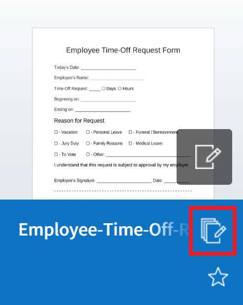
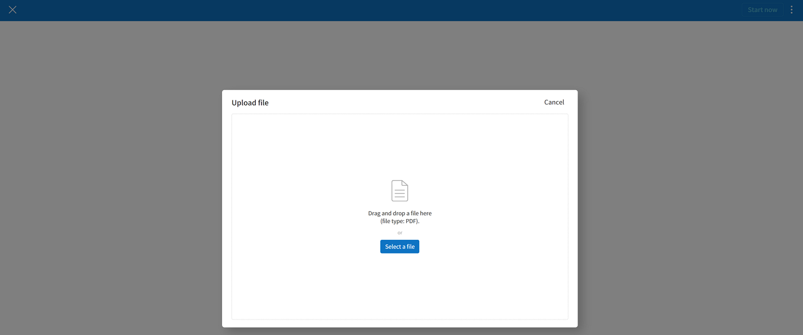

.. _createnew:

Creating documents
==================

Overview
--------

Anyone can use eformsign to easily convert existing documents into
electronic documents and then send them for signature. In eformsign,
there are two ways to create and send documents. You can upload a file
from your PC to eformsign, or use an existing template saved in
eformsign.

-  **New from my file**: You can upload your file to create an
   electronic document and then send it to participants.

-  **New from template**: You can use a template uploaded to eformsign
   to create documents. When you click this menu, templates created by
   the company administrator or members with template management
   permissions are displayed on the screen.

.. note::

   Templates can be created only by the company administrator or members
   with the template management permission, and the templates on the screen
   are shown only to members who are given template usage permission for
   a given template.

   You can create a template using Web Form Designer or Form Builder.
   For more information, refer to `Template Web Form Designer <chapter6.html#template_wd>`__ and
   `Tempate Form builder <chapter7.html#template_fb>`__.

.. important::

   When creating a document with **New from my file**, you cannot save it as a template. For documents you plan on using frequently, it is recommended to create a template first.

New from my file
-------------------

You can upload a file you want and then add fields (components) onto the document. Then, you can specify the participants that will fill in each component and enter the information of the document participants and reviewers, and then send the document.

1. Go to the **New from my file** menu.

   |image1|

2. Upload the document file you want. The supported file types are pdf, hwp, doc, docx, xls, xlsx, ppt, pptx, odt, jpg, png, gif, and tiff with a maximum size of 9MB.

   |image2|

3. Add the **document participants** that will be participating in document creation and select their roles.

   |image3|

   .. note::

      You can add participants by clicking **Add new participant** and up to 30 can be added. Note that you can change, add, or delete participant information in the **Add recipient** step after the **Design form** step.

4. Add the components each participant will fill in and then set component properties on the right.

   |image4|

5. In the Add recipients step, you can add contact information such as email and phone number and set **Recipient options** for each participant.

   |image5|

   .. note::

      There are two recipient types: reviewer and participant. The
      participants added in the Design form step are shown in the Add
      recipients step. You can enter the contact information of each
      recipient such as email. In the Add recipient screen, you can
      delete/add participants and reviewers and set detailed options for
      each recipient.

   .. tip::

      **The difference between participants and reviewers**

      Participants can fill in components such as signature and text on
      each document, but reviewers cannot fill in components and can
      only approve documents after reviewing them.

      |image6|

6. Click the **Options** step to change the document title and select whether to timestamp the document when completed.

   |image7|

   .. note::

      The above three steps are the steps you need to go through before
      creating a document. If you save the document as a draft before
      clicking the **Start now** button, the document is saved in
      `Drafts <chapter8.html#drafts>`__, and the saved file can be opened again so
      that you can begin creating a document. To save a document as a
      draft, click the (|image8|) icon at the top right corner and then
      click **Save as a draft**.

      |image9|

7. When you are done with all the settings, click **Start now**.

   |image10|

   .. caution::

      A document is created once you click **Start now**, and it counts
      as a created document.

8. If you click the **Send** button after reviewing/filling in the document, then the document is sent to recipients.

   |image11|

**Add recipients > Recipient options**

In the **Design form** step or the **Add recipients** step, you can add participants who will receive the document.

In the **Add recipients** step, you can set detailed settings for each participant. Additionally, you can add or remove participants as well as adding reviewers who will review the document.

You have to add the name of each participant and reviewer, and their email/ID. If a participant is a member of your company, you can select the member in the drop-down menu and import their member information stored in eformsign.

The detail settings in **Recipient options** is displayed differently depending on whether the participant or reviewer is a member of your company or is a non-member.

-  **When the recipient is a member**

   **Set document password:** The email address and mobile number are automatically filled-in. You can select whether to send the document via email or mobile.

   .. caution::

      When the mobile number option is selected, then the document will be sent via SMS and additional charges will occur.

   -  **Notification:** **Edit notification message**\ allows you to edit the email or SMS notification message sent to recipients.      

   -  **Document expiration:** Allows to set the period in which recipients can open and submit documents.

      .. tip::

         Setting the valid period to 0 days 0 hours disables the document expiration period.

   |image12|

-  **When the recipient is a non-member**

   If the information you enter is not the same as the member information, then the recipient is recognized as a non-member. This requires the below information to be filled in.

   -  **Email/Mobile:** You can select one of email and mobile, or both. If you select mobile, then you must enter the mobile number of the recipient.

      .. caution::

         If you select mobile, then the document is sent via SMS and additional charges will apply per SMS.

   -  **Document expiration:** You can set the expiration period in which the non-member can open and submit the document.

   -  **Require document password:** If you tick the Set password tick box, you can set the password required for the non-member recipient to open the document. For the password hint, you can set it to something the recipient will be able tell.

   -  **Require email verification:** You can require mobile verification in order for the non-member recipient to open and fill-in the document. Extra charges apply.

**Options**
~~~~~~~~~~~~~~~~~~~~~~~~~~~~~~~~~~~~~~~~~~
In the Options step, you can set the document title, set and edit document notification settings, and choose whether to timestamp the document.

.. figure:: resources/wfd-option.png
   :alt: Options page
   :width: 700px

New from template
-----------------

You can create and send documents whenever necessary by uploading
frequently used forms and saving them as templates by adding workflows
and other details.

Templates can be created by using Web Form Designer or Form Builder. For
more information, refer to `Creating templates from Web Form Designer <#template_wd>`__\  and
`Creating templates from Form Builder <#template_fb>`__.

.. note::

   A document can only be created by members or groups that have been
   granted template usage permission (allows to create documents from
   the template) for a template by a member with template management
   permission for that template.

   A template is shown in the **Manage templates** page only to
   member/groups that have been granted template usage permission for
   that template.

1. Click and go to **New from template** in the dashboard or the sidebar menu.

   |image14|

2. Click the create icon(|image15|) of the template you want to create a document from.

   |image16|

3. If you create a document and then click the **Complete** or
   **Request** button on the top right corner, the document will proceed
   to the next step in the workflow. If you want to temporarily save the
   document as a draft before proceeding to the next step, click the
   **Save as draft** button to save.

   .. note::

      The button may be displayed as **Complete** or **Request**,
      depending on the workflow set for the template.

   .. important::

      Documents saved when clicking the **Save as draft** when creating
      documents from templates can be found in the **Action required** page, not the **Drafts** page.

      To continue to create a document saved as a draft, click the **Edit** button in the **Action required** page.

Send in bulk
-----------------------------------------

When creating a document from a template, you can use the **Send in bulk** feature to send a document to multiple recipients at once.

.. note::

   This feature requires either the company administrator or template usage permission.

**Send in bulk**

1. Go to **New document > New from template**.

2. Click the Send in bulk icon of the template you want to create a
document from.

3. Select whether to enter data either by manually (Enter manually) or by uploading an Excel file (Upload file).

.. figure:: resources/bulk_create.png
   :alt: Send in bulk screen
   :width: 800px

.. tip::

**How do enter data when sending documents in bulk**

**Method 1. Enter manually: max 200 documents (rows)**

   Select**Enter manually**\ to display the table in which you can enter data directly. Each column of the table contains all the fields of a document. The IDs of components (which are fields in a template) are shown as the name of each column. The last row of the first column (No.) indicates the number of documents to be created..

   Tables are filled in a similar way as in Excel. You can double-click on each cell to enter a value and right-click on the mouse to add or delete columns. The value entered in a cell can be copied and pasted, and dragged to another cell.

   When entering data by uploading an Excel file, you must first download the Excel file for data entry shown on the screen, then enter data into the fields in the file, and then finally upload the file.

   .. figure:: resources/bulksend-edit.png
      :alt: Send in bulk enter manually option 
      :width: 700px

**Method 2. Upload file: max 1000 documents (rows)**

   Select **Upload file**\ and download the Excel file for data entry. Once the file is downloaded, enter the neccessary data into the file and upload it.

   .. figure:: resources/bulksend-fileupload.png
      :alt: Send in bulk upload file option
      :width: 1000px

4. Click the **Preview** button on the top right corner of the screen to
view the documents you created. 

5. To send the document right away, click the **Send now** button. To send the documents at a schedule time and date, click the **Schedule send** button.

   .. figure:: resources/bulksend-sending.png
      :alt: send in bulk
      :width: 700px

.. note::

   If there is an non-member participant step in a template, then the left
   area of the table is highlighted in blue. This area is for entering non-member recipients’ names, emails, etc. Depending on the
   non-member participant step settings, there can be phone numbers, verification
   passwords, etc.

   |image17|

   Right before sending documents in bulk, eformsign will automatically check to see if there are any errors in the document. Documents with an error will not be sent and only normal documents will be sent.

   |image17|

   When bulk sending documents at a scheduled time, the scheduled time must be at least 10 minutes from the current time.

   |image17|

.. tip::

   If there is a component that is not shown in the **Send in bulk** screen, then the following must be checked.

   1. The components that cannot be entered in **Send in bulk**: camera, voice, and grouped radio components cannot be used in Send in bulk.

   2. Check whether the components are allowed access in Template settings. Only the components that are checked to be allowed access in **Manage templates > Template settings (⚙) > Workflow settings**
   are shown.

   You can delete rows by right-clicking on your mouse and selecting the desired option in the pop-up window.

   |image17|

.. |image1| image:: resources/newfrommyfile-menu.png
   :width: 700px

.. |image3| image:: resources/newfrommyfile-participants-popup.png
   :width: 400px
.. |image4| image:: resources/newfrommyfile-formdesign.png
   :width: 700px

.. |image6| image:: resources/newfrommyfile-recipients-type.png
   :width: 400px
.. |image7| image:: resources/newfrommyfile-option.png
   :width: 1100px
.. |image8| image:: resources/menu_icon_3.png
   :width: 20px
.. |image9| image:: resources/newfrommyfile-saveasdrafts.png
   :width: 200px

.. |image11| image:: resources/newfrommyfile-startfromnow-send.png
   :width: 700px
.. |image12| image:: resources/newformmyfile-recipientoption-member.png
   :width: 1200px

.. |image15| image:: resources/create-icon.PNG
.. |image16| image:: resources/startfromtemplate-create.png
   :width: 700px

