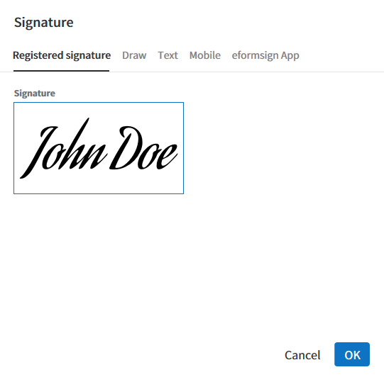
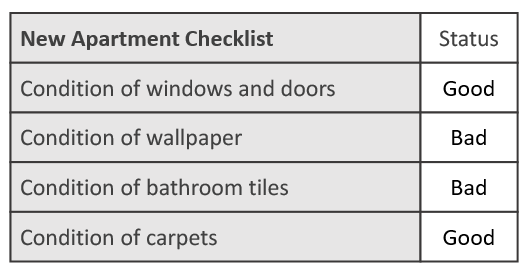

.. _webform:

===================================
Introduction to Web Form Designer
===================================

Web Form Designer is a web form editor that allows you to create electronic documents by uploading document files to eformsign
and adding fields. You can upload files in the **New from template** or the **New from my file** menus to create documents using Web Form Designer. After uploading a file, simply click and add the fields available in the left tree menu of Web form designer and set the properties of each field. This is all you need to do to create documents with an ease.

.. note::

   File formats that can be uploaded are pdf, hwp, doc, docx, xls, xlsx, ppt, pptx, odt, jpg, png, gif, and tiff. The maximum file size supported is 9MB.

.. note::

   In addition to Web Form Designer, eformsign also provides a
   Microsoft Office Add-in feature named **eformsign for Microsoft Office**
   which allows you to create electronic documents directly in Microsoft
   Office. To use eformsign for Microsoft Office, please install the Microsoft Office
   add-in. Refer to `Introduction to eformsign for Microsoft Office <chapter6.html#_formbuilder>`__ for more information.

-------------------
File Uploading
-------------------

Uploading a file in the **New from my file** menu.
~~~~~~~~~~~~~~~~~~~~~~~~~~~~~~~~~~~~~~~~~~~~~~~~~~~

1. Click the **New from my file** menu.

   .. figure:: resources/en-new-from-my-file-dashboard.png
      :alt: New from my file in the dashboard
      :width: 700px

2. Drag and drop the file onto the screen or click the **Select a file**
   button and select a file from your computer to upload.

   |image2|

3. Once the file is uploaded, the Web Form Designer screen will be
   displayed. You can add fields to the document here.

   .. figure:: resources/en-web-form-designer-signers-popup.png
      :alt: New from my file in the dashboard
      :width: 700px

.. tip::

   You can add a file by clicking the **Add file** button and replace a file by clicking the see more icon (⋮) on the file tab and then clicking the **Replace file** button. 

   .. figure:: resources/en-add-file-replace-file.png
      :alt: Add/replace file

Uploading a file in the **Manage templates** menu.
~~~~~~~~~~~~~~~~~~~~~~~~~~~~~~~~~~~~~~~~~~~~~~~~~~~~~~~~~~

.. note::

   Creating a template in the **Manage templates** menu requires either a company administrator or template manager permission.

1. Go to the **Manage templates** menu.

   .. figure:: resources/web-form_1.png
      :alt: Web Form Designer Screen
      :width: 700px

2. To upload a file, simply drag the file onto the **Manage templates** page or click the **Select a file** button and then upload the file.

   .. figure:: resources/web-form_2.png
      :alt: Web Form Designer Screen
      :width: 700px

3. When a file is uploaded, the **Create template** page will be displayed as follows:

.. figure:: resources/en_web-form_3.png
   :alt: Web Form Designer Screen
   :width: 700px

.. tip::

   You can add a file by clicking the **Add file** button and replace a file by clicking the see more icon (⋮) on the file tab and then clicking the **Replace file** button. 

   .. figure:: resources/en-template_addreplacefile.png
      :alt: Add/replace file

.. _webformdesigner_menus:

-------------------------------
Web Form Designer Menu Layout
-------------------------------

Web Form Designer consists of a screen that displays the file, the left and right panels, and the top bar.

1. **Top bar:** In **New from template**, there are two steps: **Design form** and **Configure**. You can also go back to the Manage templates page and preview the template with fields added. In **New from my file**, there are three steps: **Design form**, **Add recipients**, and **Options**. After designing a form, you can create a document or save the form as a draft.

   .. note::

      Clicking each step shown on the top bar displays the screen for each
      step. You can set the workflow, permission, etc. Make sure to
      configure the settings before you finish creating a document.

2. **Document display screen:** Displays the uploaded file.

3. **Signers:** Select the signers of the document and then drag and drop the fields to be filled in by each signer. You can add new signers by clicking the **Add new signer**. There can be up to 30 signers for each document.

4. **Field list:** There are 14 basic fields including text,
   multiline, signature, check, and radio. There are also two data
   fields which are document ID and document number. More fields
   including custom and shape fields are planned to be added in the
   future.

5. **Properties:** Allows to set the properties of each field after
   adding fields such as Signature, Text, and Check by clicking and
   locating them to the document display screen.

6. **Bottom bar:** Displays the file name, and contains the **Add file** button for adding files, and the see more button (⋮) that shows the **Change name**, **Replace file**, **Delete file**, and **Move forward** options.

.. _fields:

----------------------------
Overview of Fields
----------------------------

Fields are used to create fields in electronic documents
that users can enter information. Many different fields including
Signature, Check, Date, and Text are provided, and each fields can be
configured in detail by using the **Properties** tab.

.. figure:: resources/en_component_web_1.png
   :alt: Adding a field in Web Form Designer
   :width: 700px

Field Types
~~~~~~~~~~~~~~~~~~~~~

The fields provided in eformsign are as follows:

**Basic fields**
--------------------------

-  `Signature <#signature2>`__\ **:** Inserts a signature.

-  `Company stamp <#companystamp2>`__\ **:** Inserts a company stamp.

-  `Text <#text2>`__\ **:** Enters short text (usually 1 to 2 words).

-  `Handwriting <#handwriting2>`__\ **:** Allows to trace text shown on the background.

-  `Number <#number2>`__\ **:** Enters a number.

-  `Multiline <#text2>`__\ **:** Enters long text with multiple lines.

-  `Label <#label2>`__\ **:** Sets the form ID.

-  `Check <#check2>`__\ **:** Ticks a check box.

-  `Radio <#select2>`__\ **:** Selects an item among multiple items (can also be set to select multiple items).

-  `Combo <#combo2>`__\ **:** Displays a drop-down menu that allows you to select an item.

-  `Toggle <#toggle2>`__\ **:** Switches to another value if two or more values are entered.

-  `Datetime <#date2>`__\ **:** Enters a specific date.

-  `Numeric stepper <#numeric2>`__\ **:** Enters a number.

-  `Hyperlink <#hyperlink>`__\ **:** Inserts a hyperlink.

-  `Camera <#camera2>`__\ **:** Takes a photo using a camera or selects a photo from an album in devices with a built-in
   camera (e.g. smartphone, tablet, etc.). Selects an image file in devices without a camera (e.g. desktop PC).

-  `Voice <#record2>`__\ **:** Records audio in devices with a voice recording function.

-  `Attachment <#attach2>`__\ **:** Attaches a file.

**Data fields**
------------------------

-  `Document ID <#document2>`__\ **:** Enters the document ID in a document.

-  `Document number <#document2>`__\ **:** Enters the document number in a document.

Setting Properties for Each Field Type
~~~~~~~~~~~~~~~~~~~~~~~~~~~~~~~~~~~~~~~~~~~~~~~

All fields have common and unique properties. When you click a
field added, the detailed properties of that field will be displayed on the right and you can set the properties. Common properties include ID and
Tooltip Text, and the meaning of each property is as follows:

-  **ID:** Unique ID that identifies each field. When assigning who can fill out a field, you can use the field ID to do so. You can also use the field ID to extract data in CSV format.

-  **Who can fill this out:** Sets which signers are allowed and/or required to fill in the field. All the signers added for this document are shown, and you can check or uncheck the Allowed and Required check boxes for each one. When a documents is sent, fields that are checked as Allowed are highlighted in yellow, and fields that are check as Required are highlighted in red.

   - **Allowed:** Allows the signer to fill in the field.
   - **Required:** Requires the signer to fill in the field.

-  **Placeholder:** Text displayed as a help message before entering information.

-  **Tooltip Text:** In Windows, the text in the Tooltip Text box of afieldis displayed in the form of a
   speech bubble when hovering the mouse over the field. In mobile, the text is displayed on the quick type bar when clicking on the field.

.. note::

   For the Document field which is for providing information, Tooltip Text is not provided.

The description of each field is as follows.

.. _signature2:

Signature
--------------------

This field is used for signing a signature on a document.

Clicking the signature area displays the **Signature** pop-up which allows you to sign a signature by drawing, entering text, or using a previously registered signature.

|image4|

**Field Properties**

.. figure:: resources/Signature-component-properties_web.png
   :alt: Setting Signature Field Properties
   :width: 250px

**① ID**

Enters the ID of the signature field. For example, the ID of the field can be ‘signerSignature’ for contract signers.

**② Available signature Type**

Selects the signature type to be used when signing.

-  **Signature:** If the user already has a signature added on eformsign, then clicking the signature area or the Signature button inserts the added signature onto the document. If not, then the user manually creates a signature.

-  **Initial:** If the user already has an initial added on eformsign, then clicking the signature area or the Initials button inserts the added initial onto the document. If not, then the user manually creates an initial.

-  **Stamp:** If the user already has a company stamp added on eformsign, then clicking the signature area or the Stamp button inserts the added stamp onto the document. If not, then the user manually applies a stamp by scanning and uploading a stamp.

.. note::

   In some cases, you may need to use a stamp on a document rather than your own signature. With eformsign, you can also use a stamp image to stamp the signature on a document. To use a stamp image when submitting a document, click the **Stamp** button after clicking on a signature area, and then select a stamp image and click **OK**.

   .. figure:: resources/select-signature-type.png
      :alt: Select signature type
      :width: 300px

**③ Signing method**

If you check the Disable auto-fill check box, it prevents the signature field from being automatically filled when clicked/touched.

**④ Signature Pen Thick**

Sets the signature pen thickness.

**⑤ Signature Pen Color**

Sets the signature pen color.

**⑥ Placeholder**

Sets the help message displayed before signing.

**⑦ Tooltip Text**

Displays the description in Tooltip Text when you hover the mouse over a field. On the eformsign app, it is displayed at the top center of the keypad.

.. tip::

   **Automatically entering signer and signature date**

   Click the signature field and then click the icons shown to add the signature date and signer.

   .. figure:: resources/Signature-component-properties_web_icon.png
      :alt: Signature date and signer
      :width: 200px

   **① Signature date:** Automatically enters the date signed. By clicking the Add date signed icon, you can set the date format in the
   date signed field properties on the right.

   .. figure:: resources/en_Signature-component-properties_web_date.png
      :alt: Date signed
      :width: 700px

   **② Add signer:** Automatically enters the signer information. By
   clicking the Add signer icon, you can specify the signer information
   by ID, name, department, title/position, mobile, or phone.

   .. figure:: resources/Signature-component-properties_web_signer.png
      :alt: Add signer
      :width: 100px

   .. note::

      You can add multiple signed dates and signers for a given
      signature. You can use this when you need to enter the date signed
      repeatedly in a given document such as a contract or enter
      detailed information of a signer.

.. _companystamp2:

Company stamp
--------------------

The company stamp field is used for applying a company stamp onto a document.
If you add a company stamp field, documents that require a company stamp will show a company stamp pop-up as shown below and you’ll be able to select and apply company stamps that you have permission to access.

**Field Properties**

.. figure:: resources/companystamp-component-properties_web.png
   :alt: Setting Text and Multiline Field Properties
   :width: 250px

**① ID**

Enter the ID of the Company stamp field. For example, the ID of the field for applying a company stamp can be named ‘companystamp’.

**② Who can fill this out**

Sets whether the recipient is required or allowed to fill in this field.

**③ Placeholder**

Sets the help message displayed.

**④ Tooltip Text**

Displays the description in Tooltip Text when you hover the mouse over a field. 

.. _text2:

Text and Multiline
--------------------

Both Text and Multiline fields are used to create text fields. The Textfield is suitable for short
text with 1 to 2 words, and the Multiline field is suitable for long text with more than 1 line.

**Field Properties**

.. figure:: resources/wfd-text-component-properties.png
   :alt: Setting Text and Multiline Field Properties
   :width: 400px

**① ID**

Enters the ID of the Text/Multiline field. For example, the ID of the field in which John Doe, Jane Doe, etc. are entered can be named ‘personName’.

.. note::

   All fields must have an ID. An ID is automatically generated when you create a field, but it is recommended to rename it to something you can easily recognize. For example, you can rename the ID of a field for entering John Doe, Jane Doe, etc. as 'name'. By doing so, it is easier to identify fields when deciding whether to display a field to a specific user when you are configuring the Field settings of a template.

**② Who can fill this out**

Selects who is allowed or required to fill out the field.

**③ Default value**

Sets the default text.

.. note::

   This option can be set only in the Text field. By checking this option, the password is hidden with the password symbol (●) or asterisk (*) when entering text. The password is also hidden with the password symbol in PDFs, and can only be seen when downloaded in the CSV format.

**④ Input type**

Selects either ''Plain text', 'Password', or 'Custom' for the Text field and 'Plain text' and 'Custom' for the Multiline field.

**⑤ Select custom input type**

Selects additional input types as well as create a custom input type by creating a rule. It is enabled when **Input type** is set to 'Custom'. 

**⑥ Autofit text**

 Allows you to limit character count to fit the text field, resize font to fit the text field, and set the character limit for each text and multiline field.
 
**⑦ Keypad type on mobile devices**

Selects the keyboard type to be used when entering text in the field. Keyboard Type can only be used in mobile devices such as
smartphones and tablets.

**⑧ Placeholder**

Displays a help message when no value is entered.

**⑨ Tooltip Text**

Displays the description in Tooltip Text when you hover the mouse over a field.

.. _handwriting2:

Handwriting
--------------------

The handwriting field is used to trace a pre-written tex. 

You can type in the text to be displayed on a document in which recipients can trace.

.. figure:: resources/handwriting-component-example.png
   :alt: Example of the handwriting field   

**Field propertites**

**① ID**

Enters the ID of the handwriting field.

**② Pen Thickness**

Sets the pen thickness.

**③ Pen Color**

Sets the pen color.

**④ Show Word Tracing**

Allows you to type in the text that will be displayed on the handwriting field.

----------------------------------------------------------

.. _number2:

Number
--------------------

Enters a number.

**Field properties**

**① ID**

Sets the ID of the number field.

**② Default value**

Sets the default value.

**③ Allow negative value**

Allows to enter a negative value.

**④ Maximum Value, Minimum Value**

Sets the minimum or maximum value that can be entered.

.. note:: 

   If you enter a value that is lower than the minimum value set, then the value is changed to the minimum value. If you enter a value that is higher than the maximum value set, then the value is changed to the maximum value. 

**⑤ Number of decimal places**

Sets the number of decimal places that can be entered. The number of decimal places that can be entered is from 0 to 10.

**⑥ Show thousands separator**

Automatically marks the value entered with a comma separated by thousands.

**⑦ Prefix, Suffix**

Sets the prefix/suffix required for a number to be entered automatically. For example, if you need to enter "10,000 dollars in total," set the prefix to "total" and the suffix to "dollars".

----------------------------------------------------------

.. _label2:

Label
--------------------

This field is used for setting the form ID of a document.

**Field Properties**

.. figure:: resources/label_property_web.png
   :alt: Setting Label Field Properties
   :width: 250px

   Setting Label Field Properties

**① ID**

The form ID of the document is automatically generated and displayed. It can also be changed.

The form ID defined here can be applied when editing the document.

**②Text**

Text entered in the text box is displayed on the document.

.. _check2:

Check
--------------------

The Check field is used to check whether an item is checked or not. This field is similar to the Radio field, but
the Check field is used for checking the status of an item (whether it is checked or not) while the Radio field is used for checking which item among multiple items is checked.

.. tip::

   **Difference between check and radio fields**

   You can select multiple items for check fields, but not for radio fieldss.

When data is downloaded in the CSV format, the Check field’s input value is displayed as follows:

-  When the item is checked: true

-  When the item is not checked: false

In Word and PowerPoint, the Check field is shown in a rectangular shape. Make sure to enter data inside the rectangular shape.

**Field Properties**

.. figure:: resources/check-component-properties-1_web.png
   :alt: Setting Check Field Properties
   :width: 250px

**① ID**

Each Check field must be given a different ID. If multiple check fields are given the same ID, then only the value of the last field is displayed.

**② Who can fill this out**

Selects who is allowed or required to fill out the field.

**③ Items**

You can enter the text to be displayed in the item. You can also add multiple check fields so that multiple items can be selected.

**④ Checked Style**

You can specify the style of each field in **Field Properties**.
The check box is set as the default style, and you can change it to another style (radio button or red circle).

The below example shows how checks are displayed according to the selected style.

|image5|

.. tip::

   You can select the color and style by clicking the drop-down icon.
   Once selected, the check style will be shown in the color and style you selected.

   |image6|

**⑤ Unchecked style**

You can select the style of each field that is not selected. For unchecked style, checks display square boxes, radio buttons display circles, and circles display nothing.

**⑥ Check box alignment**

You can choose whether to align the placeholder text to the right or left of the check box.

**⑦ Tooltip text**

If you hover mouse over a field, the description you entered in the tooltip text will be displayed. In the eformsign app, this will be displayed at the top center of the keypad.

.. _select2:

Radio
--------------------

The Radio field is used for checking which item is selected among multiple items. When data is downloaded in the CSV
format, the selected item will be displayed. 

**Field Properties**

.. figure:: resources/Radio-component-properties_web.png
   :alt: Setting Radio Field Properties
   :width: 250px

**① ID**

In **Field Properties**, make sure that all the selected radio buttons are assigned the same ID.

For example, if there are six choices available in a multiple choice question, assign ‘question1’ as the ID for all of them. I

**② Who can fill this out**

Selects who is allowed or required to fill out the field.

**③ Items**

Items with the same ID are shown in the item list of the field properties window and you can edit text easily.

**④ Selected style**

You can specify the style of each field in **Field Properties**.
The black circle set as the default style, and you can change it to another style in the dropdown menu.

.. tip::

   You can select the color of each style by clicking the drop-down icon. Once selected, the circle will be in the color you selected.

   |image7|

**⑤ Unselected style**

You can select the style of each field that is not selected.

**⑥ Radio button alignment**

Select whether to place the button to the left or right of the text.

**⑦ Tooltip Text**

If you hover mouse over a field, the description you entered in the tooltip text will be displayed. In the eformsign app, this will be displayed at the top center of the keypad.

.. _combo2:

Combo
--------------------

The Combo field is used when you need to select one of multiple items.

If you click a Combo field, a list of items is displayed as follows:

|image8|

**Field Properties**

.. figure:: resources/combo-component-properties_web.png
   :alt: Setting Combo Field Properties
   :width: 250px

**① ID**

Enter the ID of the Combo field. For example, the ID of the field for selecting the favorite color can be ‘Favorite color’.

**② Who can fill this out**

Selects who is allowed or required to fill out the field.

**③ Item count**

Enter the items you want. You can separate the items by pressing Enter.

**④ Default item**

Select the item set as default.

**⑤ Placeholder**

Text displayed as a help message before entering information.

**⑥ Tooltip Text**

If you hover mouse over a field, the description you entered in the tooltip text will be displayed. In the eformsign app, this will be displayed at the top center of the keypad.

.. note::

   If you want to display a message such as ‘Select a color’ in a combo box, then enter ‘Select a color’ and set the default item as 'Select a color'.

.. _toggle2:

Toggle
--------------------

This field is used for indicating a specific status such as ON/OFF. If you use this field, then the input value is switched according to a defined order whenever the field is clicked.

You can change the status to Good or Bad by clicking the fields as follows:

|image9|

**Field Properties**

.. figure:: resources/toggle-component-properties_web.png
   :alt: Toggle Field Properties
   :width: 250px

**① ID**

Enters the ID of the Toggle field. For example, the ID of the field for the first inspection item can be named ‘APT inspection 1’.

**② Who can fill this out**

Selects who is allowed or required to fill out the field.

**③ Items**

Enters the list of items that will be toggled whenever the Toggle field is clicked. You can separate the items by pressing Enter.

**④ Default item**

Select the item set as default.

**⑤ Tooltip Text**

Displays the description in Tooltip Text when you hover the mouse over a field.

.. _date2:

Datetime
--------------------

This field is used for entering a date. Clicking the field displays a date selection window where you can select the date you want.

**Field Properties**

.. figure:: resources/datetime-component-properties_02_web.png
   :alt: Setting Datetime Field Properties
   :width: 250px

**① ID**

Enters the ID of the Datetime field. For example, the ID of the field for selecting the vacation start date can be named ‘Vacation start date’.

**② Who can fill this out**

Selects who is allowed or required to fill out the field.

**③ Default value**

Sets the date to be displayed as default. If you check **Set today's date as default date**, then today's date is automatically entered when a document is opened.

**④ Format**

Sets the format in which date will be displayed. The default setting is date_yyyy-MM-dd.

-  **yyyy:** Displays the year.

-  **MM:** Displays the month. Must be in uppercase.

-  **dd:** Displays the day.

For example, if you want to display the date in the format of ‘15-02-2020’, then enter **dd-MM-yyyy** in the Format field.

**⑤ Minimum Date/Maximum Date**

Sets the range of dates that can be selected in the field by specifying the minimum and maximum dates.

**⑥ Placeholder**

Text displayed as a help message before entering information.

**⑦ Tooltip Text**

If you hover mouse over a field, the description you entered in the tooltip text will be displayed. In the eformsign app, this will be displayed at the top center of the keypad.

.. _numeric2:

Numeric stepper
--------------------

This field is used for entering a number.
Clicking the field displays two arrows on the right, and you can increase or decrease the number by clicking them. In PCs, you can directly enter the desired number into the field by using a keyboard. In smartphones and tablets, you can scroll through the list of numbers and select the one you want.

**Field Properties**

.. figure:: resources/number-component-properties_web.png
   :alt: Setting Numeric Field Properties
   :width: 250px

**① ID**

Enters the ID of the Numeric field. For example, the ID of the field for entering the number of people in a reservation can be named ‘peopleCount’.

**② Who can fill this out**

Selects who is allowed or required to fill out the field.

**③ Default value**

Enters the default number to be displayed.

**④ Unit of Change**

Enters the unit of number that will increase/decrease the number whenever the up/down arrow icon is clicked. For example, if the **Unit of Change** is set to 100, then when you click the up arrow icon (▲), the number is increased by 100 such as 200, 300, 400, and so on.

**⑤ Minimum/Maximum Value**

Sets the range of numbers that can be entered into the field by
specifying the minimum and maximum values. For example, for the date of
birth, setting the Minimum Value to 1900, Maximum Value to the current
year, and the Unit of Change to 1. Also, if you enter a value that is
lower/higher than the Minimum/Maximum Value, then the Minimum/Maximum
Value will be automatically entered. For example, if the Maximum Value
is set to 100 and you enter 101, then the number will automatically
change to 100.

**⑥ Placeholder**

Text displayed as a help message before entering information.

**⑦ Tooltip Text**

If you hover mouse over a field, the description you entered in the tooltip text will be displayed. In the eformsign app, this will be displayed at the top center of the keypad.

.. _hyperlink:

Hyperlink
--------------------

This field is used for inserting a hyperlink. If the hyperlink is linked to a web address, the page opens with a new tab or window.

**Field Properties**

**① Text to display**

Enters the text to be displayed for the hyperlink.

**② Address**

Enters the address of the hyperlink.

.. _camera2:

Camera
--------------------

This field is for uploading photos (taken with a device with a built-in camera such as smartphones and tablets) to a document. In PCs without a camera, clicking the field displays a window for selecting the desired image file.

If the size of the selected image is larger than the size of the field, then it is resized to fit the field.

.. note::

   For the device with a built-in camera, camera feature will be executed, and for the devices with no camera, a window for selecting an image file will be displayed.

|image10|

**Field Properties**

**① ID**

Enters the ID of the Camera field. For example, the ID of the field that takes the photo of a driver’s license can be
‘driverLicense’.

**② Who can fill this out**

Selects who is allowed or required to fill out the field.

**③ Placeholder**

Enters the text displayed before taking a photo.

.. tip::

   If you check the Show icon check box, the camera icon is shown on the camera
   area.

   |image11|

**④ Tooltip Text**

If you hover mouse over a field, the description you entered in the tooltip text will be displayed. In the eformsign app, this will be displayed at the top center of the keypad.

.. _record2:

Voice
--------------------

This field is used for storing recorded voice. You can set the maximum recording time and you can also configure the settings to allow users to only listen to the voice recording.

When you add a Voice field, you can record voice or play a voice recording as follows:

|image12|

.. note::

   Voice recording is only available in the eformsign app.

**Field Properties**

.. figure:: resources/record_component_web.png
   :alt: Setting Voice Field Properties
   :width: 250px

**① ID**

Enter the ID of the voice field. For example, the ID of the field that plays voice recordings can be named 'Record1'.

**② Who can fill this out**

Selects who is allowed or required to fill out the field.

**③ Placeholder**

Enters the text shown before recording.

.. tip::

   If you check the Show icon check box, the mic icon will be displayed on the voice recording area.

   |image13|

**④ Tooltip text**

If you hover mouse over a field, the description you entered in the tooltip text will be displayed. In the eformsign app, this will be displayed at the top center of the keypad.

.. _attach2:

Attachment
-------------------

This field is used for attaching a file to a document. When attaching a file to a document by using the Attachment field, the file will be attached at the very end of the document as a new page.

The types and sizes of files that can be attached are as follows:

-  File type: PDF, JPG, PNG, and GIF

-  File size: Up to 5MB

**Field Properties**

.. figure:: resources/Attachment-component-properties_web.png
   :alt: Setting Attachment Field Properties
   :width: 250px

**① ID**

Enters the ID of the Attachment field. For example, the ID of the field for attaching a resume can be named ‘myResume’.

**② Who can fill this out**
Selects who is allowed or required to fill out the field.

**③  Placeholder**

Enters the text shown before attachment.

.. tip::

   If you check the Shown icon check box, the clip icon will be displayed on the attachement area.

   |image14|

**④ Tooltip text**

If you hover mouse over a field, the description you entered in the tooltip text will be displayed. In the eformsign app, this will be displayed at the top center of the keypad.

.. _document2:

Document ID and Document number
------------------------------------
 
Data fields are used for entering document-related information in the document itself. You can select either one of the document ID or document number.

-  **Document ID:** A unique ID assigned to all documents in the system and is shown in 32 digit alphanumeric format. E.g. 0077af27a98846c8872f5333920679b7

-  **Document number:** The document number set in **Template settings > General**.

   .. note::

      The document ID is a unique ID assigned in the system, so it does not require separate settings.

**Field Properties**

**① ID**

Enter the ID of the Document field. For example, the field ID can be ‘docNum’ for document number.

-----------------------------------------
Configuring Template Settings
-----------------------------------------

After uploading a file and adding fields with Web Form Designer, you can configure additional settings for documents that will be created from the template such as the document name, document number, and workflow.

In the **Design form** screen, click the **Next** button to go to the **Configure** screen. In the **Configure** screen, you can configure the five settings shown below.

-  **General:** Sets the template name, abbreviation, document name, document number, etc.

-  **Set permissions:** Selects the members and groups who can edit the template or create documents using the template.

-  **Workflow:** Sets the steps of the document workflow from **Start** to **Complete**.

-  **Field:** Sets the field default values, auto-filled values, etc.

-  **Notification settings:** Sets the notification settings for documents created from the template.

.. figure:: resources/component_web_2.png
   :alt: The 5 Configuration Tabs in Template Settings
   :width: 730px

.. important::

   In order to create documents from a template, you must save and deploy the template. If you save a template but not deploy it, then template does not appear in the **New from template** page of members with permission to use that template.

   A template that is not deployed are indicated with the text **Not deployed**. To deploy a template, click on the see more (⋮) button on the template and click the **Deploy** option. You can also click on the template to go to **Template settings** and click the **Save** button and then click **Yes** to deploy.

   .. figure:: resources/en-template_publish.png
      :alt: Template deployment
      :width: 750px

.. note::

   For more information on templates, refer to `Creating templates using Web Form Designer <chapter6.html#template_wd>`__.

.. |image1| image:: resources/en-new_from_myfile-menu.png
.. |image2| image:: resources/myfile_create_document2.png
   :width: 500px
.. |image3| image:: resources/en_myfile_create_document3.png

.. |image8| image:: resources/combo-1.png
   :width: 450px

.. |image11| image:: resources/Camera-component-properties_icon.png
.. |image12| image:: resources/record1.png
   :width: 350px
.. |image13| image:: resources/record_component_web_icon.png
.. |image14| image:: resources/Attachment-component-properties_web_icon.png
