.. _formbuilder:

Introduction to Form Builder
===============================

Form Builder Overview
-------------------------

Form Builder Also known as OZ in Office, Form builder is a form editor
which converts a document created using Microsoft Office into an
electronic document containing components (fields). By using OZ in
Office, you can easily convert existing Excel, Word, and PowerPoint
forms such as contracts, applications, and agreements into electronic
documents.

Previously, converting Excel, Word, or PowerPoint documents into
electronic documents required the use of an IDE (Integrated Development
Environment) needing a high degree of programming knowledge for use.
Now, with OZ in Office, anyone with the ability to use Microsoft Office
can easily create electronic documents.

OZ in Office, provided as a Microsoft Office add-in, is easy to use as
it is displayed as a ribbon menu and contains various components
including signature, check box, text box, camera, and voice.

The process of creating electronic documents using OZ in Office's
components is as follows:

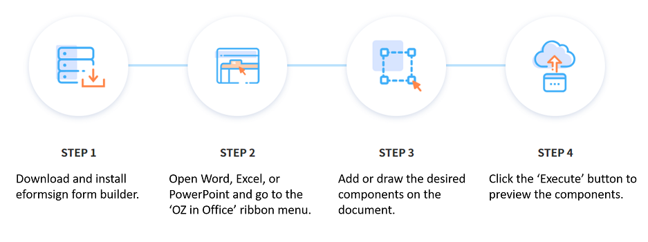

Downloading Installing Form Builder
~~~~~~~~~~~~~~~~~~~~~~~~~~~~~~~~~~~~~~~

Download Form Builder 1. Login to eformsign and then click the menu icon
(|image1|) on the top left corner of the dashboard screen to open the
sidebar menu. Then, click the **Download eformsign form builder** button
at the bottom.

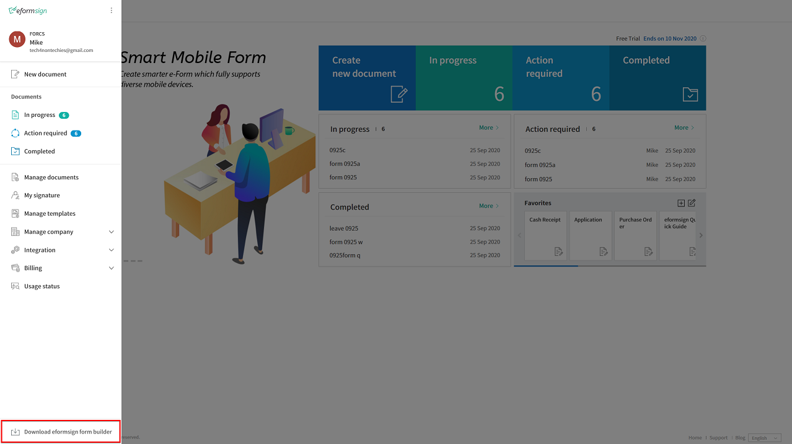

2. The **Download eformsign form builder** page will be displayed, as
shown below. Click the **Download form builder** button at the bottom of
the page.

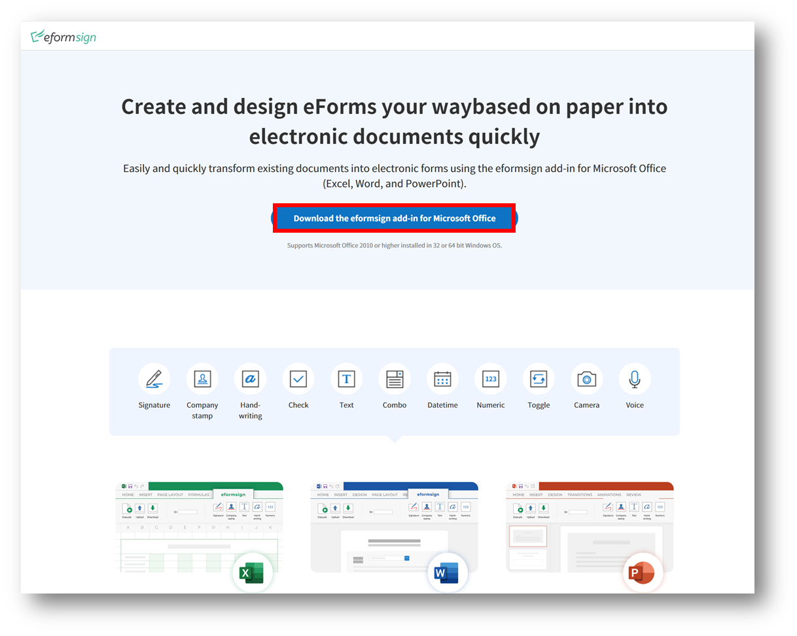

3. After clicking the form builder executable file you downloaded, the
following installation screen will be displayed. Select the **Complete**
option and then click the **Next** button.

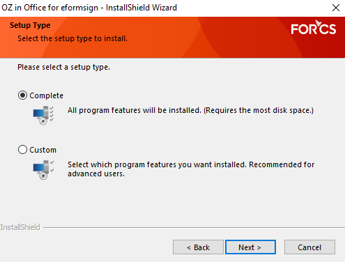

4. When the installation proceeds, the following screen is displayed.

.. figure:: resources/formbuilder_wizard_2.png
   :alt: Form Builder Installation Screen (2)
   :width: 500px

5. When the installation is completed, the following screen is
displayed. Click the **Finish** button to close the installation screen.

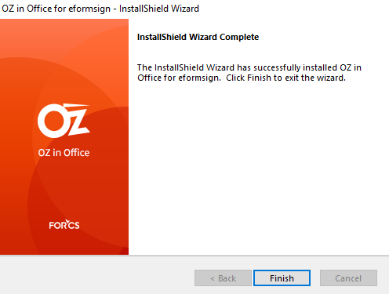

6. Check whether Form builder was installed properly by running MS
Office (Word, Excel, PowerPoint). If **OZ in Word/Excel/PowerPoint** is
displayed as below, then it was installed properly.

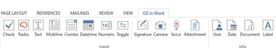

Form Builder Menu Layout
~~~~~~~~~~~~~~~~~~~~~~~~

If you run Microsoft Office Excel, Word, or PowerPoint after installing Form builder, you can see that the **OZ in Excel, OZ in Word, or OZ in PowerPoint** tab is added to the OZ in Office ribbon menu.

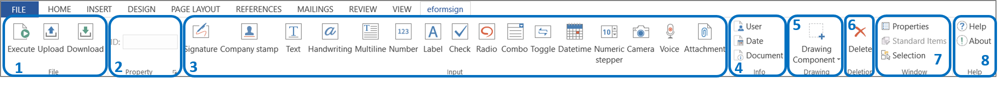

1. **File:** Allows to execute (preview) the document as an electronic form, upload the document to eformsign as a template, or download an electronic form from eformsign.

2. **Property:** Sets the component properties including ID, and Items.

3. **Input:** Adds components used in templates.

4. **Info:** Adds the necessary components in order to have information such as user and date to be automatically entered into templates.

5. **Drawing:** Draws components in the location and size you want. **Drawing** is supported only in Word and PowerPoint.

6. **Deletion:** Deletes components after selecting components and then clicking the **Delete** button.

7. **Window:** Allows to open the **Properties** tab of the selected component or display selected components in the **Selection** tab.

8. **Help:** Checks the version of Form builder and performs updates.

Overview of Components
-------------------------

Components are used to create fields in electronic documents that users can enter information. Many different components including signature, check, date, and text are provided in Form builder, and each component can be configured in detail by using the **Component Properties** tab.

Component Types
~~~~~~~~~~~~~~~

The components provided in eformsign are as follows:

-  `Check <#check>`__\ **:** Ticks a check box.

-  `Radio <#select>`__\ **:** Selects an item among multiple items (can also be set to select multiple items).

-  `Text <#text>`__\ **:** Enters short text (usually 1 to 2 words).

-  `Multiline <#text>`__\ **:** Enters long text with multiple lines.

-  `Combo <#combo>`__\ **:** Displays a drop-down menu that allows you to select an item.

-  `Datetime <#date>`__\ **:** Enters a specific date.

-  `Numeric <#numeric>`__\ **:** Enters a number.

-  `Toggle <#toggle>`__\ **:** Switches to another value if two or more values are entered.

-  `Signature <#signature>`__\ **:** Enters a signature.

-  `Camera <#camera>`__\ **:** Takes a photo using a camera or selects a photo from an album in devices with a built-in camera (e.g. smartphone, tablet, etc.). Selects an image file in devices without a camera (e.g. desktop PC).

-  `Voice <#record>`__\ **:** Records audio in devices with a voice recording function.

-  `Attachment <#attach>`__\ **:** Attaches a file.

-  `User <#user>`__\ **:**Enters information of the document user.

-  `Date <#usedate>`__\ **:** Enters the date in which the document is created or modified.

-  `Document <#document>`__\ **:** Enters the document number or ID in the document itself.

-  `Label <#label>`__\ **:** Sets the form ID.

Accessing Component Properties
~~~~~~~~~~~~~~~~~~~~~~~~~~~~~~~

Every component has its own detailed settings called **OZ Component Properties**. The properties of each component can be accessed by
selecting a component and then clicking the property icon or the **Properties** menu.

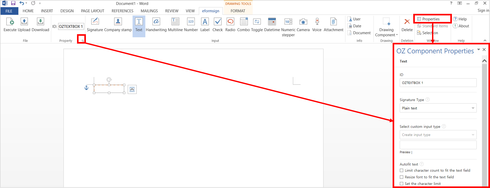

.. note::

   All components must have an ID. An ID is automatically generated when you create a component, but it is recommended to rename it to
   something you can easily recognize. For example, you can rename the ID of a component for entering John Doe, Jane Doe, etc. as 'name'. By
   doing so, it is easier to identify components when deciding whether to display a field to a specific user when you are configuring the Field settings of a template.

How to Add Components
~~~~~~~~~~~~~~~~~~~~~

There are two different ways of adding components: adding components in Excel, and adding components in Word/PowerPoint. In Word or PowerPoint, you can add components in two different ways.

Adding Components in Excel
^^^^^^^^^^^^^^^^^^^^^^^^^^

1. Open Excel and go to the **OZ in Excel** ribbon menu.

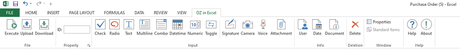

2. Select the cell in which you want to add a component.

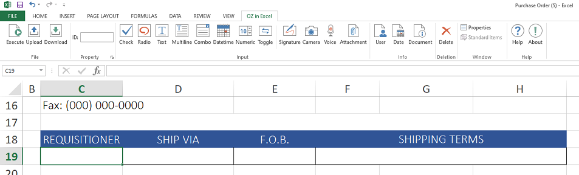

3. Click the component you want.

.. figure:: resources/ozinexcel_3.png
   :alt: Adding Components in Excel (3)
   :width: 730px

4. Check that the component has been added by viewing the **OZ Component Properties** tab.

Adding Components in Word or PowerPoint
^^^^^^^^^^^^^^^^^^^^^^^^^^^^^^^^^^^^^^^

**Method 1: Adding Components by Clicking a Component Type**

1. Open Word or PowerPoint and select the location in the document where you want to add the component.

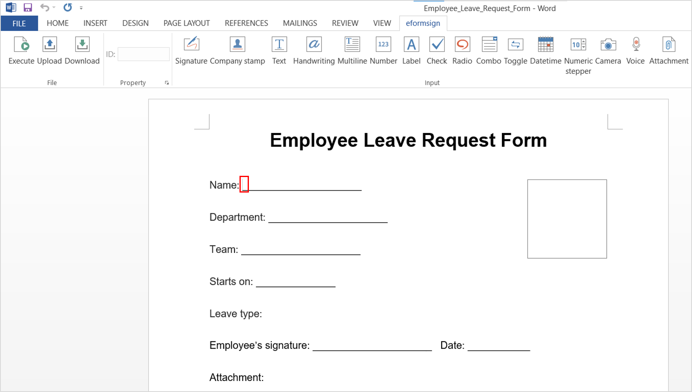
   Word or PowerPoint (1)
   :width: 700px

2.Click the component type you want to add in the ribbon menu of **OZ in Word** or **OZ in PowerPoint**.

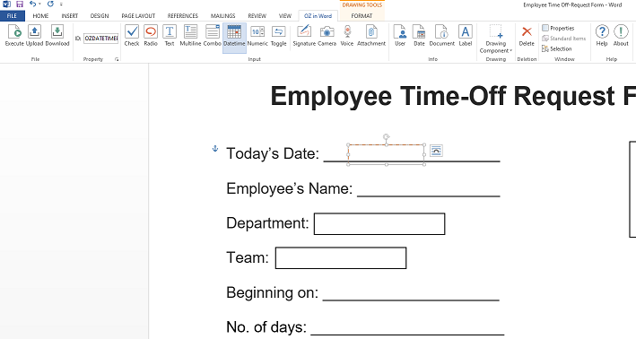
   Word or PowerPoint (2)
   :width: 700px

3. Adjust the size of the component.

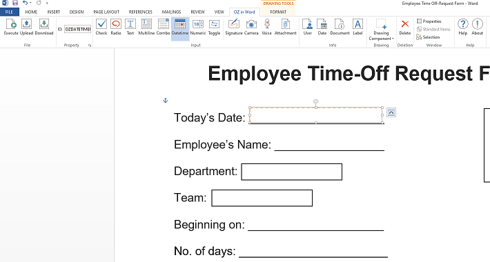
   Word or PowerPoint (2)
   :width: 700px

**Method 2: Adding Components by Drawing a Component**

1. Open Word or PowerPoint and go to the **OZ in Word/Powerpoint** ribbon menu.

2. Click the **Drawing Component** icon and select the component type you want to add in the drop-down menu displayed.

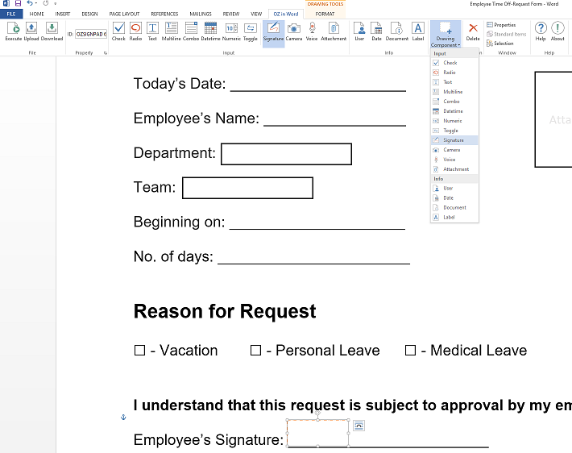
   PowerPoint (1)
   :width: 700px

3. Add the component in the position and size you want.

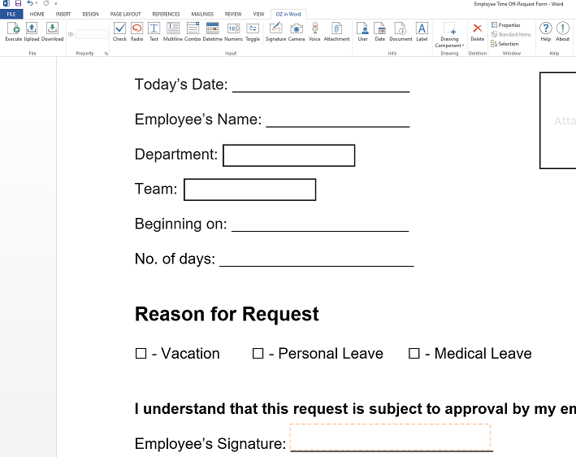
   PowerPoint (2)
   :width: 700px

How to Delete Components
~~~~~~~~~~~~~~~~~~~~~~~~

Select the component you want to delete and then click the **Delete** icon (|image2|) in the **OZ in Office** menu. You can also select and delete multiple components.

How to Use Each Component Type
------------------------------

eformsign provides various types of components such as check box, combo box, text, and signature through Microsoft Office’s **OZ in Office** ribbon menu.

All components of **OZ in Office** have both common and unique properties. You can view both the common and unique properties of components in the **OZ Component Properties** tab. Common properties
include ID and Tooltip Text, and the meaning of each property is as follows:

-  **ID:** Unique ID that identifies each component. You can use the component ID to set a field to be required or
   inaccessible when setting fields in the workflow and to download data in CSV format.

-  **Tooltip Text:** In Windows, the text in the Tooltip Text box of a component is displayed in the form of a speech bubble when hovering the mouse over the component. In mobile, the text is displayed on the quick type bar when clicking on the component.

.. note::

   To open the **OZ Component Properties** window, click on a component and then click the **Properties** icon (|image3| ) in the **OZ in Office** ribbon menu.

.. note::

   The Tooltip Text feature is not provided for the Info group including User, Date, Document, and Label component types.

The description of each component type provided in eformsign is as follows.

Check
~~~~~

The **Check** component is used to check whether an item is checked or not. This component is similar to the **Radio** component, but it is used for checking the status of an item (whether it
is checked or not) while the **Radio** component is used for checking which item among multiple items is checked.

|image4|

When data is downloaded in the CSV format, the **Check** component’s input value is displayed as follows:

-  When the item is checked: true

-  When the item is not checked: false

In Word and PowerPoint, the **Check** component is shown as a rectangular shape. Make sure to enter data inside the rectangular shape.

**Component Properties**

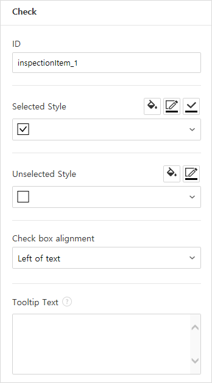

**① ID**

Each Check component must be given a different ID. If multiple check components are given the same ID, then only the value of the last component is displayed.

**② Check Style**

You can specify the style of each component in **Component Properties**.
The check box is set as the default style, and you can change it to another style (radio button or red circle).

The below example shows how check boxes are displayed according to the selected style.

|image5|

.. _select:

Radio
~~~~~

The Radio component is used for checking which radio button is selected among multiple items. When data is downloaded in the CSV format, the selected item will be displayed.

|image6|

In Word and PowerPoint, the radio component is shown as a rectangular shape. Make sure to enter data inside the rectangular shape.

**Component Properties**

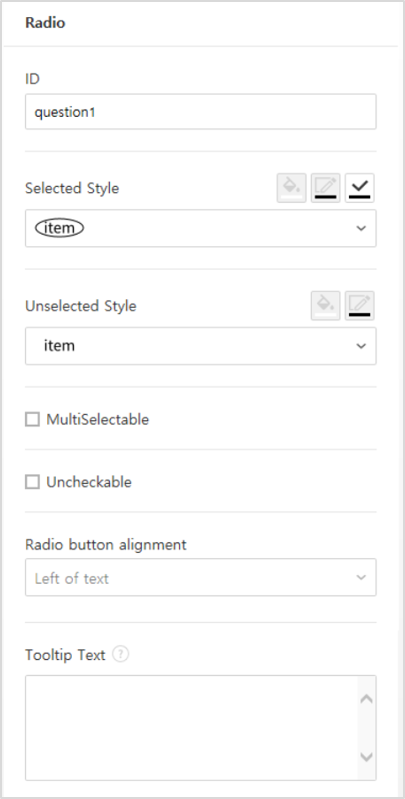

**① ID**

In **Component Properties**, make sure that all the selected radio buttons are assigned the same ID.

For example, if there are six choices available in a multiple choice question, assign "question1" as the ID for all of them. In the example shown below, the IDs of all the items are set to the same "question 1".

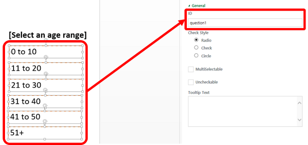

**② Check Style**

You can choose the style of the Radio component in **Component Properties**. The default style is the **Circle**, and you can change it to another style (check box and radio button).

**③ Multiselectable**

Checking the **Multi-selectable** option allows you to select multiple items. If you select more than one item, then when data is saved, each
item is separated with a comma (,).

**④ Uncheckable**

Checking the **Uncheckable** option allows you to deselect a selected item by clicking it again.

**⑤ Tooltip Text**

Displays the description in Tooltip Text when you hover the mouse over a component.

Combo
~~~~~

The Combo component is used when you need to select one of multiple items.

|image7|

If you click a combo component, a list of items is displayed as follows:

|image8|

**Component Properties**

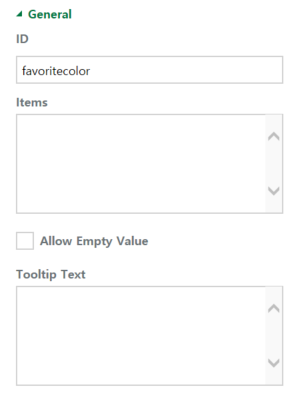

**① ID**

Enters the ID of the Combo component. For example, the ID of the component for selecting the favorite color can be 'favoriteColor’.

**② Items**

Enters the items you want. You can separate the items by pressing Enter.

.. note::

   If you want to display a message such as ‘Please select a color’ in a combo box in a document for recipients to view, then enter the
   message at the top of the list of items in the combo box and select it before sending the document.

**③ Allow Empty Value**

Checking the **Allow Empty Value** option allows you to deselect a selected item. Empty Value can be allowed in the following ways:

-  PC: Right-click on the component and select the **Allow Empty Value** option in the pop-up menu.

-  Mobile: Click the Trash can icon.

**④ Tooltip Text**

Displays the description in Tooltip Text when you hover the mouse over a component.

.. _text:

Text and Multiline
~~~~~~~~~~~~~~~~~~

Both Text and Multiline components are used to create text fields. The Text component is suitable for short text with 1 to 2 words, and the Multiline component is suitable for long text with more than 1 line.

|image9|

**Component Properties**

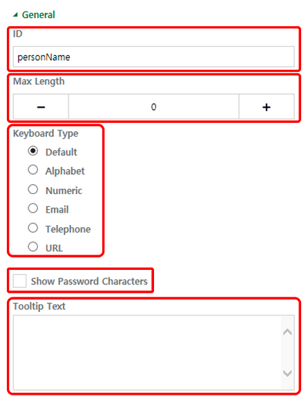

**① ID**

Enters the ID of the text/multiline component. For example, the ID of the component in which John Doe, Jane Doe, etc. are entered can be named ‘personName’.

**② Max Length**

Sets the maximum length of characters (including space) that can be entered. By default, it is set to ‘0’, and in this case, there is no limit for the number of characters.

**③ Keyboard Type**

Selects the keyboard type to be used when entering text in the component. Keyboard Type can only be used in mobile devices such as smartphones and tablets.

**④ Show Password Characters**

This option can be set only in the text component. By checking this
option, the password is hidden with the password symbol (●) when
entering text. The password is also hidden with the password symbol in
PDFs, and can only be seen when downloaded in the CSV format.

**⑤ Tooltip Text**

Displays the description in Tooltip Text when you hover the mouse over a
component.

.. _date:

Datetime
~~~~~~~~

This component is used for entering a date. Clicking the component displays a date selection window where you can select the date you want.

|image10|

**Component Properties**

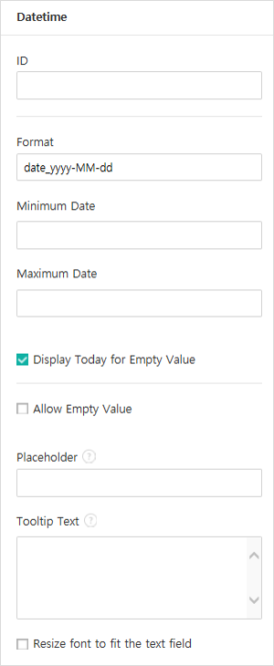

**① ID**

Enters the ID of the Datetime component. For example, the ID of the component for selecting the vacation start date can be named ‘vacationStartDate’.

**② Format**

Sets the format in which date is displayed. The default setting is date_yyyy-MM-dd.

-  **yyyy:** Displays the year.

-  **MM:** Displays the month. Must be in uppercase.

-  **dd:** Displays the days.

For example, if you want to display the date in the format of ‘15-02-2020’, then enter **dd-MM-yyyy** in the Format field.

**③ Minimum Date/Maximum Date**

Sets the range of dates that can be selected in the component by specifying the minimum and maximum dates.

**④ Display Today for Empty Value**

Checking this option automatically enters the date (the date in which the document is opened) when the document is opened. This option is
checked by default when you add a **Datetime** component. You can change the date by clicking the component.

**⑤ Allow Empty Value**

Checking this option allows you to clear the number displayed on a Numeric component. In a Datetime component, once you select a date, you
can change it to another date but cannot clear the date. However, checking this option allows you to clear the date displayed on the
Datetime component. If no date is selected in the Datetime component but the **Display Today for Empty Value** option is checked, then the date
component is automatically filled in with the date in which the document is opened.

-  PC: Right-click on the component to display the pop-up menu and then select the **Initialize Input Data** menu.

-  Mobile: Click the Trash icon.

**⑥ Tooltip Text**

Displays the description in Tooltip Text when you hover the mouse over a component.

Numeric
~~~~~~~

This component is used for entering a number.
Clicking the component displays two arrows on the right, and you can
increase or decrease the number by clicking them. In PCs, you can
directly enter the desired number into the component by using a
keyboard. In smartphones and tablets, you can scroll through the list of
numbers and select the one you want.

|image11|

**Component Properties**

.. figure:: resources/number-component-properties.png
   :alt: Setting Numeric Component Properties
   :width: 300px

**① ID**

Enters the ID of the numeric component. For example, the ID of the
component for entering the number of people in a reservation can be
named ‘peopleCount’.

**② Unit of Change**

Enters the unit of number that will increase/decrease the number
whenever the up/down arrow icon is clicked. For example, if the ‘Unit of
Change’ is set to 100, then when you click the up arrow icon (▲), the
number is increased by 100 such as 200, 300, 400, and so on.

**③ Minimum/Maximum Value**

Sets the range of numbers that can be entered into the component by
specifying the minimum and maximum values. For example, for the date of
birth, setting the Minimum Value to 1900, Maximum Value to the current
year, and the Unit of Change to 1. Also, if you enter a value that is
lower/higher than the Minimum/Maximum Value, then the Minimum/Maximum
Value will be automatically entered. For example, if the Maximum Value
is set to 100 and you enter 101, then the number will automatically
change to 100.

**④ Allow Empty Value**

Checking the **Allow Empty Value** option allows you to clear the number
displayed on the numeric component. After entering a number in a numeric
component, you can change the number again, but cannot clear the number.
However, by checking this option, you can clear the number displayed on
the component as described below.

-  PC: Right-click on the component to display the pop-up menu and then select the **Initialize Input Data** menu.

-  Mobile: Click the Trash icon.

**⑤ Tooltip Text**

Displays the description in Tooltip Text when you hover the mouse over a component.

Toggle
~~~~~~

This component is used for indicating a specific status such as ON/OFF. If you use this component, then the input value
is switched according to a defined order whenever the component is clicked.

|image12|

You can change the status to **Good** or **Bad** by clicking the components as follows:

|image13|

**Component Properties**

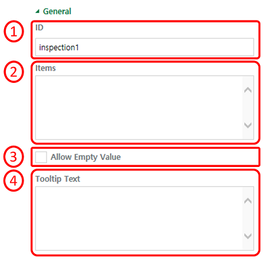

**① ID**

Enters the ID of the toggle component. For example, the ID of the component for the first inspection item can be named ‘inspection1’.

**② Items**

Enters the list of items that will be toggled whenever the toggle component is clicked. You can separate each item by pressing Enter.

**③ Allow Empty Value**

Checking this option allows you to clear the item displayed on the toggle component. When you select a toggle component, you can toggle to
another item but cannot clear the item displayed on the component.
However, by checking this option, you can clear the item displayed on the component as described below:

-  PC: Right-click on the component to display the pop-up menu and then select the **Initialize Input Data** menu.

-  Mobile: Click the Trash icon.

**④ Tooltip Text**

Displays the description in Tooltip Text when you hover the mouse over a component.

Signature
~~~~~~~~~

This component is used for signing a signature on a document.

|image14|

Clicking the signature area displays the **Signature** pop-up which allows you to sign a signature by drawing, entering text, or using a
previously registered signature.

|image15|

**Component Properties**

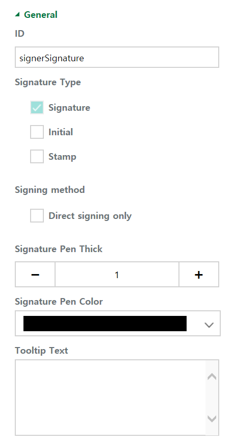

**① ID**

Enters the ID of the signature component. For example, the ID of the component can be ‘signerSignature’ for contract signers.

**② Signature Type**

Selects the signature type to be used when signing.

-  **Enter Directly:** Clicking the signature area displays the **Signature** pop-up which allows you to sign by selecting one of the
   multiple signing methods which are **Draw**, **Text**, **Mobile**, **Stamp**, and **Registered signature**.

-  **Registered Signature:** If the user has already registered a signature on eformsign, then clicking the signature area inserts the
   registered signature into the document.

-  **Registered Initials:** If the user has already registered an initial on eformsign, then clicking the signature area inserts the
   registered initial into the document.

-  **Registered stamp:** If the user has already registered an stamp on eformsign, then clicking the signature area inserts the registered
   stamp into the document.

.. note::

   If there is a registered signature or initial, then it will be automatically entered in the signature area when a signature area is
   clicked. However, if there is no registered signature or initial, then a regular **Signature** pop-up will be displayed when a signature area is clicked.

.. note::

   In some cases, you may need to use a seal or stamp on a document rather than your own signature. With eformsign, you can also use a
   stamp image to stamp the signature on a document. To use a stamp image when submitting a document, click the **Stamp** tab in the **Signature** pop-up, and then select a stamp image and click **OK**.

**③ Signature Pen Thick**

Sets the signature pen thickness.

**④ Signature Pen Color**

Sets the signature pen color.

**⑤ Tooltip Text**

Displays the description in Tooltip Text when you hover the mouse over a component.

.. note::

   You can set the signature date to be automatically entered in documents that require signature, such as electronic contracts and electronic agreements.

   1. Open the document file (Word, Excel, PowerPoint) to be converted into an electronic form or create a new document.

   2. Add a Signature component in the area of the document to be signed.

   3. Enter the ID of the Signature component in the **Component Properties** tab. For example, the ID can be named ‘signature1’.

   4. Add the Date (not to be confused with Datetime) component where the signature date will be entered.

   5. Open the **Component Properties** tab of the Date component.

   6. Select the **Date Type** as **Last modified date of the content**.

   7. Enter the ID of the Signature component in the Input Component ID field on the bottom. In this case, it would be ‘signature1’.

   ※ You can select the Format of date to be displayed on the Date component by selecting the desired date format in the **Component Properties** tab.

Camera
~~~~~~

This component is for uploading photos (taken with a device with a built-in camera such as smartphones and tablets) on a
document. In PCs without a camera, clicking the component displays a window for selecting a desired image file.

|image16|

If the size of the selected image is larger than the size of the text box, then it is resized to fit the component.

.. note::

   For the device with a built-in camera, camera feature will be executed, and for the devices with no camera, a window for selecting an image file will be displayed.

|image17|

**Component Properties**

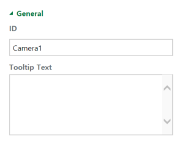

**① ID**

Enters the ID of the Camera component. For example, the ID of the component that takes the photo of a driver’s license can be ‘driverLicense’.

**② Tooltip Text**

Displays the description in the Tooltip Text when you hover the mouse over a component.

.. _record:

Voice
~~~~~

This component is used for storing recorded voice. You can set the maximum recording time and you can also configure the
settings to allow users to only listen to the voice recording.

When you add a Voice component in OZ in Office, you can record voice or play a voice recording as follows:

|image18|

.. note::

   If the recording time limit is set to 1 or higher, recording is completed automatically at the time set (unit: seconds).

   In the case of ActiveX viewer, the recording playback UI is supported from Windows 8 and later.

   In PCs, the Voice component works only when a voice recording device is connected to a PC.

**Component Properties**

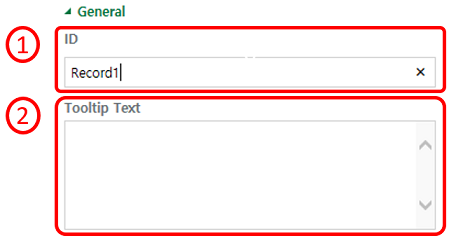

**① ID**

Enter the ID of the Voice component. For example, the ID of the component that plays voice recordings can be named 'Record1'.

**② Tooltip Text**

Displays the description in Tooltip Text when you hover the mouse over a component.

.. _attach:

Attachment
~~~~~~~~~~

This component is used for attaching a file to a document. When attaching a file to a document by using the Attachment
component, the file will be attached at the very end of the document as a new page.

|image19|

The types and sizes of files that can be attached are as follows:

-  File type: PDF, JPG, PNG, and GIF

-  File size: Up to 5MB

**Component Properties**

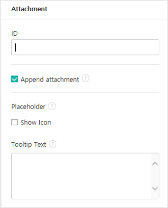

**① ID**

Enters the ID of the Attachment component. For example, the ID of the component for attaching a resume can be named ‘myResume’.

**② Tooltip Text**

Displays the description Tooltip Text when you hover the mouse over a component.

User
~~~~

This component is used for entering the information of the user who created or modified a document. The user’s basic
information such as name or contact information, or custom field information is automatically entered into the user component based on the settings.

|image20|

**Component Properties**

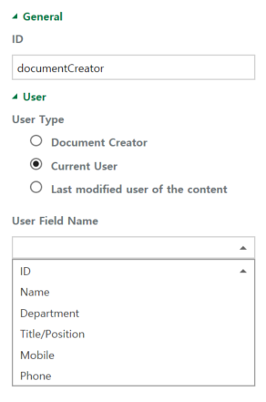

**① ID**

Enters the ID of the user component. For example, the ID of the component that displays the name of the document creator can be named ‘documentCreator’.

**② User Type**

-  **Document Creator:** Displays the information of the user who created the document.

-  **Current User:** Displays the information of the user who has most recently opened or modified the document.

-  **Last modified user of the content:** Displays the information of the user who entered information in a specific component.

If you select **Last modified user of the content**, then the **Input Component ID** field will be displayed. In this field, enter the ID of the component that will display the information when triggered.

|image21|

.. note::

   You need to have company administrator or template manager permission to perform this action.

.. note::

   To automatically fill in the signer’s name in the User component, create a Signature component and then name the ID (for example,
   signer1). Then, create the User component that will display the signer’s name when triggered and name the ID (for example,
   signer1name). Then, select **Last modified user of the content** under User Type and enter the ID of the Signature component (in this case, signer1) under **Input Component ID**.

**③ User Field Name**

This field allows to select the type of member information that will be displayed. You can select basic information in the **Manage member > Member info** menu of the member or information in a custom field.

-  Basic member information types: Name, ID, Department, Position,
   Mobile, and Telephone

.. note::

   You need to have company administrator permission to change basic member information.

   To modify a member's basic information, login to eformsign and go to the **Manage company > Manage members** menu. Select a member in the member list and edit the information in the **Member info tab** on the right. Then, click the **Save** button.

.. _usedate:

Date
~~~~

This component is used to automatically enter the date in which a document is created or modified. The date in which the document is created, the date in which the document is accessed, or the date in which the content of a component is last modified is automatically entered, according to the date type selected.

|image22|

**Component Properties**

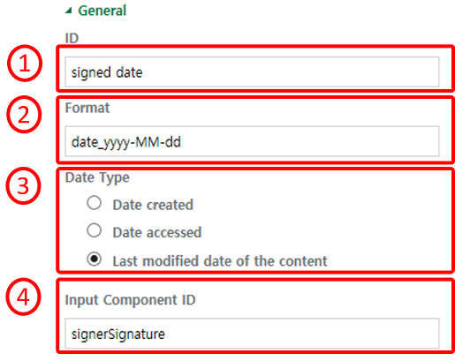

**① ID**

Enters the ID of the Date component. For example, the ID of the component that displays the date in which the document is signed can be named ‘signed date’.

**② Format**

Sets the format in which date will be displayed.

-  **yyyy:** Displays the year.

-  **MM:** Displays the month. Must be in uppercase.

-  **dd:** Displays the day.

For example, if you want to display the date in the format of ‘15-20-2020’, then enter dd-MM-yyyy in the Format field.

**③ Date Type**

-  **Date created:** Displays the date in which the document is created.

-  **Date accessed:** Displays the most recent date in which the document is modified or opened.

-  **Last modified date of the content:** Displays the date in which the information of a specific component is filled in.

If **Last modified date of the content** is selected, the **Input Component ID** field is displayed. In this field, enter the ID of the component that will display the information when triggered.

|image23|

.. note::

   You need to have company administrator or template manager permission to perform this action.

.. note::

   If you want the signature date of a signer to be displayed automatically in a contract, first add a Signature component and then name the ID (e.g. 'contractSign'). Then, add a Date component which will display the signature date when the signature is signed and name the ID (e.g. signDate). Then, select **Last modified date of the content** under Date Type and enter the ID of the signature component (in this case ‘contractSign’) in the **Input Component ID** field.

Document
~~~~~~~~

This component is used for entering document-related information in the document itself. You can select either one of the document ID or document number.

|image24|

The document ID is a unique document ID assigned in the system, so it does not require separate settings. For settings related to document number, upload a template and then go to **Template settings > General**.

**Component Properties**

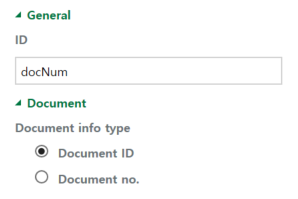

**① ID**

Enters the ID of the document component. For example, the component ID can be ‘docNum’ for document number.

**② Document info type**

Selects the type of information that will be used.

-  **Document ID:** A unique ID containing 32 digits of alphanumeric characters assigned to all documents in the system. E.g. 0077af27a98846c8872f5333920679b7.

-  **Document no.:** The document number set in **Template settings > General.** For information on how to set a document number, go to `Generating and viewing a document number <chapter6.html#docnumber_wd>`__.

Label
~~~~~

This component is used for setting the form ID of a document.

**Component Properties**

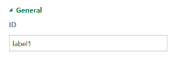

**① ID**

Sets the label component ID.

Upload Form File
----------------

Form files created using OZ in Office are uploaded in the following order:

1. Click the **Execute** icon (|image25|) in the File group. The login page will be displayed as a pop-up window.

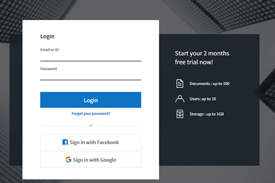

2. After you log in, the document converted to a form will be displayed as a preview.

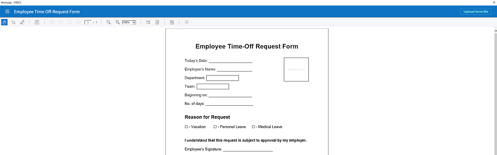

3. Click the **Upload form file** button or click the **Upload** (|image26|) icon in the ribbon menu. The **Template list** page with the **Create template** card will be displayed.

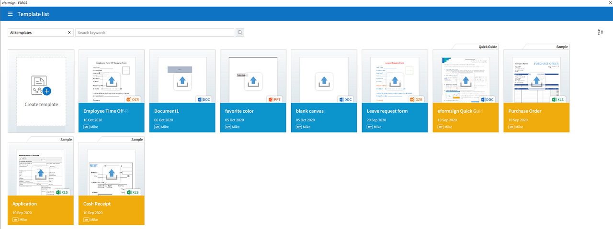

4. Click the **Create template** card. The screen for configuring the template settings will be displayed. Click the settings tabs on the left to configure the settings for the template and then click the Save button on the top right corner to save and create a template.

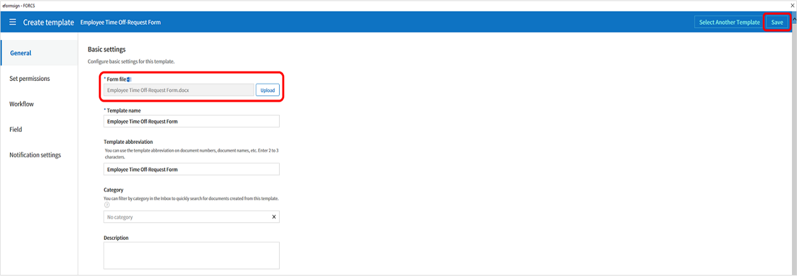

Configuring Template Settings
-----------------------------

After uploading a template, you can configure additional settings for documents created from the template such as the template name, document number, and workflow.

1. Login to eformsign.

2. Go to the **Manage templates** menu.

3. Click the Template settings icon (|image27|) of the desired template.

-  **General:** Sets the template name, abbreviation, document name, document number, etc.

-  **Set permissions:** Sets the permissions for who can create documents created from the template and who can open, void, or
   permanently remove documents created from the template.

-  **Workflow:** Sets the steps of the document workflow from **Start** to **Complete**.

-  **Field:** Sets the field default values, auto-filled values, etc.

-  **Notification settings:** Sets the notification settings for documents created from the template.

4. After configuring all settings, click the **Save** button to save the settings.

.. important::

   In order to create documents from a template, you need to first save and deploy the template first. If you save the template but don't deploy it, then the template will not be shown in the **New from template** page of the members with template usage permission.

.. note::

   For a detailed explanation of templates, please refer to `Template_Form Builder <chpater7.html#template_fb>`__.

.. |image1| image:: resources/menu_icon.png
.. |image2| image:: resources/delete_icon1.png
.. |image3| image:: resources/property-icon.png
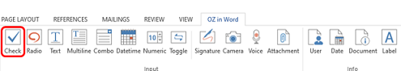
.. |image5| image:: resources/check-component-style-settings.png
   :width: 600px
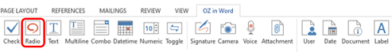
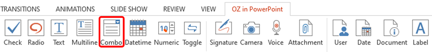
.. |image8| image:: resources/combo-1.png
   :width: 500px
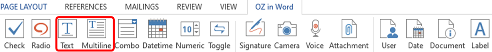
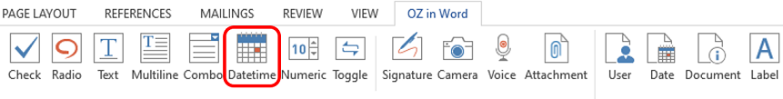
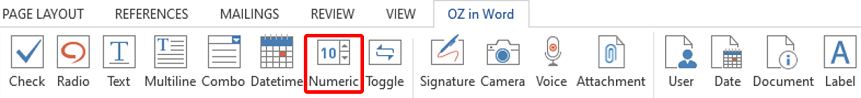
.. |image12| image:: resources/form-builder-components_toggle.png
   :width: 730px
.. |image13| image:: resources/toggle.png
   :width: 400px
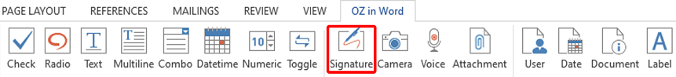
.. |image15| image:: resources/signature.png
   :width: 400px
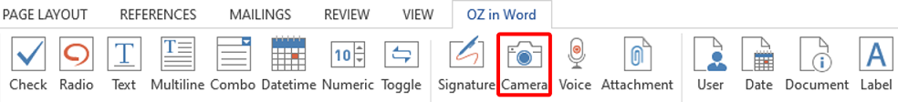
.. |image17| image:: resources/camera1.png
   :width: 350px
.. |image18| image:: resources/record1.png
   :width: 400px
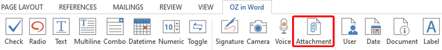
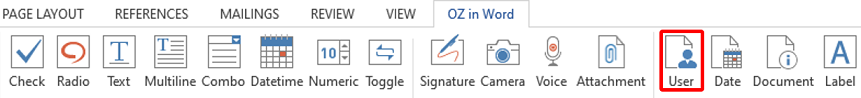
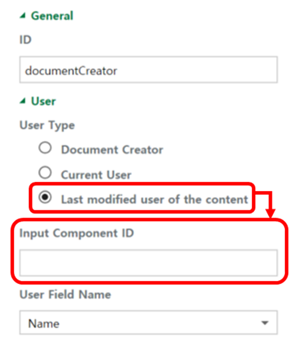
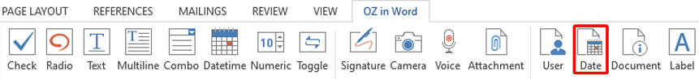
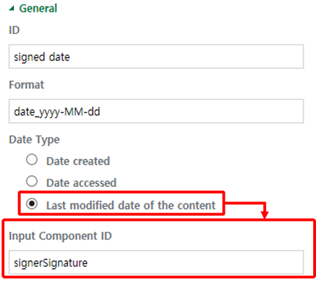
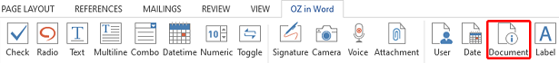
.. |image25| image:: resources/excute_button.png
.. |image26| image:: resources/upload_button.png
.. |image27| image:: resources/config-icon.PNG
