.. _template_wd:

===============================================
Creating templates using Web Form Designer
===============================================

------------------
About Templates
------------------

Templates are **electronic documents** used for the eformsign service. They are e-documents transformed from existing paper forms such as applications, contracts, and agreements. You can create and upload templates in the eformsign service with its **Web form designer** or **Form builder**. 

.. tip::

  **❗Why use templates?**

   Using templates is useful for documents that need to be sent often or regularly. If a tempate is registered once, you don't have to upload a document file whenever you need to send a document. You can just easily create and sent documents using the template. 

.. note::

   For more information about Form builder, refer to `Creating templates using Form Builder <chapter7.html#template_fb>`__.

**How to create a template with Web Form Designer**
~~~~~~~~~~~~~~~~~~~~~~~~~~~~~~~~~~~~~~~~~~~~~~~~~~~~~~~~~~~~~

.. note::

   For more information about Web form designer, please refer to `Web Form Designer <chapter4.html#webform>`__.

You can easily create a template by uploading a file online.

.. note::

   The file formats supported: pdf, hwp, doc, docx, xls, xlsx, ppt, pptx, odt, jpg, png, gif, tiff

   File size: up to 9MB

1. Drag and drop the file that you want to create as a template, or click the **Select a file** button to select a file from your computer and upload it.

   .. figure:: resources/managetemplate-upload-en.png
      :alt: Manage Templates > Uploading a File (1)
      :width: 700px

   .. figure:: resources/en-managetemplate-upload-popup.png
      :alt: Manage Templates > Uploading a File (2)
      :width: 500px

2. Add participants and set the role for each participant.

   .. figure:: resources/en-template-settings-wfdesign0.png
      :alt: Dragging a field
      :width: 500px

3. Select a field that you want to add and drag it onto the uploaded file.

   .. figure:: resources/en-template-settings-wfddesign.png
      :alt: Dragging a field
      :width: 700px

4. Adjust the size and position of the field.

5. Set the details in the **Properties** tab after clicking the field.

6. View the document by clicking the **Preview** button.

7. Click the **Next** button after you finish designing the form. The **Create template** page will be displayed.

**Template settings**

You can set the details for the template.

-  **General**

   Sets the template name, abbreviation, document name, document number, etc.

-  **Set permissions**

   Grants members or groups the permission to use and edit the template and to create documents from it and manage them.

-  **Workflow**

   Sets the workflow for the document from its creation to completion.

-  **Field**

   Sets the default values and auto-filled values for fields.

-  **Notification settings**

   Sets the recipients, and the content of the notification messages for notifying changes in the status of documents created from the template.

.. _workflow:

--------------------
Workflow Overview
--------------------

A **workflow** is a document process from its creation to completion.

The workflow for each template can be set by template managers in **Template settings** > **Workflow**.

By default, all workflows have **Start** and **Complete** steps. You can add as many **Reviewer**, and **Participant** steps as you want for each workflow.

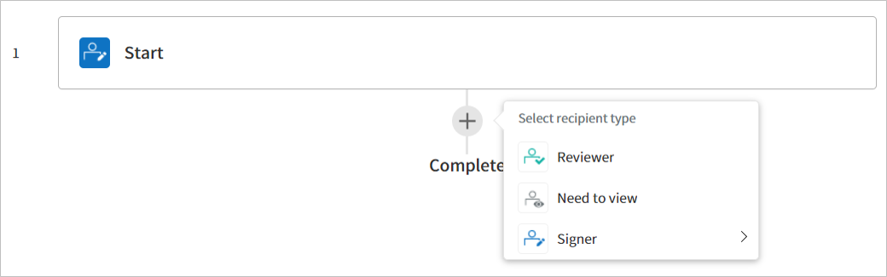

-  **Participant**

   Signs and fills out documents.

-  **Reviewer**

   Only approves or rejects documents.

-  **Need to view**

   Only views documents.

.. _template_setting:

-------------------
Template Settings
-------------------

You can set detailed configurations for each template you create.

.. note::

   Only the **Company administrator** or **Template manager** can perform this action.

   This action can be performed in web browsers of computers and mobile devices, and also in mobile apps.

1. Go to **Manage templates** in the sidebar menu.

2. Click the name or settings icon (|image1|) of the template you want.

   |image2|

.. _general_wd:

General
~~~~~~~~~~~~

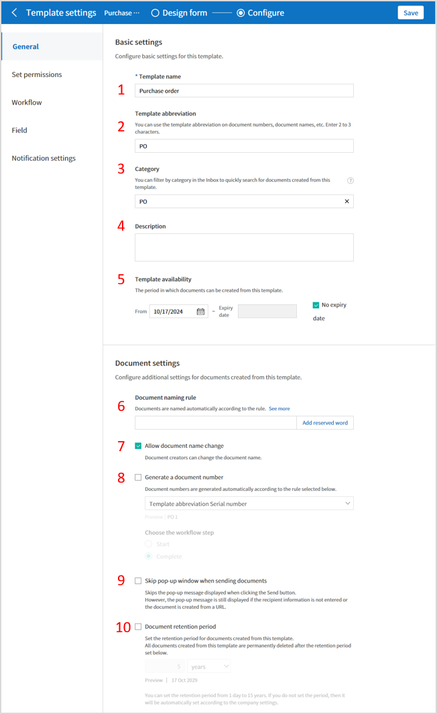

**Configure basic settings for the template**
-------------------------------------------------------

Set basic information about the template including the template name, category, validity period, etc.

**① Template name**
   The template name will be displayed in the **Manage templates** and **New from template** pages.

   The recommended length of the template name is about 11 characters, including spaces. If the name is longer than 11 characters, you can see the full name by hovering the mouse over the name.

   .. figure:: resources/en-template-name.png
      :alt: Template Name
      :width: 250px

**② Template abbreviation**
   A short name that briefly descries the template. It is recommended to use two or three words.

   **Template abbreviation** can be used in the document number, document name, mail template, etc.

**③ Category**
   Category is used to sort templates by type. With the category name, you can filter templates in the **Manage templates** menu, and can filter documents in the **Documents** menus and the **Manage documents** menu. You can choose from an existing category or create a new category by entering a new name.

   You can set multi-level categories with a separator ( **/** ). For example, if you set a category as **HR Team/Vacation**, the Vacation category in the HR category is created.

**④ Description**
   Enter additional comments about the template. This description is displayed under the template name in **New from template.**

**⑤ Template validity period**
   Sets the time period in which documents can be created from this template. By default, the start date is set to the uploaded date and you can change the date.

   If you check **No expiry date**, documents can be created without a time limit. If you uncheck it and set the date, then documents can be created from the template up to that date.

**Document settings**
-------------------------------------

Configure additional settings including document naming rules for documents created from the template.

**⑥ Document naming rule**
   Sets the document name when creating the document from the template. If a document naming rule is not set, the template name will be the document name.

**⑦ Allow document name change**
   If **Allow document name change** is checked, the document creator can change the document name.

**⑧ Generate a document number**
   If **Generate a document number** is checked, documents are automatically numbered. You can select the document number format and the workflow step in which document numbers are generated.

   |image3|

**⑨ Skip pop-up window when sending documents**
   Use it when many documents are created and submitted. If this option is unchecked, a pop-up window for entering a message will appear when sending a document. When **Skip pop-up window when sending documents** is checked, the pop-up window does not appear and the page proceeds to the next step.

.. _document_naming:

General > Setting the Document Naming Rule
----------------------------------------------------

In **Template settings**, you can set the document naming rule for documents created from a template.

**Document naming rule**
^^^^^^^^^^^^^^^^^^^^^^^^^^^^^^^^^

You can make a piece of information entered into a document or document-related information to be automatically entered into the document name. If you set the document naming rule, then the document name is automatically entered based on the information of the document. As well, you can see this name in all document pages (In progress, Action required and Completed) and the **Manage document** page.

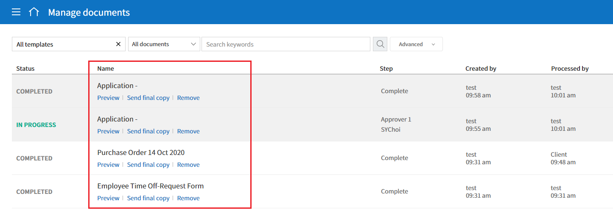

**How to set the document naming rule**
++++++++++++++++++++++++++++++++++++++++++++++

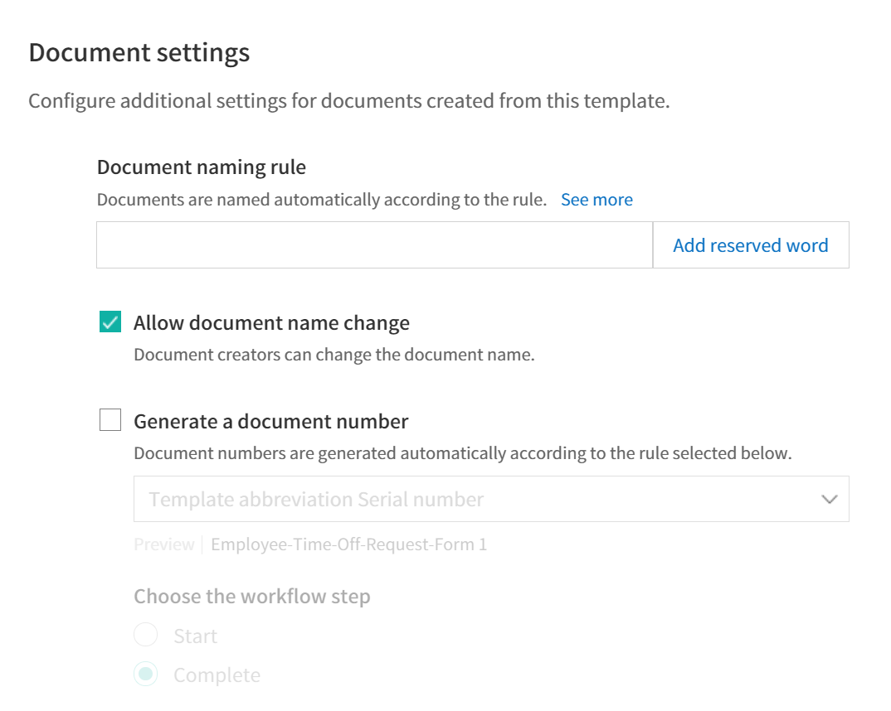

1. In the sidebar menu, click the **Manage templates** menu.

2. Click on the settings icon (|image4|) of the desired template to go to the **Template settings** page.

3. Set the desired naming rule in the **Document naming rule** section in the **General** tab by adding reserved words.

4. Click the **Save** button on the top right corner to save the changes.

.. _reserved_words:

**How to use reserved words**
++++++++++++++++++++++++++++++++++++++++++++++++++++++++++++

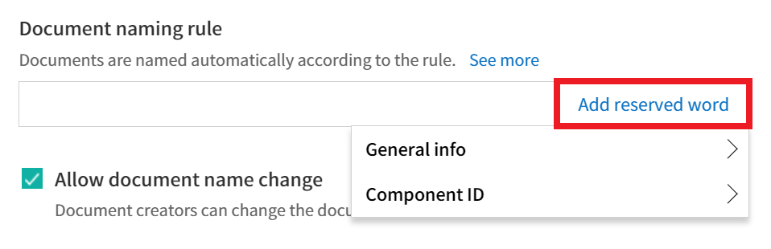

-  **Component ID**\ : Adds a piece of information in the document into the document name.

   Click the **Add reserved word** button, and click **Component ID**\  to display the list of field IDs and then select the desired field ID. The information in that particular field will be added to the document name.

-  **General info**\ : Adds document-related information into the document name.

   Click **General info**\  to display the list of information type and then select the desired information. Information types are as follows.

   +-----------------------+-----------------------------------------------+
   | Information types     | Description                                   |
   +=======================+===============================================+
   | Current_date          | The date in which the document is created     |
   |                       | (e.g. Feb 20, 2020)                           |
   +-----------------------+-----------------------------------------------+
   | Current_time          | The time in which the document is created     |
   |                       | (e.g. 02:59 pm)                               |
   +-----------------------+-----------------------------------------------+
   | Current_datetime      | The date and time in which the document is    |
   |                       | created (e.g. Feb 20, 2020, 02:59 pm)         |
   +-----------------------+-----------------------------------------------+
   | Creator_ID            | The ID of the member who created the document |
   +-----------------------+-----------------------------------------------+
   | Creator_name          | The name of the member who created the        |
   |                       | document                                      |
   +-----------------------+-----------------------------------------------+
   | Creator_dept          | The department of the member who created the  |
   |                       | document                                      |
   +-----------------------+-----------------------------------------------+
   | Creator_company Name  | The name of the company in which the member   |
   |                       | who created the document belongs to           |
   +-----------------------+-----------------------------------------------+
   | Template_name         | The template name entered in Template         |
   |                       | settings > General                            |
   +-----------------------+-----------------------------------------------+
   | Template_abbreviation | The template abbreviation entered in Template |
   |                       | settings > General                            |
   +-----------------------+-----------------------------------------------+
   | Company               | The company name entered in Manage company >  |
   |                       | Company profile                               |
   +-----------------------+-----------------------------------------------+
   | Company_address       | The address entered in Manage company >       |
   |                       | Company profile                               |
   +-----------------------+-----------------------------------------------+
   | Company_contact_no    | The contact information entered in Manage     |
   |                       | company > Company profile                     |
   +-----------------------+-----------------------------------------------+
   | Company_              | The business registration number entered in   |
   | registration_no       | Manage company > Company profile              |
   +-----------------------+-----------------------------------------------+
   | Company_homepage      | The homepage URL entered in Manage company >  |
   |                       | Company profile                               |
   +-----------------------+-----------------------------------------------+

.. tip::

   Check the status of the **Allow document name change** field.

   Even if the document naming rule is set, if the **Allow document name change** option is checked, the document creator can arbitrarily change the document name. If you do not want the document name to be changed, then make sure to uncheck the **Allow document name change** option.

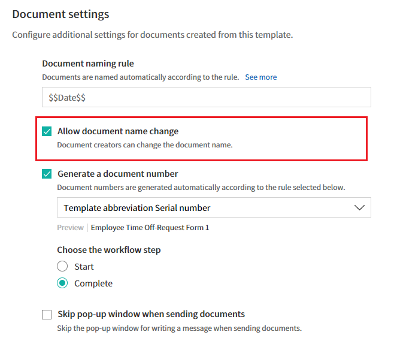

.. _docnumber_wd:

General > Generating and Viewing a Document Number
-----------------------------------------------------------

You can set a document number for documents created in eformsign. You
can set it so that a document number is generated automatically for each
template, and can select one of four document numbering formats. The
document number can be generated in the document using the document
field. You can also see a separate column in the document list and
search documents by the document number.

**Generating a document number**
^^^^^^^^^^^^^^^^^^^^^^^^^^^^^^^^^^^^^^^^^^

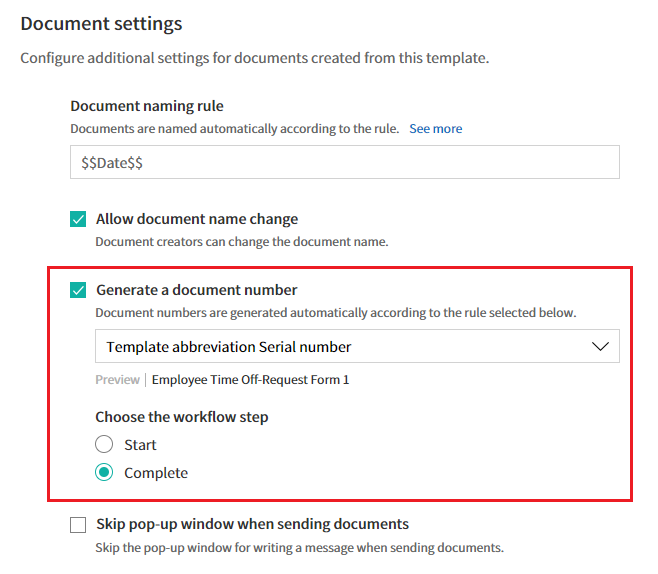

1. In the sidebar menu, click the **Manage templates** menu.

2. Click on the settings icon (|image5|) of the desired template to go to the **Template settings** page.

3. Tick the **Generate a document number** checkbox in the **General** page.

   -  **Selecting a document numbering rule**

   .. figure:: resources/en-generate-document-number-select.png
      :alt: Selecting a Document Numbering Rule

   **▪ Serial number**
      Generated in the format of the document creation order

      E.g. 1, 2, 3...

   **▪ Year_serial number**
      Generated in the format of the document creation year + document creation order

      E.g. 2020_1, 2020_2...

   **▪ Template_serial number**
      Generated in the format of the template abbreviation + document creation order

      E.g. Application 1, Application 2...

   **▪ Template_year_serial number**
      Generated in the format of the template abbreviation + document creation year + document creation order

      E.g. Application 2020_1, Application 2020_2...

   -  **Choosing when to number a document**

   ▪ **Start**
      A number is generated when a document is created.

   ▪ **Complete**
      A number is generated when a document has been completed after going through all the steps in the workflow.

4. Click the **Save** button at the top right corner of the page to apply your changes.

**Viewing a document number**
^^^^^^^^^^^^^^^^^^^^^^^^^^^^^^^^^^^

A document number can be viewed directly on a document using the document field and can also be viewed in the document list.

-  **Viewing a document number directly on a document**

   You can generate a document number directly on a document by using the document number field.

   1. Upload a file on Web form designer.

   2. Add the document field in the location where the document number will be displayed.

      |image6|

   3. Click the **Next** button to go to **Template settings.**

   4. In **Template settings > General,** tick the **Generate a document number** checkbox.

   5. Select a document numbering rule.

   6. Click the **Save** button to save the settings.

-  **Viewing a document number in the Completed and Manage documents pages**

   .. figure:: resources/en-completed-document-box-docno.png
      :alt: Completed - Document List
      :width: 700px

   .. figure:: resources/en-completed-document-list-docno-column.png
      :alt: Completed - Document List - Document Number
      :width: 700px

   A document number can be viewed in the Documents menus (In progress, Action required, and Completed), and the Manage documents menu (requires document management permission).

   1. In the sidebar, click the **Completed** or **Manage documents** menu.

   2. Click the column settings icon at the top right corner of the page.

   3. Check **Document number** in the column list.

      |image7|

   4. Check that the **Document number** column is added.

-  **Searching for a document using a document number**

   |image8| 

   You can search a document by its document number via advanced search.

   1. Go to the **Completed** or **Manage documents** page.

   2. Click the **Advanced** button at the top right corner of the page.

   3. Select **Document number** among the search conditions.

   4. Type in the word or number to be searched.

   5. View the search results.

.. _auth_wd:

Set Permissions
~~~~~~~~~~~~~~~~~~~~

You can set the permissions for template usage, template editing, and document management.

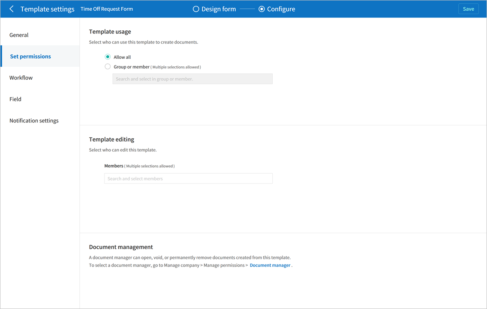

**Template usage**

This permission is needed to create documents from the template, and you can select **Allow all** or **Group or member** to allow all the members or some members in the company to create documents from the template.

**Template editing**

This permission is needed to edit the template, and you can select **Members** to allow editing the template. 

**Document management**

You can select groups or members to open documents created from the template, void completed documents, or remove documents permanently. You can grant permission for all or some of the three options described below.

-  **Open all documents** (default): Default permission granted to a document manager and gives the permission to open all documents to authorized groups or members.

-  **Void documents** (optional): Permission for voiding completed documents when requested by the document creator.

-  **Remove documents** (optional): Permission to permanently remove documents from the system.

.. _workflow_wd:

Workflow Settings
~~~~~~~~~~~~~~~~~~~~~

You can create or modify the workflow of the template by clicking the **Workflow** tab in the **Template settings**\  page.

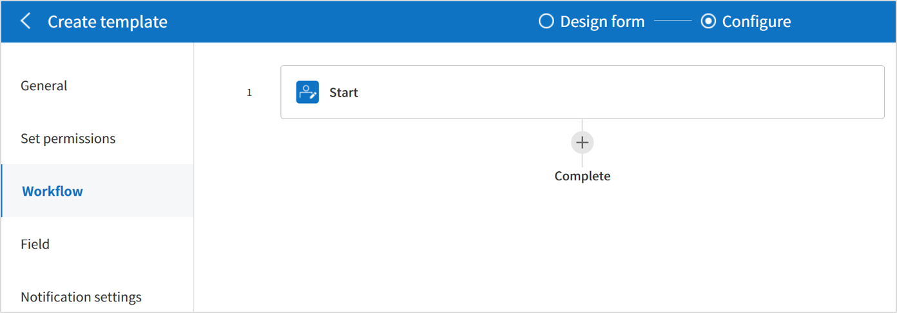

**Adding steps to the workflow**
-----------------------------------------

1. Go to the **Workflow** configuration page by clicking the **Workflow** tab.

2. Click the add button (|image10|) which is in between the **Start** and **Complete** steps.

3. Select the type of recipient you want to add.

   |image11|

.. tip::

   **❗The difference between participant, reviewer, and need to view recipients**

   Participants can sign and fill in the fields in the document while reviewers can only approve or reject the document and Need to view recipients can only view the document.

4. When selected, a step is added to the workflow.

.. tip::

   Participants can be added only in the **Design form** step. Up to 30 participants can be added. In the workflow, you can add as many steps as you want. 
   You can adjust the order of steps by clicking and dragging a workflow step.
   To delete a step, click **-** on the right side of the step button.

   |image12|

.. tip::

  **Merge workflow steps**

   You can merge multiple workflow steps into one so that documents can be sent to all recipients at the same time, regardless of the signing order. You can also split workflow steps that are merged together.

  **Instructions:**

   1. Go to Manage templates > Template settings> Configure > Workflow.

   2. Click the workflow step you want to merge with (when merging two steps, you must click the bottom one).

   3. Click the Merge signing order icon displayed at the top left corner of the selected workflow step. The bottom and top workflow steps will be merged together.

   4. You can also split workflow steps by clicking the same icon.

   .. figure:: resources/merge_workflow_steps.png
      :alt: Merge workflow steps (before)

   .. figure:: resources/merge_workflow_steps2.png
      :alt: Merge workflow steps (after)

   ❗ Note that this feature is available only in New from template. For New from my file, the feature is planned to be available in the future.

**Configuring the details of each workflow step**
----------------------------------------------------------

You can click a step to set the details such as **Properties** for each workflow step.

**Start: Step for creating a document**

+++++++++++++++++++++++++++++++++++++++++++++++

   |image14|

   -  **Limit the number of documents**: Set the maximum number of documents that can be created from the template.

   -  **Create documents from URL**: Create a public link for external recipients (non-members) to review and sign documents directly via URL without the need to login to the eformsign service.

   - **Approved domain IP**: Set to allow creating documents only form approved domains or IPs.

   -  **Do not allow duplicate documents**: Prevent the creation of duplicate documents and allows to select a field for determining whether a document is duplicated or not.

.. tip::

   **How to generate QR code when using the 'Create documents from URL' option**

   When creating a signing link by using the 'Create document form URL' option, you can generate a QR code instead of a signing link.  You can upload the QR code image on a website or share it with others so the people can create and submit documents by scanning the image using the camera on a mobile device.

   Select the **Create documents from URL** option in the Start step of the workflow and click the
   **Generate QR code** button to download the image file.

   
   .. figure:: resources/en-workflow-step-start-QRcode.png
      :alt: Workflow > Generate QR code
      :width: 400px

**Participant: Recipient who can sign or fill out a document**

++++++++++++++++++++++++++++++++++++++++++++++++++++++++++++++++++++++++++++++++++++++

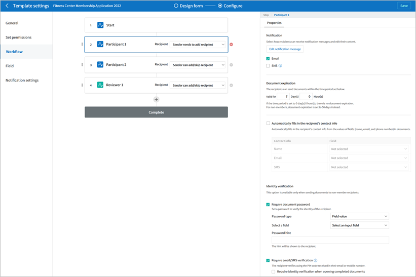

-  **Notification**\: Select how recipients can receive notifications and edit their content. 

   - By default, notifications are sent by email. You can also select SMS to send notifications via text messages.

   - **Edit notification message:** You can edit the notification message for each step.  

-  **Document expiration**\: Set the time period in which documents can be sent by the recipient of the step. If the time period is set to 0 day 0 hour, then there is no document expiration. No document expiration is only available for members.  
   

-  **Automatically fills in the recipient's contact info**\: When sending documents to a recipient, this option allows the name and contact of the recipient to be filled in automatically based on the information the recipient enters into the document.

-  **Identify verification**\: Require non-member recipients to verify their identity when opening the document.   

   - **Require document password**\: Set a verification password that recipients must enter before opening the document. The password can be the recipient name, a value entered directly by the sender, or the value of a field in the document.

            .. figure:: resources/en-doc-require-doc-password-setting.png
               :alt: Require document password
               :width: 400px    
      
   - **Require email/SMS verification**\: Require recipients to verify their identity using email/SMS. A 6-digit code will be sent to recipients' email address/mobile number and the recipients must enter the code in the identity verification window.
      
-  **Hide files or sheets:** Allows you to choose which files/sheets in the document are hidden from the recipient, if the form consists of two or more files. This option cannot be applied to company members.

.. note::

   **Selecting a participant/reviewer/need to view in a workflow step**

   For any given step other than Start and Complete, you can choose to pre-select recipients or choose to allow the sender to select recipients before sending a document.

   .. figure:: resources/en-workflow-participant-selected.png
      :alt: Workflow > Recipients
      :width: 700px   

   -  **Sender can add/skip recipient**: Allows the sender to enter the contact information of the recipients before sending the document. If the sender does not enter the contact information, this step is skipped.

   -  **Sender needs to add recipient**: Requires the sender to enter the contact information of recipients before sending the documents. If the sender does not enter the contact information, the document is not sent.

   -  **Group or member**: Allows you to pre-select recipients. You can only select groups or members in your company.

   -  **Recipient of a previous step**: Allows you to select the person of a previous step including the Start step.

**Reviewer: Recipient who can only approve or reject a document**

+++++++++++++++++++++++++++++++++++++++++++++++++++++++++++++++++++++++++++++

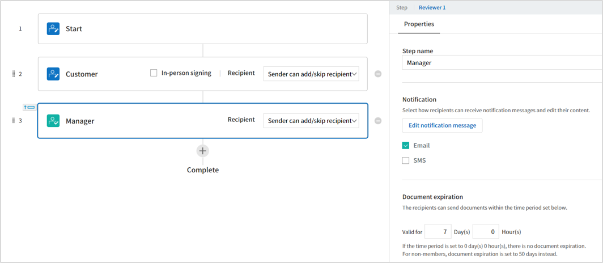

-  **Step name**\: Sets the step name.

-  **Notification**\: Selects how recipients can recive notification messages and edit their content.

   - Edit notification message: Edits the notification messages sent to recipients for each step.

-  **Document expiration**\: Sets the time period for document expiration. If it is set to 0 days and 0 hours, there is no document expiration (applies only to recipients who are members).

.. _hide:

**How to collaborate with other recipients in a workflow step**
^^^^^^^^^^^^^^^^^^^^^^^^^^^^^^^^^^^^^^^^^^^^^^^^^^^^^^^^^^^^^^^^^^^

.. tip::

   
   If you add multiple recipients in a workflow step, all recipients of the step can sign or review the document.

   .. figure:: resources/collaborate_workflow.png
      :alt: All recipients can sign or review the document
      :width: 500px

   However, multiple recipients cannot work on a document simultaneously. Only one recipient can work on a document at a time, and all others are locked out from the document and can only preview it.

   .. figure:: resources/document_locked.png
      :alt: Document locked
      :width: 500px

   Once the recipient working on the document saves it as a draft by clicking the see more button (⋮) and then clicking **Save as draft**, then other recipients can work on the document.

   .. figure:: resources/save_as_draft_collaborate.png
      :alt: Save as draft
      :width: 200px
   

   ❗Note that when there are multiple recipients in a workflow step, if any one of them submits a document, it is sent to the next step in the workflow. Therefore, when you finish working on a document, you should save it as as a draft and only send the document when everyone has finished working on it.

**How to hide files in a document**
^^^^^^^^^^^^^^^^^^^^^^^^^^^^^^^^^^^^^^^^^^^^^^^^^^^^^^^^^^

.. tip::

   
   **Using the 'Hide files or sheets option'**

   If you add multiple files to a document, you can hide certain files from recipients in a workflow step. If you upload multiple files to a document, then the **Hide files or sheets** option appears in the **Properties** tab of workflow steps in **Template settings** where you can choose to hide or show each file.
   

   ❗Note that the 'Hide files or sheets' option is only available when sending a document to non-member recipients.

   **Instructions**

   1. Go to **Sidebar menu  Manage templates**.
   2. Click the **Settings icon (⚙)**\ of the desired template.
   3. Go to **Configure > Workflow**.
   4. Select the desired **recipient** step. 
   5. Select the **Hide files or sheets** option in **Properties** on the right. 
   6. For each file or Excel sheet, select one of the options below.

      - **Required:** The file or sheet is shown to the recipient.

      - **Optional:** The document creator can choose whether to show or hide the file or sheet to the recipient.

      - **Hide:** The file or sheet is hidden from the recipient.

   .. figure:: resources/en-hide-setting.png
      :alt: Hide files or sheets
      :width: 500px

**Complete: Step in which a document is finally completed**

++++++++++++++++++++++++++++++++++++++++++++++++++++++++++++++++++++++

   |image20|

   -  **Step name**\: Change the name of the step. The default name is ‘Complete’.

   -  **Backup completed documents in external cloud storages**: Allow the document to be stored in external cloud storages connected to eformsign by the administrator or company managers.

   -  **Timestamp the document when completed**: Allow the completed document to be timestamped which proves that the document remains unchanged since that time. This feature will incur an extra charge.

.. _field_wd:

Field
~~~~~~~~~~

In the **Field** menu, you can set the default values or auto-fill values for fields in the template, and adjust the order of the fields.

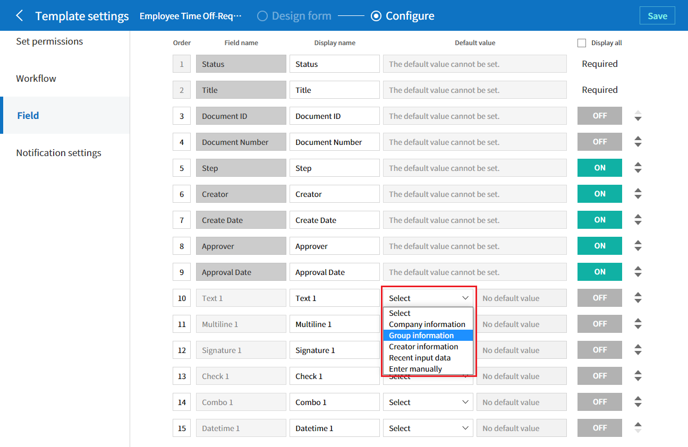

You can set the default value of a field to be the value saved in company/group/member information in **Manage custom fields**. You can also choose it to be the value entered recently or a value entered manually.

.. tip::

   **How to configure auto-fill**

   You can save information that are frequently entered into a document so that they can be used for auto-filling later.

   For example, you can pre-save information about your company or group (such as department name, leader, and representative number) and information about the document creator (including name and contact details). You can add items for related fields and set the default values in **Manage company > Manage custom fields**.

   1. In the **Manage custom fields** screen, add a field.

   2. Go to the **Manage templates** menu.

   3. Click the **Template settings** icon.

   4. Go to the **Field** menu.

   5. Enter the default value for the field that you want to be auto-filled.

   6. After completing all the settings, click the **Save** button.

.. _noti_wd:

Notification Settings
~~~~~~~~~~~~~~~~~~~~~~~~~

You can select the recipients of status notification messages, and view and edit the messages for documents created from the template.

**Document status notifications**

You can select who will receive status notifications for documents created from the template. You can also preview the following notification message types: approved, reviewed and signed, rejected, voided, and corrected. As well, you can edit and preview the notification messages for completed documents.

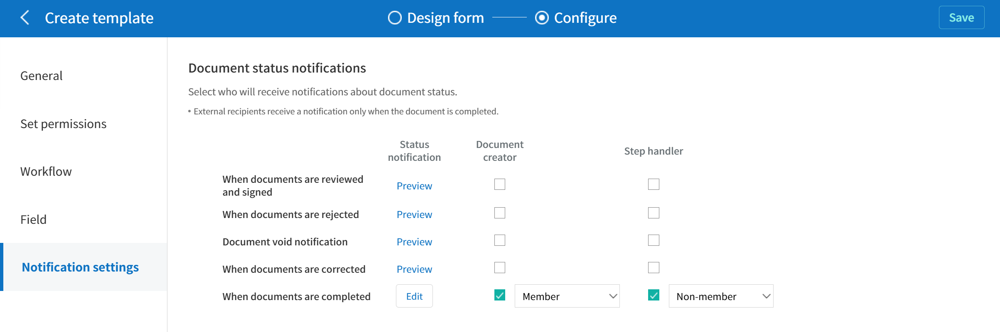

.. note::

   When the **Document creator** option is checked but the **Step handler** option is unchecked, a status notification is sent to the person who originally created the document.

   When the **Document creator** option is unchecked but the **Step handler** option is checked, status notifications are sent to people who have processed the document before the current step, except the document creator.

   When the **Document creator** and **Step handler** options are both checked, status notifications are sent to both the document creator and the people who have processed the document before the current step.

   When the **Document creator** and **Step handler** options are both unchecked, no notifications will be sent for that status.

.. caution::

      ❗When the **Document creator** option for **When the document is completed** is checked and an external recipient creates and submits a document via a URL, the external recipient must enter his/her email in which a notification will be sent to when the document is completed.

**Editing document status notifications**

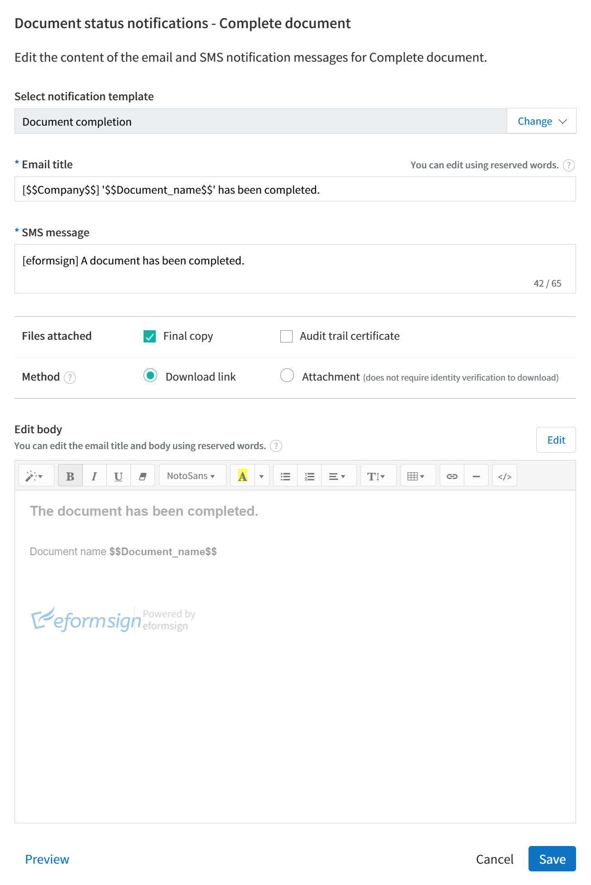

- **Select notification template:** The document status notification template is set to the default template, but you can change it to another template if you create one. For information on how to create a new notification template, refer to `Notification Template Management <chapter9.html#notification-template>`_.  

- **Email title:** Sets the title of the email sent when a document is completed.

- **SMS message:** Sets the message when a document completion notification is sent via SMS. A link for viewing the document is sent together with the message.

.. note::

   The message size can be a maximum of 65 bytes (65 characters).

- **File attachments and methods:** Select the files to be send together with the document completion notification and select the filees to be attached.

   - **Download link:** A download link button is included in the email or SMS of a completed document, and opens a document viewer page when clicked. In the viewer page, you can view and download the document.

   - **Attachment:** PDF file(s) are included in the email. However, if the size of the document exceeds 10 MB or file(s) are sent via SMS, then a download link is included instead. 

   .. caution::

      **Attachment** If you send an email notification using the **Attachment** method, the completed document is included in the email. Therefore, even if is configured to require the recipient to go through identity verification, the recipient can still view and download the document.

- **Edit body:** Edits the body of the notification message.

---------------------------
Menus for Each Template
---------------------------

Go to the **Manage templates** page, click the menu icon (|image24|) right next to the template name to see the menus that can be set for each template.

|image25|

-  **Duplicate**: Duplicates the template. The template's file and
   detailed settings for the template will be duplicated. You will have
   a chance to change and save the detailed settings before the template
   is duplicated.

-  **Delete**: Deletes the template. Once a template is deleted, you can
   no longer create documents from that template.

-  **Deactivate**: When a template is deactivated, it will not be shown
   in the **New from template** page for other members.

-  **Change owner**: You can change the owner of the template. By
   default, the person who created the template is automatically
   assigned as the template owner. If you want to make changes later,
   you can change the owner to another member by clicking this menu. The
   new template owner can be selected among members who have permission
   to manage templates.

   |image26|

-  **Reset document numbering rule**: You can reset the starting serial
   number of the document number. The new starting serial number will be
   applied to all documents created afterwards.

   .. caution::

      Take caution in that two documents with the same document number can be created.

   |image28|

-------------------
Search Templates
-------------------

In the **Manage templates** page, you can lookup and search templates by template category.

|image29|

**① Lookup Templates**
   Click the box **(1)** to lookup templates by template status and category. Click **X** to return to view all categories.

   By default, templates are saved in the Sample category. You can create categories in **Template settings > General.**

**② Search templates**
   You can search templates by entering keywords for the template name and category name.

**③ Sort**
   You can select the template sorting order in ascending or descending by template name or category.

.. |image1| image:: resources/config-icon.PNG
   :width: 20px
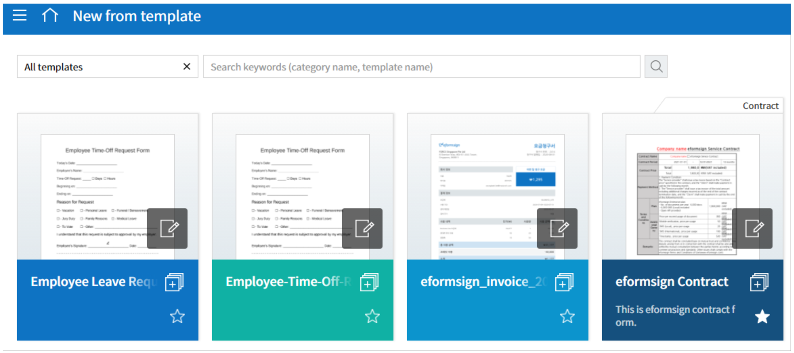
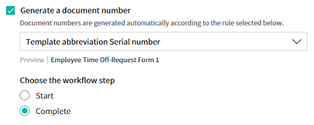
.. |image4| image:: resources/config-icon.PNG
   :width: 20px
.. |image5| image:: resources/config-icon.PNG
   :width: 20px
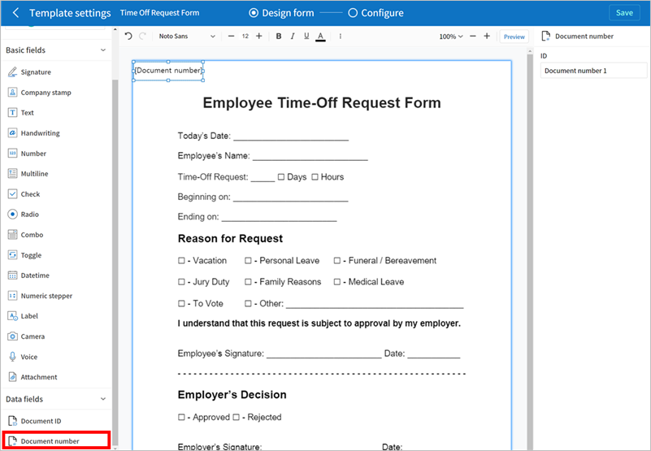
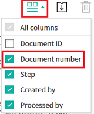
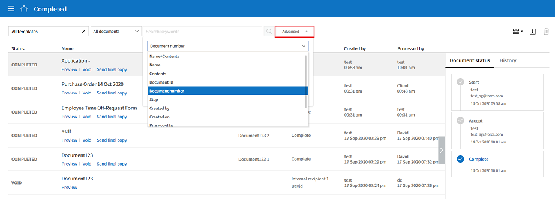
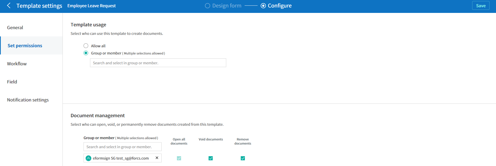
.. |image10| image:: resources/workflow-addstep-plus-button.png
   :width: 20px
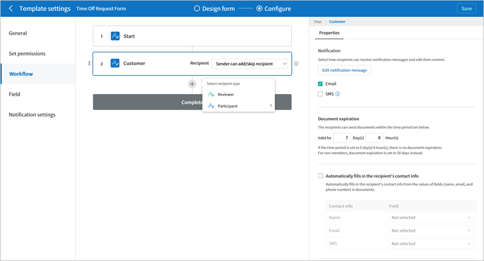
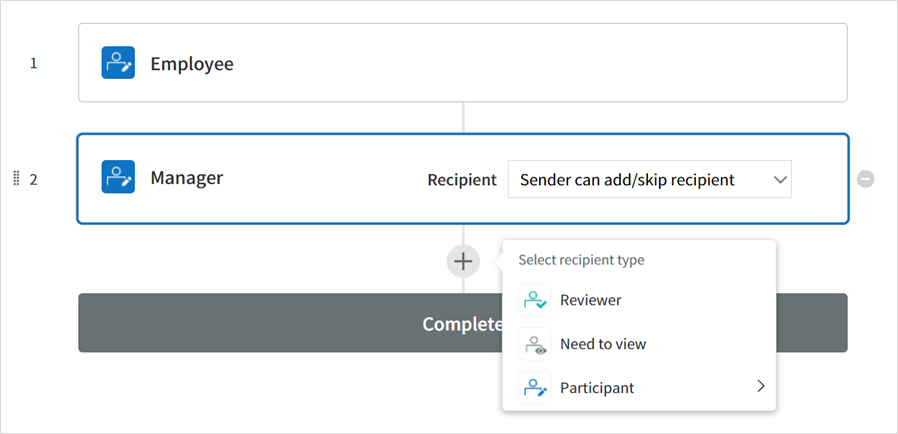
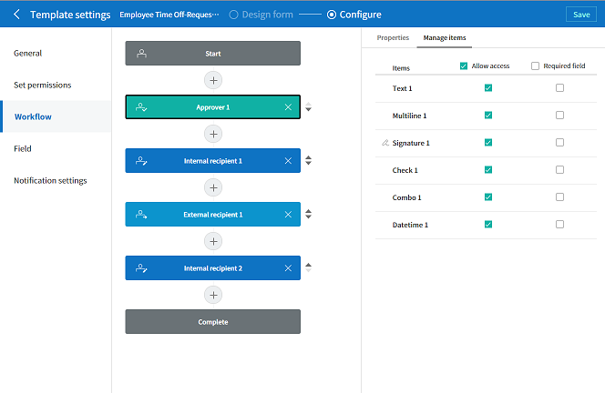
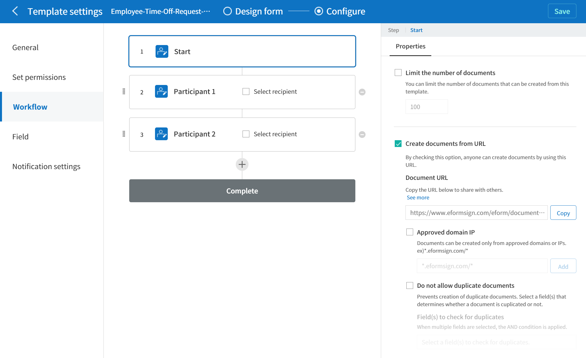
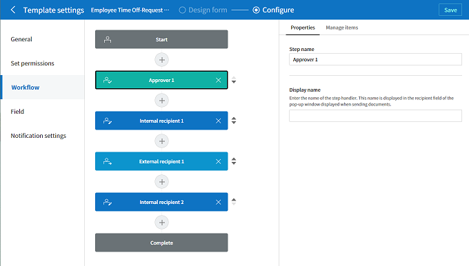
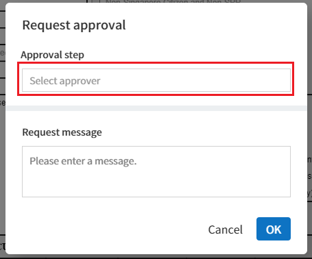
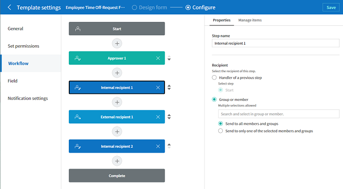
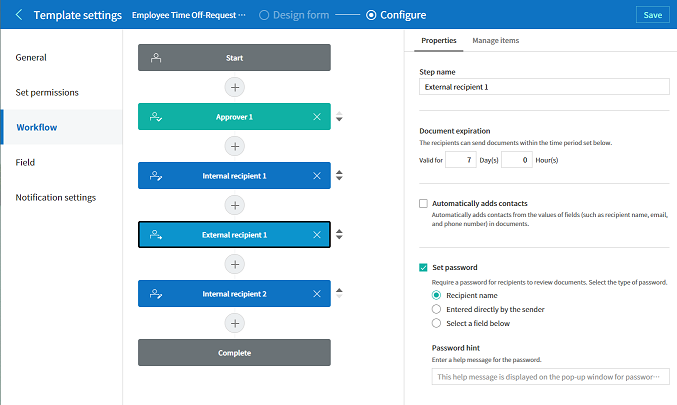
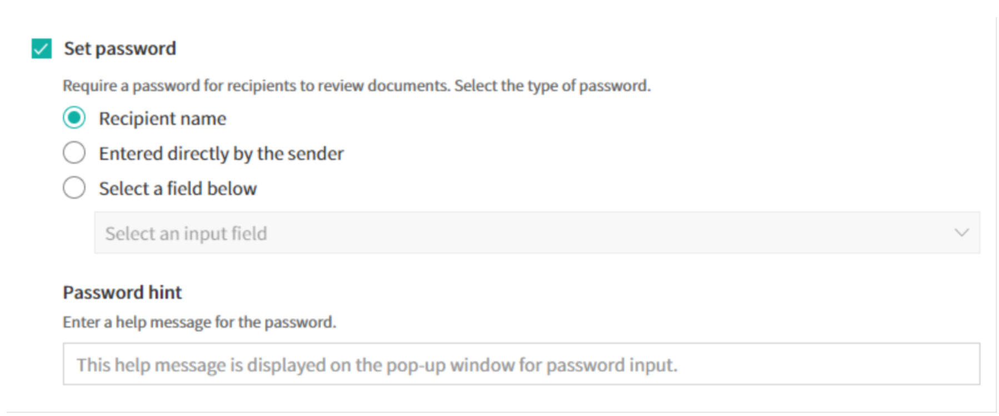
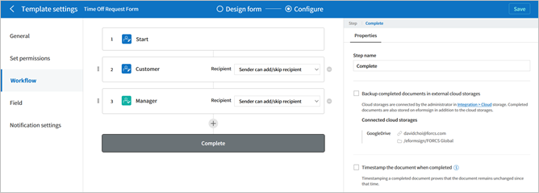
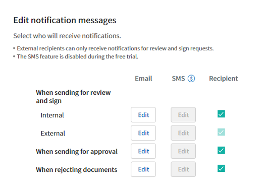
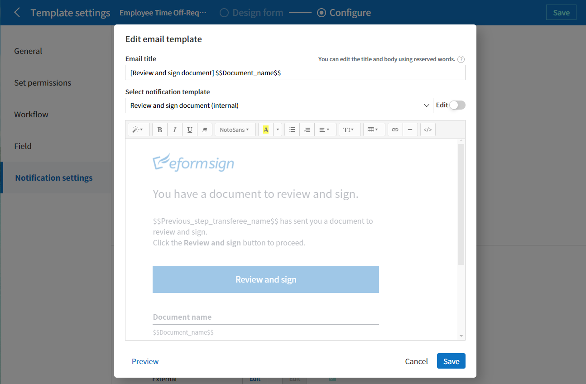
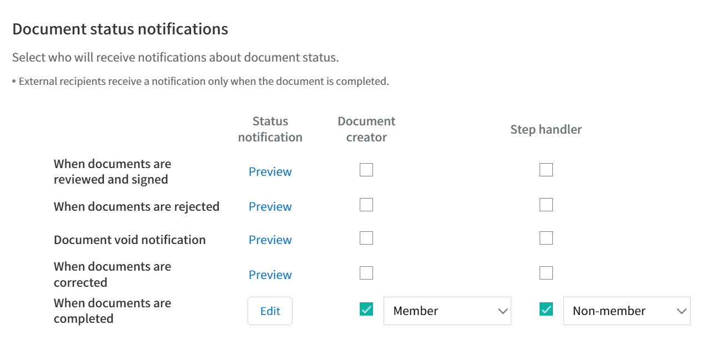
.. |image24| image:: resources/template-hamburgericon.png
   :width: 10px
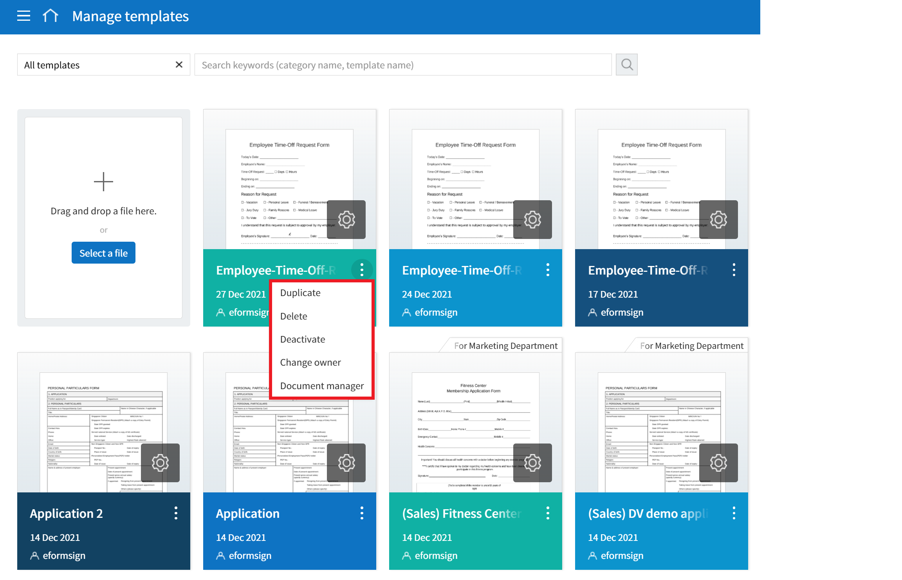
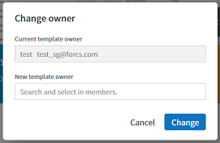
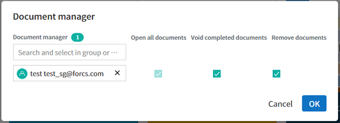
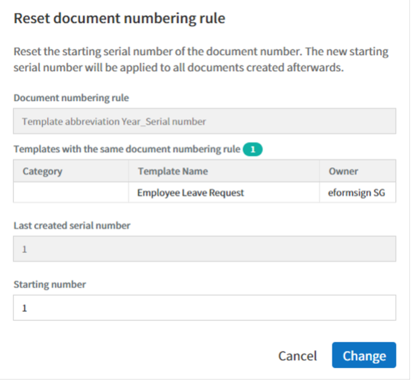
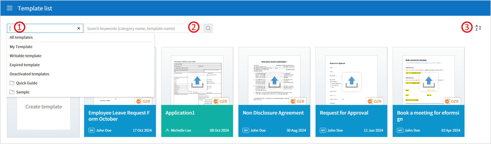
