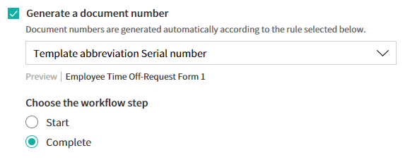
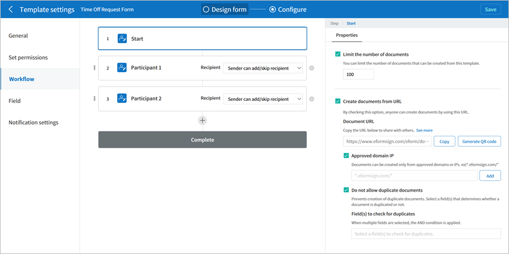

.. _template_wd:

Templates - Web Form Designer
================================

About Templates
------------------

Web form designer Templates Templates are **electronic documents** used for the eformsign service. They are e-documents converted from existing paper forms such as applications, contracts, and agreements. You can create and upload templates in the eformsign service with its Web form designer or Form builder. For more information about Form builder, refer to `Template_Form builder <chapter7.html#template_fb>`__.

Template Overview
~~~~~~~~~~~~~~~~~~~

To create and send electronic documents via eformsign, you have to first create a template, which can later be converted into an e-document.

**How to create a template with Web Form Designer**

You can easily create a template by uploading a file online.

.. note::

   For more information about Web form designer, please refer to `Web Form Designer <chapter4.html#webform>`__.

Convert the file you want into a PDF file and upload it to eformsign Web form designer.

1. Drag and drop the PDF file that you want to create as a template, or click the **Select a file** button to select the file from your computer and upload it.

   .. figure:: resources/managetemplate-upload-en.png
      :alt: Manage Templates > Uploading a File (1)
      :width: 700px

   .. figure:: resources/en-managetemplate-upload-popup.png
      :alt: Manage Templates > Uploading a File (2)
      :width: 700px

2. Select a component that you want to add and drag it onto the uploaded file.

   .. figure:: resources/en-template-settings-wfdesign.png
      :alt: Dragging a Component
      :width: 700px

3. Adjust the size and position of the component.

4. Set the details in the **Properties** tab after clicking the component.

5. View the document by clicking the **Preview** button.

6. Click the **Next** button after you finish designing the form. The **Create template** page will be displayed.

**Template settings**

You can set the details for the template.

-  `General <#general_wd>`__

   Set the template name, abbreviation, document name, document number, etc.

-  `Set permissions <#auth_wd>`__

   Grant members or groups the permission to use the template and to create documents from it and manage them.

-  `Workflow <#workflow_wd>`__

   Sets the workflow for the document from its creation to completion.

-  `Field <#field_wd>`__

   Sets the default values and auto-filled values for fields.

-  `Notification settings <#noti_wd>`__

   Sets the notification channels, recipients, and the content of the notification messages for notifying requests or changes in the status of documents created from the template.

Workflow Overview
~~~~~~~~~~~~~~~~~

A workflow is a document process from its creation to completion.

The workflow for each template can be set by template managers by going to **Template settings** > **Workflow**.

By default, all workflows have **Start** and **Complete** steps. You can add as many **Approver**, **Internal recipient**, and **External recipient** steps as you want for each workflow.

.. figure:: resources/en-workflow-steps.png
   :alt: Workflow Steps

-  **Approver**

   Sending an e-document approval request to a member in your company.

-  **Internal recipient**

   Sending an e-document to a member in your company to review and sign.

-  **External recipient**

   Sending an e-document to a user outside of your company to review and sign.

   .. important::

      **What's the difference between an approval and internal recipient?**

      Both an approver and internal recipient can approve or reject a requested document, but only the internal recipient can designate the next recipient(s) in line in the workflow to process the document.

      In other words, only internal recipients can designate downstream recipients whether it be external recipients, internal recipients, or approvers.

      For example, if you want a recipient in a workflow to have the ability to choose the recipients that come after her/him in the workflow, then you specify her/him as an internal recipient. In this case, when the internal recipient receives a document, then she/he can choose the recipient(s) that come after her/him in the workflow.

Template Settings
-----------------

You can set detailed configurations for each template you create.

.. note::

   Only the **company administrator** or **template manager** can perform this action.

   This action can be performed in web browsers of computers and mobile devices, and also in mobile apps.

1. Go to **Manage templates** in the sidebar menu.

2. Click the name or settings icon (|image1|) of the template you want.

   |image2|

.. _general_wd:

General
~~~~~~~

.. figure:: resources/en-create-template.png
   :alt: Template Settings > General
   :width: 600px

**Configure basic settings for the template**
   Set basic information about the template including the template name, category, validity period, etc.

① Template name
   The template name will be displayed in the **Manage templates** and **New document** pages.

   The recommended length of the template name is about 11 characters, including spaces. If the name is longer than 11 characters, you can see the full name by hovering the mouse over the name

   .. figure:: resources/en-template-name.png
      :alt: Template Name
      :width: 250px

② Template abbreviation
   A short name that briefly descries the template. It is recommended to use two or three words.

   **Template abbreviation** can be used in the document number, document name, mail template, etc. by entering **$$**.

   .. figure:: resources/en-template-name-abb.png
      :alt: Template Abbreviation

③ Category
   Category is used to sort templates by type. With the category name, you can filter templates in the **Manage templates** menu, and can filter documents in the **Documents** menus and the **Manage documents** menu. You can choose from an existing category or create a new category by entering a new name.

   You can set multi-level categories with a separator ( **/** ). For example, if you set a category as **HR Team/Vacation**, the Vacation category in the HR category is created.

④ Description
   Enter additional comments about the template. This description is displayed under the template name in the New document page.

⑤ Template validity period
   Sets the time period in which documents can be created from this
   template. By default, the start date is set to the uploaded date and
   you can change the date.

   When **No expiry date** is checked, documents can be created without
   a time limit. **No expiry date** is unchecked and set the date, the
   document can only be created until the set date.

**Document settings**
   Configure additional settings including document naming rules for
   documents created from the template.

⑥ Document naming rule
   Sets the document name when creating the document from the template.
   If a document naming rule is not set, the template name will be the
   document name.

   You can add reserved words in the document name using **$$** and
   **{{**.

⑦ Allow document name change
   If **Allow document name change** is checked, the document creator
   can change the document name.

⑧ Generate a document number
   If **Generate a document number** is checked, documents are automatically numbered. You can select the document number format and the workflow step in which document numbers are generated.

   |image3|

⑨ Skip pop-up window when sending documents
   Use it when many documents are created and submitted. If this option is unchecked, a pop-up window for entering a message will appear when sending a document. When **Skip pop-up window when sending documents** is checked, the pop-up window does not appear and the page proceeds to the next step.

General > Setting the Document Naming Rule
~~~~~~~~~~~~~~~~~~~~~~~~~~~~~~~~~~~~~~~~~~

In **Template settings**, you can set the document naming rule for documents created from a template.

You can make a piece of information entered into a document or document-related information to be automatically entered into the
document name. If you set the document naming rule, then the document name is automatically entered based on the information of the document. As well, you can see this name in all document pages (In progress, Action required and Completed) and the **Manage document** page.

.. note::

   Only the **Company administrator** or **Template managers** can perform this action.

**How to set the document naming rule**

.. figure:: resources/en-document-naming-rule.png
   :alt: Template Settings > Setting the Document Naming Rule
   :width: 600px

1. In the sidebar menu, click the **Manage templates** menu.

2. Click on the settings icon (|image4|) of the desired template to go to the **Template settings** page.

3.  Enter the desired naming rule in the **Document naming rule** field in the **General** tab.

4. Click the **Save** button on the top right corner to save the changes.

**How to use reserved words Templates Reserved words**

**{{**
   This symbol adds a piece of information in the document into the document name.

   Enter **{{** in the Document naming rule field to display the list of Component IDs and then select the desired component ID. The information in that particular component will be added to the document name.

**$$**
   This symbol adds document-related information into the document name.

   Enter **$$** in the Document naming rule field to display the drop-down menu and then select the desired information.

   +-----------------------+-----------------------------------------------+
   | Information types     | Description                                   |
   +=======================+===============================================+
   | Current_date          | The date in which the document is created     |
   |                       | (e.g. Feb 20, 2020)                           |
   +-----------------------+-----------------------------------------------+
   | Current_time          | The time in which the document is created     |
   |                       | (e.g. 02:59 pm)                               |
   +-----------------------+-----------------------------------------------+
   | Current_datetime      | The date and time in which the document is    |
   |                       | created (e.g. Feb 20, 2020, 02:59 pm)         |
   +-----------------------+-----------------------------------------------+
   | Creator_ID            | The ID of the member who created the document |
   +-----------------------+-----------------------------------------------+
   | Creator_name          | The name of the member who created the        |
   |                       | document                                      |
   +-----------------------+-----------------------------------------------+
   | Creator_dept          | The department of the member who created the  |
   |                       | document                                      |
   +-----------------------+-----------------------------------------------+
   | Creator_company Name  | The name of the company in which the member   |
   |                       | who created the document belongs to           |
   +-----------------------+-----------------------------------------------+
   | Template_name         | The template name entered in Template         |
   |                       | settings > General                            |
   +-----------------------+-----------------------------------------------+
   | Template_abbreviation | The template abbreviation entered in Template |
   |                       | settings > General                            |
   +-----------------------+-----------------------------------------------+
   | Company               | The company name entered in Manage company >  |
   |                       | Company profile                               |
   +-----------------------+-----------------------------------------------+
   | Company_address       | The address entered in Manage company >       |
   |                       | Company profile                               |
   +-----------------------+-----------------------------------------------+
   | Company_contact_no    | The contact information entered in Manage     |
   |                       | company > Company profile                     |
   +-----------------------+-----------------------------------------------+
   | Company_              | The business registration number entered in   |
   | registration_no       | Manage company > Company profile              |
   +-----------------------+-----------------------------------------------+
   | Company_homepage      | The homepage URL entered in Manage company >  |
   |                       | Company profile                               |
   +-----------------------+-----------------------------------------------+

.. tip::

   Check the status of the **Allow document name change** field.

   Even if the document naming rule is set, if the **Allow document name change** option is checked, the document creator can arbitrarily change the document name. If you do not want the document name to be changed, then make sure to uncheck the **Allow document name change** option.

.. figure:: resources/en-allow-document-name-change.png
   :alt: Checking the Allow Document Name Change Option

.. _docnumber_wd:

General > Generating and Viewing a Document Number
~~~~~~~~~~~~~~~~~~~~~~~~~~~~~~~~~~~~~~~~~~~~~~~~~~

You can set a document number for documents created in eformsign. You
can set it so that a document number is generated automatically for each
template, and can select one of four document numbering formats. The
document number can be generated in the document using the document
component. You can also see a separate column in the document list and
search documents by the document number.

**Generating a document number Templates Generate a document number**

.. note::

   Only the **Company administrator** or **Template managers** can perform this action.

.. figure:: resources/en-generate-document-number.png
   :alt: Setting a Document Number
   :width: 600px

1. In the sidebar menu, click the **Manage templates** menu.

2. Click on the settings icon (|image5|) of the desired template to go to the **Template settings** page.

3. Tick the **Generate a document number** checkbox in the **General** page.

   -  **Selecting a document numbering rule**

   .. figure:: resources/en-generate-document-number-select.png
      :alt: Selecting a Document Numbering Rule

   **▪ Serial number**
      Generated in the format of the document creation order

      E.g. 1, 2, 3...

   **▪ Year_serial number**
      Generated in the format of the document creation year + document creation order

      E.g. 2020_1, 2020_2...

   **▪ Template_serial number**
      Generated in the format of the template abbreviation + document creation order

      E.g. Application 1, Application 2...

   **▪ Template_year_serial number**
      Generated in the format of the template abbreviation + document creation year + document creation order

      E.g. Application 2020_1, Application 2020_2...

   -  **Choosing when to number a document**

   ▪ **Start**
      A number is generated when a document is created.

   ▪ **Complete**
      A number is generated when a document has been completed after going through all the steps in the workflow.

4. Click the **Save** button at the top right corner of the page to apply your changes.

**Viewing a document number**

A document number can be viewed directly on a document using the document component and can also be viewed in the document list.

-  **Viewing a document number directly on a document**

   You can generate a document number directly on a document by using the document component.

   1. Upload a PDF file on Web form designer.

   2. Add the document component in the location where the document number will be displayed.

      |image6|

   3. Click the **Next** button to go to the **Template settings.**

   4. In **Template settings > General,** tick the **Generate a document number** checkbox.

   5. Select a document numbering rule.

   6. Click the **Save** button to save the settings.

-  **Viewing a document number in the Completed and Manage documents pages**

   .. figure:: resources/en-completed-document-box-docno.png
      :alt: Completed - Document List
      :width: 700px

   .. figure:: resources/en-completed-document-list-docno-column.png
      :alt: Completed - Document List - Document Number
      :width: 700px

   A document number can be viewed in the Documents menus (In progress, Action required, and Completed), and the Manage documents menu (requires document management permission).

   1. In the sidebar, click the **Completed** or **Manage documents** menu.

   2. Click the column settings icon at the top right corner of the page.

   3. Check **Document number** in the column list.

      |image7|

   4. Check that **the document number** column is added.

-  **Searching for a document using a document number**

   |image8| 

   You can search a document by its document number via advanced search.

   1. Go to the **Completed** or **Manage documents** page.

   2. Click the **Advanced** button at the top right corner of the page.

   3. Select **Document number** among the search conditions.

   4. Type in the word or number to be searched.

   5. View the search results.

.. _auth_wd:

Set Permissions
~~~~~~~~~~~~~~~

You can set the permissions for template usage and document management.

.. figure:: resources/en-template-settings-permissions.png
   :alt: Template Settings > Set Permissions
   :width: 700px

**Template usage**

This permission is needed to create documents from the template, and you can select **Allow all** or **Group or member** to allow all the members or some members in the company to create documents from the template.

**Document management**

You can select groups or members to open documents created from the template, void completed documents, or remove documents
permanently. You can grant permission for all or some of the three options described below.

-  **Open all documents** (default): Default permission granted to a document manager and gives the permission to open all documents to authorized groups or members.

-  **Void completed documents** (optional): Permission for voiding completed documents when requested by the document creator.

-  **Remove documents** (optional): Permission to permanently remove documents from the system.

   |image9|

.. _workflow_wd:

Workflow Settings
~~~~~~~~~~~~~~~~~

You can create or modify the workflow of the template by clicking the **Workflow** tab in the **Template settings**\ page.

**Adding steps to the workflow**

1. Go to the **Workflow** configuration page by clicking the **Workflow** tab.

2. Click the add button (|image10|) which is in between the **Start** and **Complete** steps.

3. Select the type of recipient you want to add.

   |image11|

4. When selected, a step is added to the workflow.

.. tip::

   You can add as many steps as you want. You can adjust the order of steps by clicking the arrow next to a workflow step.

   To delete a step, click **X** on the right side of the step button.

   |image12|

**Configuring the details of each workflow step**

You can click a step to set the details such as **Properties** and **Manage items** for each workflow step.

-  In **Properties**, you configure the details of the step including the step name and recipients.

-  In **Manage items**, you can set the fields in which the recipient has access to or is required to fill in.

   |image13|

**Start: Step for creating a document**
   |image14|

   -  **Step name**: Change the name of the step. The default name is 'Start'.

   -  **Limit the number of documents**: Set the maximum number of documents that can be created from the template.

   -  **Create documents from URL**: Create a public link for external recipients (non-members) to review and sign documents directly via URL without the need to login to the eformsign service.

   -  **Do not allow duplicate documents**: Prevent the creation of duplicate documents and allows to select a field for determining whether a document is duplicated or not.

**Approver: Step for requesting a document for approval**
   |image15|

   -  **Display name**: Set the text to be displayed in the text box when requesting a document for approval. If you do not enter it, the default text will appear as shown below.

      |image16|

**Internal recipient (member): Step for requesting a document to be reviewed and signed by internal members of your company**
   |image17|

   -  **Recipient**: Select the member that will receive the document in this step.

      -  **Handler of a previous step**: Select an internal recipient
         that will receive the document. You can choose an internal
         recipient from one of the previous internal recipient steps in
         the workflow or the document creator in the Start step.

      -  **Group and member**: Select the groups or members in your
         company that will receive the document. You can select multiple
         groups or members.

**External recipient: Step for requesting a document to be reviewed and signed by external users (recipients who are not members of your company)**
   |image18|

   -  **Document expiration**: Set the time period in which documents
      can be sent to external users using this URL.

   -  **Automatically adds contacts**: When sending documents to an
      external recipient, this option allows the name and contact of the
      external recipient to be added automatically based on the
      information the external recipient enters into the document.

   -  **Set password**: Set a verification password that external
      recipients must enter when viewing the document. The password can
      be the recipient name, a value entered directly by the sender, or
      a field in the document.

   -  **Password hint**: Set the help message that will be displayed
      when an external recipient enters a password to view the document.

      |image19|

   -  **Require mobile verification to review documents:** Require
      external recipients to verify identity using mobile to open the
      document. This feature will incur an extra charge.

      .. note::

         The **Require mobile verification to review documents** feature is available in Korea only.

**Complete: Step in which a document is finally completed**
   |image20|

   -  **Backup completed documents in external cloud storages**: Allow the document to be stored in external cloud storages connected to eformsign by the administrator or company managers.

   -  **Timestamp the document when completed**: Allow the completed document to be timestamped which proves that the document remains unchanged since that time. This feature will incur an extra charge.

.. _field_wd:

Field
~~~~~

In the **Field** menu, you can set the default values or auto-fill values for fields in the template, and adjust the order of
the fields.

.. figure:: resources/en-template-settings-field.png
   :alt: Template Settings > Field
   :width: 700px

You can set the default value of a field to be the value saved in company/group/member information in **Manage custom fields**. You can also choose it to be the value entered recently or a value entered manually.

**How to configure auto-fill**

You can save information that are frequently entered into a document so that they can be used for auto-filling later.

For example, you can pre-save information about your company or group
(such as department name, leader, and representative number) and
information about the document creator (including name and contact
details). You can add items for related fields and set the default
values in **Manage company > Manage custom fields**.

1. In the **Manage custom fields** screen\ **,** add a field.

2. Go to the **Manage templates** menu.

3. Click the **Template settings** icon.

4. Go to the **Field** menu.

5. Enter the default value for the field that you want to be auto-filled.

6. After completing all the settings, click the **Save** button.

.. _noti_wd:

Notification Settings
~~~~~~~~~~~~~~~~~~~~~

You can select the method to send request or status notification message to recipients, view and edit the messages
for documents created from the template.

**Notification methods**

Select the methods for sending notification messages to internal and external recipients. You can select either email\ **,** SMS, or both.

.. note::

   **SMS** can only be selected by a company subscribed a paid plan.
   Extra charges will apply.

When SMS is selected, **Send via SMS** and **Send via SMS if failed to send via KakaoTalk** are enabled.

-  **Send SMS**: Send notifications to recipients via SMS.

-  **Send via KakaoTalk and if fails, send via SMS**: Send notifications via KakaoTalk for recipients who use KakaoTalk and via SMS for recipients who do not use KakaoTalk.

**Edit notification messages**

You can view and edit notification messages to be sent to recipients when sending documents created from the template. You can find the default notification messages in the **Manage company > Notification template management** page and can edit them by clicking the **Edit** button.

.. note::

   SMS templates can only be edited by companies subscribed a paid plan.

|image21|

|image22|

-  **When sending for review and sign > Internal**: You can edit the
   notification messages to be sent to internal recipients when sending
   a document to be reviewed and signed.

-  **When sending for review and sign > External**: You can edit
   notification messages to be sent to external recipients when sending
   a document to be reviewed and signed.

-  **When sending for approval**: You can edit the notification messages
   to be sent to approvers when sending an approval request.

-  **When rejecting documents**: You can edit the notification messages
   to be sent to document senders when a document is rejected by
   approvers, internal recipients, or external recipients.

**Document status notifications**

You can select who will receive status notifications for documents
created from the template. You can also preview the following
notification message types: approved, reviewed and signed, rejected,
voided, and corrected. As well, you can edit and preview the
notification messages for completed documents.

.. note::

   For notifications sent when documents are rejected, voided, or corrected, only email templates are provided and they are not sent via SMS. Also, SMS templates for document completion notifications (internal/external) can only be edited by companies subscribed a paid plan.

|image23|

.. note::

   When the **Document creator** option is checked but the **Step
   handler** option is unchecked, a status notification is sent to the
   person who originally created the document.

   When the **Document creator** option is unchecked but the **Step
   handler** option is checked, status notifications are sent to people
   who have processed the document before the current step, except the
   document creator.

   When the **Document creator** and **Step handler** options are both
   checked, status notifications are sent to both the document creator
   and the people who have processed the document before the current
   step.

   When the **Document creator** and **Step handler** options are both
   unchecked, no notifications will be sent for that status.

-  **When documents are approved**: When the document is approved by an
   approver, a notification will be sent stating that the document has
   been approved.

-  **When documents are reviewed and signed**: When the document is
   reviewed and signed by internal or external recipients, a
   notification will be sent stating that the document has been reviewed
   and signed.

-  **When documents are rejected**: When the document is rejected by an
   approver, internal or external recipients, a notification will be
   sent stating that the document has been rejected.

-  **Document void notification**: When a request for voiding a document
   is approved, a notification will be sent stating that the document
   has been voided.

-  **When documents are corrected**: When the document is corrected by a
   document creator, a notification will be sent stating that the
   document has been corrected.

-  **When documents are completed > Internal**: When the document is
   completed, a notification will be sent to the document creator,
   approvers, and internal recipients stating that the document has been
   completed.

-  **When documents are completed > External**: When the document is
   completed, a notification will be sent to external recipients stating
   that the document has been completed.

   .. note::

      When the **Document creator** option for **When the document is completed > External** is checked and an external recipient
      creates and submits a document via a URL, the external recipient must enter his/her email in which a notification will be sent to when the document is completed.

Menus for Each Template
-----------------------

Go to the **Manage templates** page, click the menu icon (|image24|) right next to the template name to see the menus that can be set for each template.

|image25|

-  **Duplicate**: Duplicates the template. The template's file and
   detailed settings for the template will be duplicated. You will have
   a chance to change and save the detailed settings before the template
   is duplicated.

-  **Delete**: Deletes the template. Once a template is deleted, you can
   no longer create documents from that template.

-  **Deactivate**: When a template is deactivated, it will not be shown
   in the **New document** page for other members.

-  **Change owner**: You can change the owner of the template. By
   default, the person who created the template is automatically
   assigned as the template owner. If you want to make changes later,
   you can change the owner to another member by clicking this menu. The
   new template owner can be selected among members who have permission
   to manage templates.

   |image26|

-  **Document Manager:** You can select the members or groups that can
   manage documents created from the template. You can also select
   document managers in **Template settings > Set permissions.**

   |image27|

-  **Reset document numbering rule**: You can reset the starting serial
   number of the document number. The new starting serial number will be
   applied to all documents created afterwards.

   .. caution::

      Take caution in that two documents with the same document number can be created.

   |image28|

Search Templates
----------------

In the **Manage templates** page, you can lookup and search templates by template category.

|image29|

**① Lookup Templates**
   Click the box **(1)** to lookup templates by template status and category. Click **X** to return to view all categories.

   By default, templates are saved in the Sample category. You can create categories in **Template settings > General.**

**② Search templates**
   You can search templates by entering keywords for the template name and category name.

**③ Sort**
   You can select the template sorting order in ascending or descending by template name or category.

.. |image1| image:: resources/config-icon.PNG
.. |image2| image:: resources/template-settings.png
   :width: 700px

.. |image4| image:: resources/config-icon.PNG
.. |image5| image:: resources/config-icon.PNG

.. |image7| image:: resources/en-document-number-list.png
.. |image8| image:: resources/en-manage-template-search-advanced.png
   :width: 700px

.. |image10| image:: resources/workflow-addstep-plus-button.png
.. |image11| image:: resources/en-template-settings-workflow-add-step.png
   :width: 700px
.. |image12| image:: resources/en-template-settings-workflow-order.png
   :width: 500px
.. |image13| image:: resources/en-template-settings-workflow-item.png
   :width: 700px

.. |image16| image:: resources/en-template-settings-approver-display-name.png
   :width: 250px
.. |image17| image:: resources/en-template-settings-workflow-internal.png
   :width: 700px

.. |image19| image:: resources/workflow-step-external-recipient-property-pw.png
   :width: 400px
.. |image20| image:: resources/en-template-settings-workflow-complete.png
   :width: 700px
.. |image21| image:: resources/en-template-settings-edit-notification-messages.png
   :width: 400px

.. |image23| image:: resources/en-template-settings-notification-status.png
   :width: 500px
.. |image24| image:: resources/template-hamburgericon.png
.. |image25| image:: resources/en-manage-template-menu-icon-wd.png
   :width: 700px

.. |image27| image:: resources/en-manage-template-menu-icon-document-manager.png

.. |image29| image:: resources/en-manage-template-search.png
   :width: 700px
