.. _template_fb:

==========================================
Creating templates using Form Builder
==========================================

----------------
About Templates
----------------

Templates are **electronic documents** used for the eformsign service. They are e-documents transformed from existing
paper forms such as applications, contracts, and agreements. You can create and upload templates in the eformsign service with its **Web form designer** or **Form builder**. 

.. tip::

   Using Templates is useful for documents that need to be sent often or regularly. If the tempate is registered once, you don't have to upload the document file whenever you need to sent the document. You can just easily create and sent documents using the template. 

.. note::

   For more information about Web form designer, please refer to `Creating templates using Web Form Designer <chapter6.html#template_wd>`__.

To create and send electronic documents via eformsign, you have to create a template first which can be transformed into an e-document.

**How to create a template with Form Builder**
~~~~~~~~~~~~~~~~~~~~~~~~~~~~~~~~~~~~~~~~~~~~~~~~~~~~

To create a template with Form builder, you must first download eformsign Form builder.

.. note::

   For more information about Form builder, please refer to `Form builder <chapter5.html#formbuilder>`__.

MS Office files such as Word, Excel, and PowerPoint can be uploaded as a template using eformsign Form builder.

1. Open a Word, Excel, or PowerPoint file.

2. Go to the **OZ in Word/Excel/PowerPoint** menu in the file.

3. Choose a location you want to add a component.

4. Select a component type.

5. Adjust the size and position of the component.

6. Click the **Execute** button to preview the component.

7. Click the **Upload** button to upload the file as a template.

8. Click **Create template** and set details for the template.

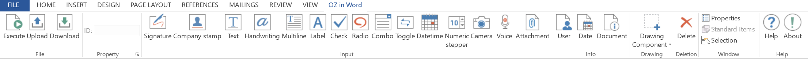

**Template settings**

You can set the details for the template.

-  `General <#general_fb>`__

   Set the template name, abbreviation, document name, document number, etc.

-  `Set permissions <#auth_fb>`__

   Grant members or groups the permission to use and edit the template and to create documents from it and manage them.

-  `Workflow <#workflow_fb>`__

   Sets the workflow for the document from its creation to completion.

-  `Field <#field_fb>`__

   Sets the default values and auto-filled values for fields.

-  `Notification settings <#noti_fb>`__

   Sets the recipients, and the content of the notification messages for notifying changes in the status of documents created from the template.

.. _workflow:

--------------------
Workflow Overview
--------------------

A **workflow** is a document process from its creation to completion.

The workflow for each template can be set by template managers by going to **Template settings** > **Workflow**.

By default, all workflows have **Start** and **Complete** steps. You can add as many **Reviewer**, and **Participant** steps as you want for each workflow.

.. figure:: resources/en-workflow-steps.png
   :alt: Workflow steps
   :width: 400px

-  **Reviewer**

   Approves or rejects documents.

-  **Participant**

   Signs and fills in documents.

.. _template_setting:

-------------------
Template Settings
-------------------

You can set detailed configurations for each template you create.

.. note::

   Only the **Company administrator** or **Template managers** can perform this action.

   This action can be performed in web browsers of computers and mobile devices, and also in mobile apps.

**How to go to the template settings screen**

1. In the sidebar menu, click the **Manage templates** menu.

2. Click the name or settings icon (|image1|) of the desired template.

   |image2|

.. _general_fb:

General
~~~~~~~~

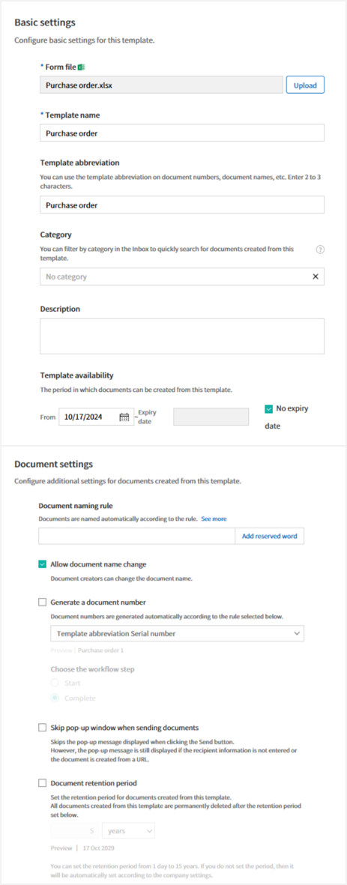

**Configure basic settings for the template**
----------------------------------------------------

Set basic information about the template including the template name, category, validity period, etc.

**① Form file**
   The name of the form file which is uploaded to eformsign from Word, PowerPoint, or Excel using Form Builder. To change the form file name, you need to change the file name of the uploaded Word, PowerPoint, or Excel file and then update it.

**② Template name**
   The template name will be displayed in the **Manage templates** and **New from template** pages.

   The recommended length of the template name is about 11 characters, including spaces. If the name is longer than 11 characters, you can see the full name by hovering the mouse over the name.

   .. figure:: resources/en-template-name.png
      :alt: Template Name
      :width: 250px

**③ Template abbreviation**
   A short name that briefly descries the template. It is recommended to use two or three words.

   **Template abbreviation** can be used in the document number, document name, mail template, etc.

   .. figure:: resources/en-manage-template-settings-document-naming-abb.png
      :alt: Template Abbreviation

**④ Category**
   Category is used to sort templates by type. With the category name, you can filter templates in the **Manage templates** menu, and can filter documents in the **Documents** menus and the **Manage documents** menu. You can choose from an existing category or create a new category by entering a new name.

   You can set multi-level categories with a separator ( **/** ). For example, if you set a category as **HR Team/Vacation**, the Vacation category in the HR category is created.

**⑤ Description**
   Enter additional comments about the template. This description is displayed under the template name in the **New from template.**

**⑥ Template validity period**
   Sets the time period in which documents can be created from this template. By default, the start date is set to the uploaded date and you can change the date.

   When **No expiry date** is checked, documents can be created without a time limit. If you check **No expiry date**, documents can be created without a time limit. If you uncheck it and set the date, then documents can be created from the template up to that date.

**Document settings**
----------------------------------

Configure additional settings including document naming rules for documents created from the template.

**⑦ Document naming rule**
   Sets the document name when creating the document from the template. If a document naming rule is not set, the template name will be the document name.

**⑧ Allow document name change**
   If **Allow document name change** is checked, the document creator can change the document name.

**⑨ Generate a document number**
   If **Generate a document number** is checked, documents are automatically numbered. You can select the document number format and the workflow step in which document numbers are generated.

   |image3|

**⑩ Skip pop-up window when sending documents**
   Use it when many documents are created and submitted. If this option is unchecked, a pop-up window for entering a message will appear when sending a document. When **Skip pop-up window when sending documents** is checked, the pop-up window does not appear and the page proceeds to the next step.

-------------------

.. _document_naming:

General > Setting the Document Naming Rule
~~~~~~~~~~~~~~~~~~~~~~~~~~~~~~~~~~~~~~~~~~~~

In **Template settings**, you can set the document naming rule for documents created from a template.

You can make a piece of information entered into a document or document-related information to be automatically entered into the document name. If you set the document naming rule, then the document name is automatically entered based on the information of the document.
As well, you can see this name in all document pages (In progress, Action required and Completed) and the **Manage document** page.

.. note::

   Only the **Company administrator** or **Template managers** can perform this action.

.. figure:: resources/en-manage-documents-document-list.png
   :alt: Manage Documents > Documents List
   :width: 700px

**How to set the document naming rule**

+++++++++++++++++++++++++++++++++++++++++++++++++++++++

.. figure:: resources/en-document-naming-rule.png
   :alt: Template Settings > Setting the Document Naming Rule
   :width: 600px

1. In the sidebar menu, click the **Manage templates** menu.

2. Click on the settings icon (|image4|) of the desired template to go to the **Template settings** page.

3. Enter the desired naming rule in the **Document naming rule** field in the **General** tab by adding reserved words.

4. Click the **Save** button on the top right corner to save the changes.

.. _reserved_words:

**How to use reserved words Templates**
++++++++++++++++++++++++++++++++++++++++++++++++++++++++++++

.. figure:: resources/en-document-naming-rule-reserved.png
   :alt: Setting Document Naming Rules Using Reserved Words

-  **Component ID**\ : Adds a piece of information in the document into the document name.

   Click the **Add reserved word** button, and click **Component ID**\  to display the list of Component IDs and then select the desired component ID. The information in that particular component will be added to the document name.

-  **General info**\ : Adds document-related information into the document name.

   Click **General info**\  to display the list of information type and then select the desired information. Information types are as follows.

   +-----------------------+-----------------------------------------------+
   | Information types     | Description                                   |
   +=======================+===============================================+
   | Current_date          | The date in which the document is created     |
   |                       | (e.g. Feb 20, 2020)                           |
   +-----------------------+-----------------------------------------------+
   | Current_time          | The time in which the document is created     |
   |                       | (e.g. 02:59 pm)                               |
   +-----------------------+-----------------------------------------------+
   | Current_datetime      | The date and time in which the document is    |
   |                       | created (e.g. Feb 20, 2020, 02:59 pm)         |
   +-----------------------+-----------------------------------------------+
   | Creator_ID            | The ID of the member who created the document |
   +-----------------------+-----------------------------------------------+
   | Creator_name          | The name of the member who created the        |
   |                       | document                                      |
   +-----------------------+-----------------------------------------------+
   | Creator_dept          | The department of the member who created the  |
   |                       | document                                      |
   +-----------------------+-----------------------------------------------+
   | Creator_company Name  | The name of the company in which the member   |
   |                       | who created the document belongs to           |
   +-----------------------+-----------------------------------------------+
   | Template_name         | The template name entered in Template         |
   |                       | settings > General                            |
   +-----------------------+-----------------------------------------------+
   | Template_abbreviation | The template abbreviation entered in Template |
   |                       | settings > General                            |
   +-----------------------+-----------------------------------------------+
   | Company               | The company name entered in Manage company >  |
   |                       | Company profile                               |
   +-----------------------+-----------------------------------------------+
   | Company_address       | The address entered in Manage company >       |
   |                       | Company profile                               |
   +-----------------------+-----------------------------------------------+
   | Company_contact_no    | The contact information entered in Manage     |
   |                       | company > Company profile                     |
   +-----------------------+-----------------------------------------------+
   | Company_              | The business registration number entered in   |
   | registration_no       | Manage company > Company profile              |
   +-----------------------+-----------------------------------------------+
   | Company_homepage      | The homepage URL entered in Manage company >  |
   |                       | Company profile                               |
   +-----------------------+-----------------------------------------------+

.. tip::

   Check the status of the **Allow document name change** field.

   Even if the document naming rule is set, if the **Allow document name change** option is checked, the document creator can arbitrarily change the document name. If you do not want the document name to be changed, then make sure to uncheck the **Allow document name change** option.

.. figure:: resources/en-allow-document-name-change.png
   :alt: Checking the Allow Document Name Change Option

.. _docnumber_fb:

General > Generating and Viewing a Document Number
~~~~~~~~~~~~~~~~~~~~~~~~~~~~~~~~~~~~~~~~~~~~~~~~~~~

You can set a document number for documents created in eformsign. You can set it so that a document number is generated automatically for each template, and can select one of four document numbering formats. The document number can be generated in the document using the document component. You can also see a separate column in the document list and search documents by the document number.

**Generating a document number**
^^^^^^^^^^^^^^^^^^^^^^^^^^^^^^^^^^^^^^^^

.. figure:: resources/en-generate-document-number.png
   :alt: Setting a Document Number
   :width: 600px

1. In the sidebar menu, click the **Manage templates** menu.

2. Click on the settings icon (|image5|) of the desired template to go to the **Template settings** page.

3. Tick the **Generate a document number** checkbox in the **General** page.

   -  **Selecting a document numbering rule**

   .. figure:: resources/en-generate-document-number-select.png
      :alt: Selecting a Document Numbering Rule

   **▪ Serial number**
      Generated in the format of the document creation order

      E.g. 1, 2, 3...

   **▪ Year_serial number**
      Generated in the format of the document creation year + document creation order

      E.g. 2020_1, 2020_2...

   **▪ Template_serial number**
      Generated in the format of the template abbreviation + document creation order

      E.g. Application 1, Application 2...

   **▪ Template_year_serial number**
      Generated in the format of the template abbreviation + document creation year + document creation order

      E.g. Application 2020_1, Application 2020_2...

   -  **Choosing when to numbered a document**

   ▪ **Start**
      A number is generated when a document is created.

   ▪ **Complete**
      A number is generated when a document has been completed after going through all the steps in the workflow.

4. Click the **Save** button at the top right corner of the page to apply your changes.

**Viewing a document number**
^^^^^^^^^^^^^^^^^^^^^^^^^^^^^^^^^^^^^

A document number can be viewed directly on a document using the document component and can also be viewed in the document list.

-  **Viewing a document number directly on a document**

   You can generate a document number directly on a document by using the document component in Form builder.

   1. Open a file in Word, Excel, or PowerPoint.

   2. Add the document component in the location where the document number will be displayed.

   3. Click the **Upload** button to upload the file on eformsign.

   4. In **Template settings > General,** tick the **Generate a document number** checkbox.

   5. Select a document numbering rule.

   6. Click the **Save** button to save the settings.

-  **Viewing a document number in the document list**

   .. figure:: resources/en-completed-document-box-docno.png
      :alt: Completed - Document List
      :width: 700px

   .. figure:: resources/en-completed-document-list-docno-column.png
      :alt: Completed - Document List - Document Number
      :width: 700px

   A document number can be viewed in the Documents menus (In progress, Action required, and Completed), and the Manage documents menu (requires document management permission).

   1. In the sidebar, click the **Completed** or **Manage documents** menu.

   2. Click the column settings icon at the top right corner of the page.

   3. Check **Document number** in the column list.

      |image6|

   4. Check that **the document number** column is added.

-  **Searching for a document using a document number**

   |image7|

   You can search a document by its document number via advanced search.

   1. Go to the **Completed** or **Manage documents** page.

   2. Click the **Advanced** button at the top right corner of the page.

   3. Select **Document number** among the search conditions.

   4. Type in the word or number to be searched.

   5. View the search results.

.. _auth_fb:

Set Permissions
~~~~~~~~~~~~~~~~~~~~~~~~~~~~

You can set the permissions for the template usage, template editing and document management.

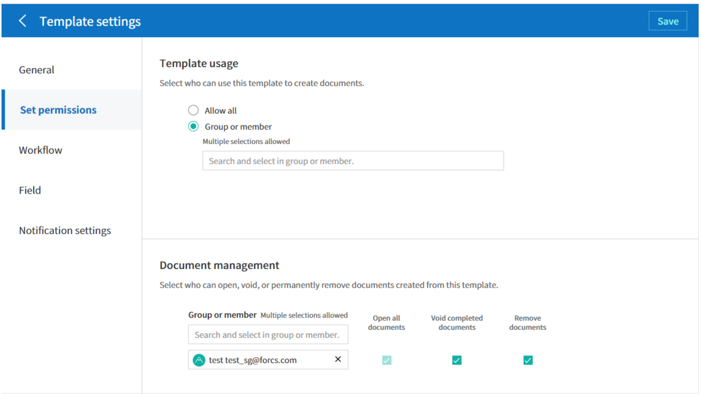

**Template usage**

This permission is needed to create documents from the template, and you can select **Allow all** or **Group or member** to allow all the members or some members in the company to create documents from the template.

**Template editing**

This permission is needed to edit the template, and you can select **Members** to allow editing the template. 

**Document management**

You can select groups or members to open documents created from the template, void completed documents, or remove documents permanently. You can grant permission for all or some of the three options described below.

-  **Open all documents** (default): Default permission granted to a document manager and gives the permission to open all documents to authorized groups or members.

-  **Void documents** (optional): Permission for voiding completed documents when requested by the document creator.

-  **Remove documents** (optional): Permission to permanently remove documents from the system.

.. _workflow_fb:

Workflow Settings
~~~~~~~~~~~~~~~~~

You can create or modify the workflow of the template by clicking the **Workflow** tab in the **Template settings** page.

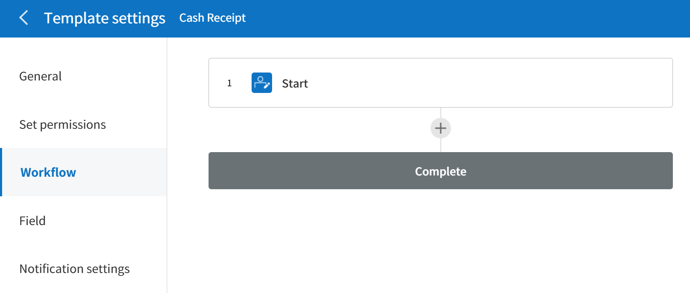

**Adding steps to the workflow**
-----------------------------------------

1. Go to the **Workflow** configuration page by clicking the **Workflow** tab.

2. Click the add button (|image8|) which is in between the **Start** and **Complete** steps.

3. Select the type of recipient which you want to add.

   |image9|

   .. tip::

      You can add as many steps as you want. You can adjust the order of steps by clicking and dragging a workflow step.
      To delete a step, click **-** on the right side of the step button.

**Configuring the details of each workflow step**
------------------------------------------------------

You can click a step to set the details such as **Properties** and **Manage items** for each workflow step.

-  In **Properties**, you can configure the details of the step including the step name and recipients.

-  In **Manage items**, you can set the fields in which the recipient has access to or is required to fill in.

   |image11|

**Start: Step for creating a document**

++++++++++++++++++++++++++++++++++++++++++++++++++++++++

   |image12|

   -  **Step name**: Change the name of the step. The default name is 'Start'.

   -  **Limit the number of documents**: Set the maximum number of documents that can be created from the template.

   -  **Create documents from URL**: Create a public link for external recipients (non-members) to review and sign documents directly via URL without the need to login to the eformsign service.

   - **Approved domain IP**: Set to allow creating documents only form approved domains or IPs.

   -  **Do not allow duplicate documents**: Prevent the creation of duplicate documents and allows to select a field for determining whether a document is duplicated or not.

**Recipient: Step for participating in a document such as signing, or filling in the document**

++++++++++++++++++++++++++++++++++++++++++++++++++++++++++++++++++++

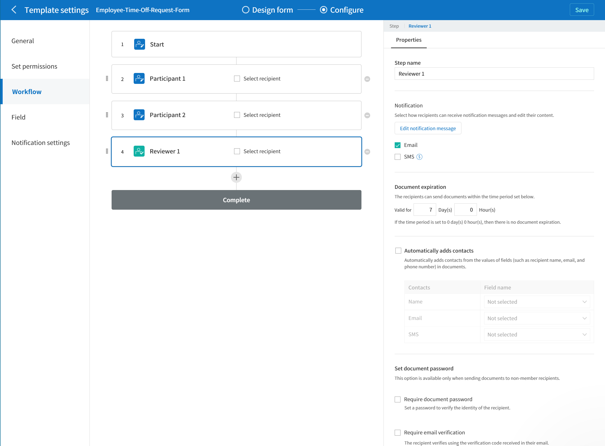

-  **Step name**: Change the name of the step. The default name is 'Start'.

-  **Notification**\: Select how recipients can receive notification and edit their content. 

   - **Select notification method:** By default, nofitications are sent by email. You can also select SMS to send notification via SMS message.

   - **Edit notification message:** You can edit notification message for each step.  

-  **Document expiration**\: Set the time period in which documents can be sent by the recipient of the step. If the time period is set to 0 day 0 hour, then there is no document expiration. No document expiration is only available for members.  
   

-  **Automatically adds contacts**\: When sending documents to a recipient, this option allows the name and contact of the recipient to be added automatically based on the information the recipient enters into the document.

-  **Set document password**\: Set to require recipients to verify their identity when opening the document.   

   - **Verification method**\: Set a verification password that recipients must enter when viewing the document. The password can be the recipient name, a value entered directly by the sender, or a field in the document.
      
   - **Email verification**\: Require recipients to verify identity using email. A 6-digit code will be sent to recipients' email and the recipients must enter the code in the identity verification window.

**Recipient - Select recipient**

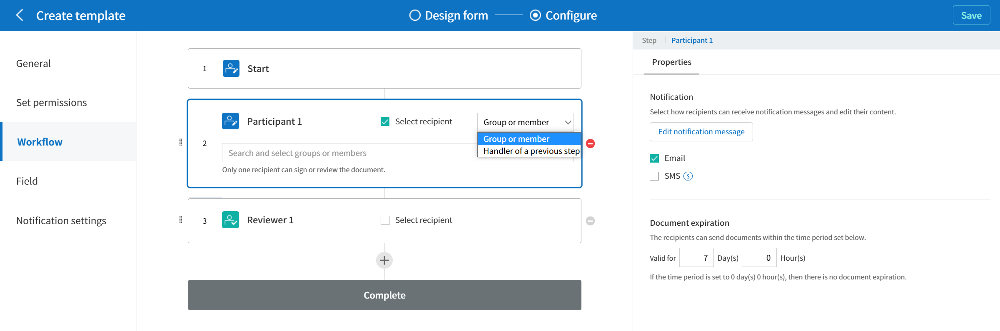

You can select the recipient of the step in advance.

-  **Group or member**: Select the groups or members who will sign and review the document. You can select multiple groups or members, but only one person among the selected can sign and review the document.

-  **Handler of a previous step**: Select the recipient of the previous step including the Start step to sign and review the document. You can select the step.

.. _hide:

**Hide sheets or sections** 
^^^^^^^^^^^^^^^^^^^^^^^^^^^^^^^^^^^

You can choose which sheets/sections of the documents are shown to external recipients in the case of Excel documents with two or more sheets and Word documents with two or more sections.

.. tip::

   Hiding sheets or sections of a document with multiple sheets or sections

   When there are multiple sheets or sections in an uploaded document, the **Hide sheets or sections** option can be shown in the external recipient step of the workflow. You can choose which sheets/sections can be seen by or hidden to the external recipient. You can also choose the person in charge of the step before the external step to choose which sheets/sections can be shown to the external recipient.

   |image18|

**Complete: Step in which a document is finally completed**

++++++++++++++++++++++++++++++++++++++++++++++++++++++++++++++++++++

   |image19|

   -  **Step name**\: Change the name of the step. The default name is ‘Complete’.

   -  **Backup completed documents in external cloud storages**: Allow the document to be stored in external cloud storages connected to eformsign by the administrator or company managers.

   -  **Timestamp the document when completed**: Allow the completed document to be timestamped which proves that the document remains unchanged since that time. This feature will incur an extra charge.

.. _field_fb:

Field
~~~~~~

In the **Field** menu, you can set the default values or auto-fill values for fields in the template, and adjust the order of the fields.

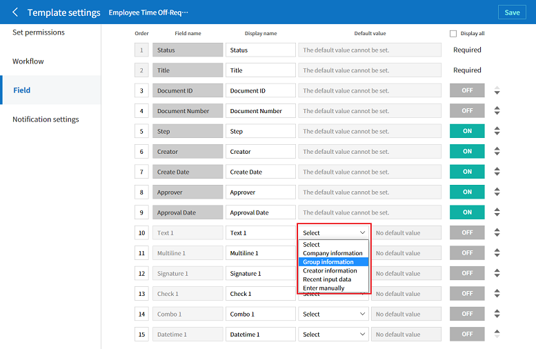

You can set the default value of a field to be the value saved in company/group/member information in **Manage custom fields**. You can also choose it to be the value entered recently or a value entered manually.

.. tip::

   **How to configure auto-fill**

   You can save information that are frequently entered into a document so that they can be used for auto-filling later.

   For example, you can pre-save information about your company or group (such as department name, leader, and representative number) and information about the document creator (including name and contact details). You can add items for related fields and set the default values in **Manage company > Manage custom fields**.

   1. In the **Manage custom fields** screen, add a field.

   2. Go to the **Manage templates** menu.

   3. Click the **Template settings** icon.

   4. Go to the **Field** menu.

   5. Enter the default value for the field that you want to be auto-filled.

   6. After completing all the settings, click the **Save** button.

.. _noti_fb:

Notification Settings
~~~~~~~~~~~~~~~~~~~~~~~~~~~~

You can select recipients of status notification message, view and edit the messages
for documents created from the template.

**Document status notifications**

You can select who will receive status notifications for documents created from the template. You can also preview the following notification message types: approved, reviewed and signed, rejected, voided, and corrected. As well, you can edit and preview the notification messages for completed documents.

.. figure:: resources/template-setting-notification-channel.png
   :alt: Notification settings

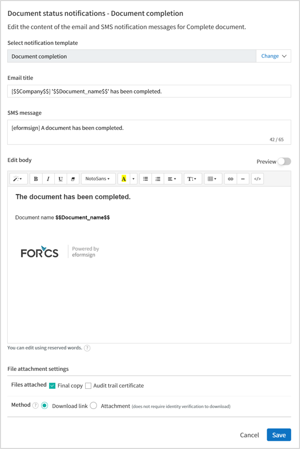

.. note::

   When the **Document creator** option is checked but the **Step handler** option is unchecked, a status notification is sent to the person who originally created the document.

   When the **Document creator** option is unchecked but the **Step handler** option is checked, status notifications are sent to people who have processed the document before the current step, except the document creator.

   When the **Document creator** and **Step handler** options are both checked, status notifications are sent to both the document creator and the people who have processed the document before the current step.

   When the **Document creator** and **Step handler** options are both unchecked, no notifications will be sent for that status.

-  **When documents are reviewed and signed**: When the document is reviewed and signed by internal or external recipients, a
   notification will be sent stating that the document has been reviewed and signed.

-  **When documents are rejected**: When the document is rejected by an approver, internal or external recipients, a notification will be sent stating that the document has been rejected.

-  **Document void notification**: When a request for voiding a document is approved, a notification will be sent stating that the document has been voided.

-  **When documents are corrected**: When the document is corrected by a document creator, a notification will be sent stating that the document has been corrected.

-  **When documents are completed**: When the document is completed, a notification will be sent to the document creator, approvers, and recipients stating that the document has been completed.

   .. note::

      When the **Document creator** option for **When the document is completed** is checked and an external recipient creates and submits a document via a URL, the external recipient must enter his/her email in which a notification will be sent to when the document is completed.

Menus for Each Template
-----------------------

Go to the **Manage templates** page, click the menu icon (|image23|) right next to the template name to see the menus that can be set for each template.

|image24|

-  **Duplicate**: Duplicates the template. The template's file and detailed settings for the template will be duplicated. You will have
   a chance to change and save the detailed settings before the template is duplicated.

-  **Delete**: Deletes the template. Once a template is deleted, you can no longer create documents from that template.

-  **Download file**: Click **Download file** to download a form in the format is was uploaded (e.g. Word, Excel, etc.).

-  **Deactivate**: When a template is deactivated, it will not be shown in the **New from template** page for other members.

-  **Change owner**: You can change the owner of the template. By default, the person who created the template is automatically assigned as the template owner. If you want to make changes later, you can change the owner to another member by clicking this menu. The new template owner can be selected among members who have permission to manage templates.

   |image25| 

-  **Document Manager:** You can select the members or groups that can manage documents created from the template. You can also select document managers in **Template settings > Set permissions.**

   |image26|

Search Templates
---------------------

In the **Manage templates** page, you can lookup and search templates by template category.

|image27|

**① Lookup Templates**
   Click the box **(1)** to lookup templates by template status and category. Click **X** to return to view all categories.

   By default, templates are saved in the Sample category. You can create categories in **Template settings > General.**

**② Search templates**
   You can search templates by entering keywords for the template name and category name.

**③ Sort**
   You can select the template sorting order in ascending or descending by template name or category.

.. |image1| image:: resources/config-icon.PNG
   :width: 25px
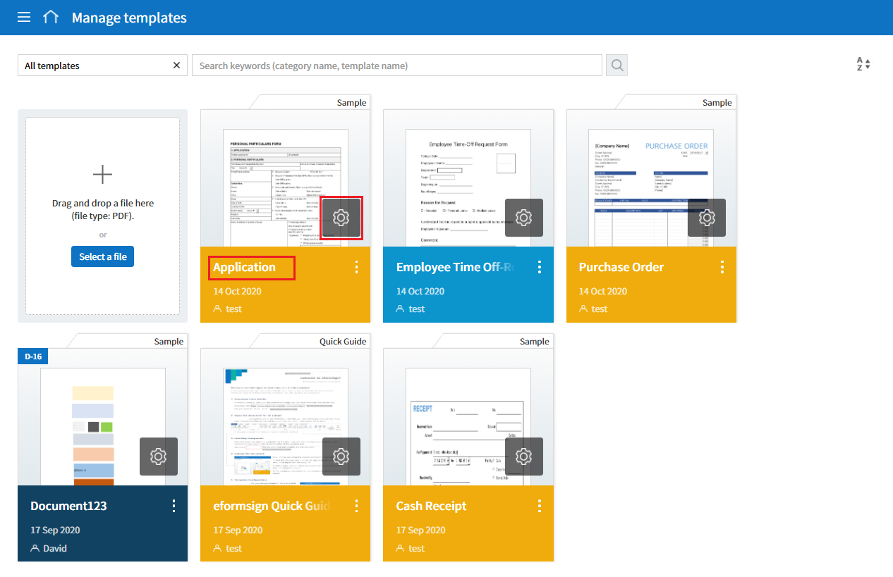
.. |image3| image:: resources/en-generate-document-no.png
.. |image4| image:: resources/config-icon.PNG
.. |image5| image:: resources/config-icon.PNG
.. |image6| image:: resources/en-document-number-list.png
.. |image7| image:: resources/en-manage-template-search-advanced.png
   :width: 600px
.. |image8| image:: resources/workflow-addstep-plus-button.png
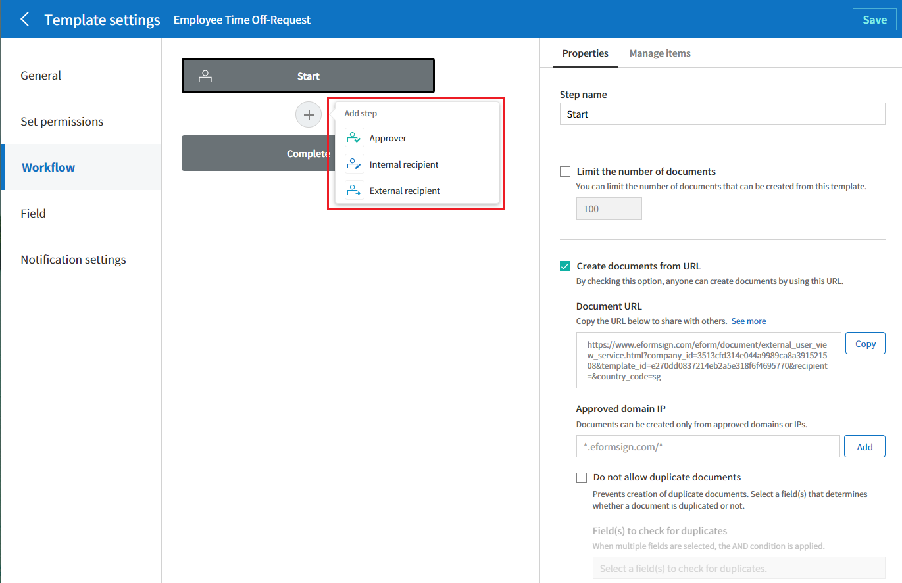
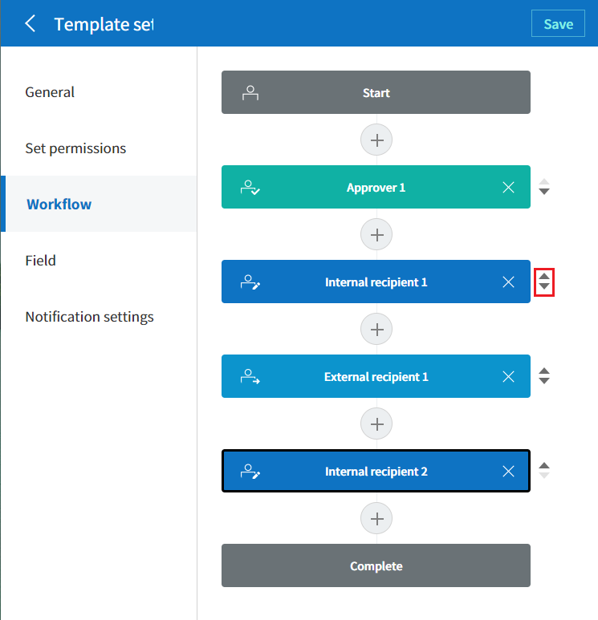
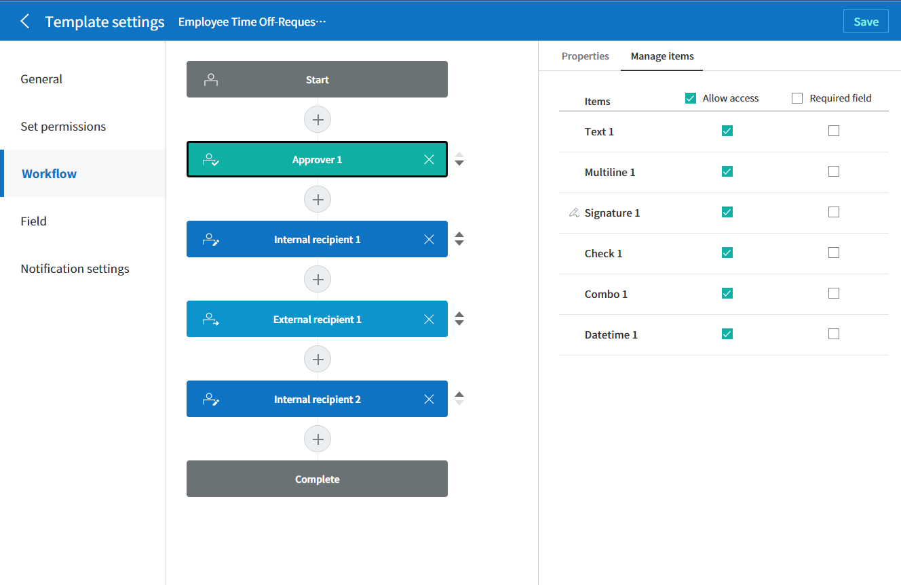
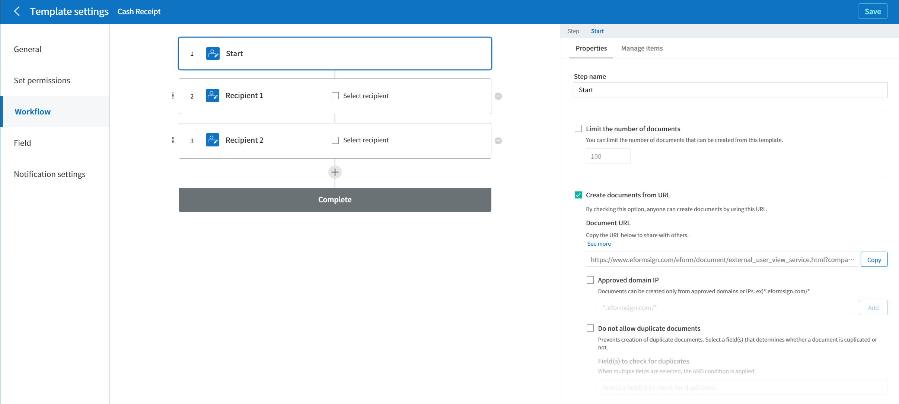
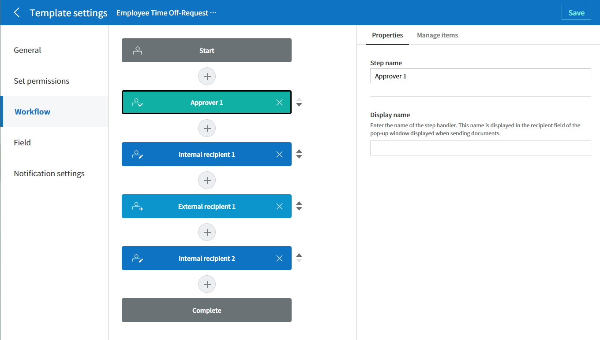
.. |image14| image:: resources/en-template-settings-approver-display-name.png
   :width: 250px
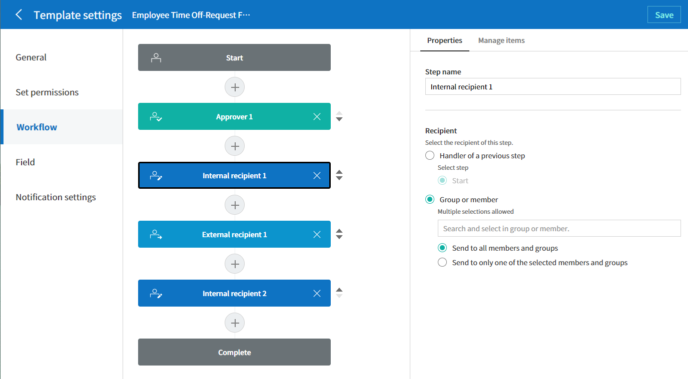
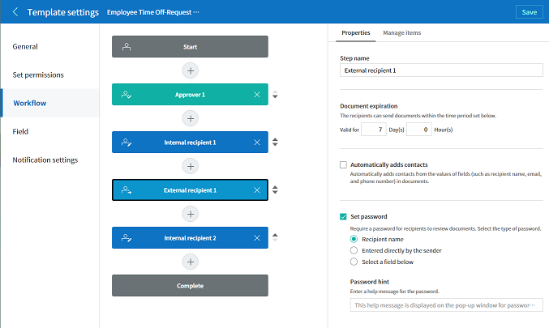
.. |image17| image:: resources/workflow-step-external-recipient-property-pw.png
   :width: 400px
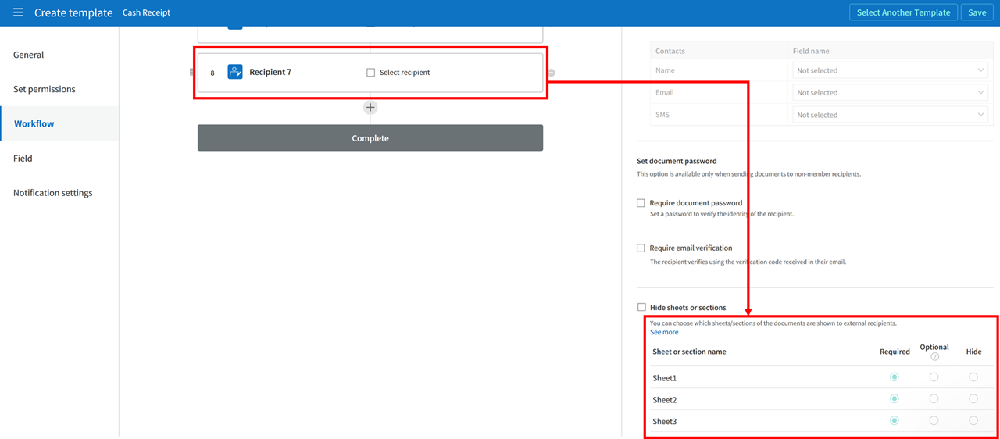
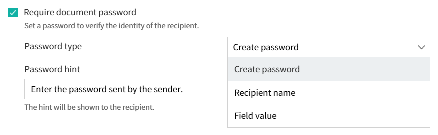
.. |image20| image:: resources/en-template-settings-edit-notification-messages.png
   :width: 400px
.. |image21| image:: resources/en-template-settings-edit-notification-messages-popup-fb.png
   :width: 700px
.. |image22| image:: resources/en-template-settings-notification-status.png
   :width: 500px
.. |image23| image:: resources/template-hamburgericon.png
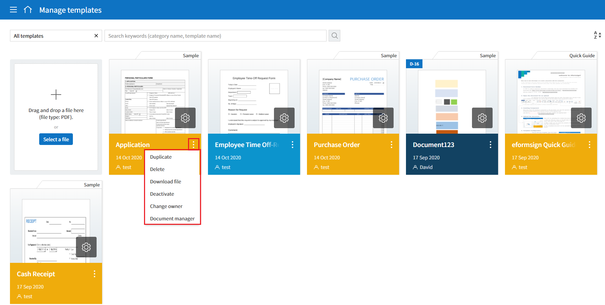
.. |image25| image:: resources/en-manage-template-menu-icon-change-owner.png
.. |image26| image:: resources/en-manage-template-menu-icon-document-manager.png
.. |image27| image:: resources/en-manage-template-search.png
   :width: 700px
