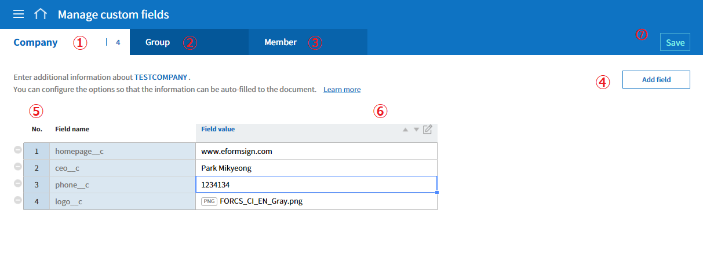
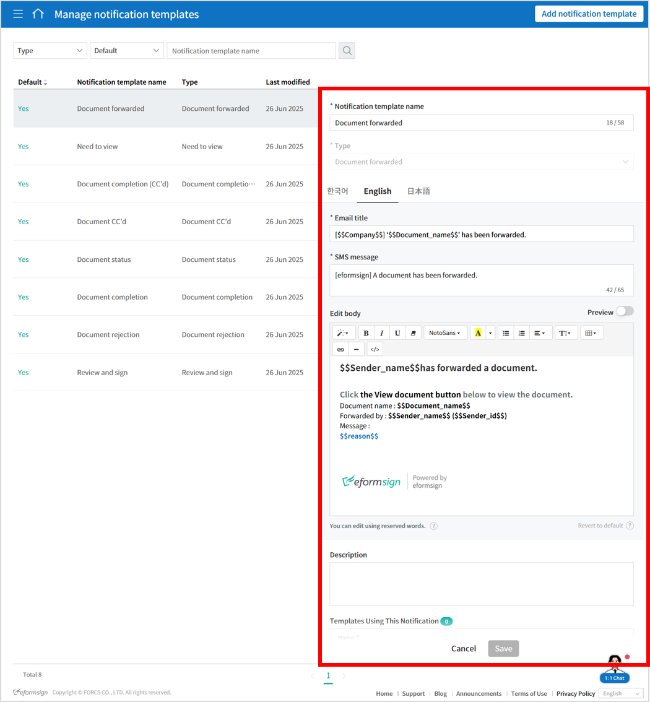
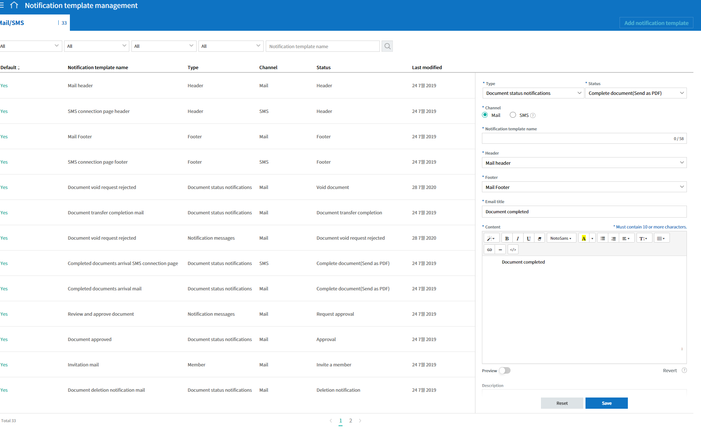

Customizing eformsign
=====================

Manage Custom Fields Manage custom fields
-----------------------------------------

You can add and edit fields for companies, groups, and members in the
**Manage company > Manage custom fields** menu.

.. tip::

   By using custom fields, you can set frequently used companies,
   groups, and member information (e.g., company phone number, address,
   company representative name, etc.) to be added automatically in
   documents. After adding custom fields in the **Manage custom fields**
   menu, go to the **Template settings > Field settings** menu to set
   which information is to be entered automatically in the documents.

   Manage company > Manage custom fields

① Manage custom fields > Company
   You can add fields related to the company such as the company
   representative name, company phone number, stamp and seal, and then
   set the values.

② Manage custom fields > Group
   You can add fields related to groups such as the department name and
   manager, and then set the values.

③ Manage custom fields > Member
   You can add fields related to members such as the job title, email
   address and phone number, and then set the values.

④ Add field
   If you click the **Add field** button, the **Add custom field**
   pop-up window will be displayed where you can add a new field. Enter
   the field name, field type (select from text or image), and field
   value, and then click the **OK** button to add the field to the
   custom field list.

.. figure:: resources/customfield-addfield.PNG
   :alt: Manage company > Manage custom fields

   Manage company > Manage custom fields

⑤ Field list
   The custom field list shows the field names and the field values that
   you added. You can also delete the fields and edit the field values.

   To delete a field, click the icon (|Manage company > Manage custom
   fields|) located to the left of the field list.

⑥ Edit field
   If you select a field to edit and then click the edit icon, the
   **Edit custom field** pop-up window will be displayed where you can
   edit the field name, field type, and field value.

   You can also change the field order. Select a field in which you want
   to change the order, and then click the arrow (|image1|) button.

   .. figure:: resources/customfield-edit.PNG
      :alt: Manage company > Manage custom fields
      :width: 700px

      Manage company > Manage custom fields

⑦ Save
   After editing the custom field, click the **Save** button to save
   your changes.

Notification Template Management
--------------------------------

Notification template management You can customize the email and SMS
notification messages to best suit the needs of your company.

Notification templates can be edited in the **Manage company >
Notification template management** menu or in the **Manage templates >
Template settings > Notification settings** menu.

   Manage company > Notification template management

Default templates are shown in the **Manage company > Notification
template management** menu. You can change the contents of the default
templates and add new notification templates.

**Basic template types (select from Mail or SMS)**

.. table:: Template Types and Status

   +--------------------+-------------------------------------------------+
   | Type               | Status                                          |
   +====================+=================================================+
   | Notification       | Request approval, Acceptance request, External  |
   | messages           | user processing request, Reject approval,       |
   |                    | Document void requested, and Document void      |
   |                    | request rejected                                |
   +--------------------+-------------------------------------------------+
   | Document status    | Approval, Acceptance approval, Approve decline  |
   | notifications      | request, External user complete document,       |
   |                    | Complete document, Correct document, Void       |
   |                    | document, Deletion notification, Document       |
   |                    | transfer completion, and Complete document      |
   |                    | (Send as PDF)                                   |
   +--------------------+-------------------------------------------------+
   | Member             | Invite a member, Accept the member invitation,  |
   |                    | Refuse the member invitation, and Withdraw from |
   |                    | company                                         |
   +--------------------+-------------------------------------------------+
   | Header and footer  |                                                 |
   +--------------------+-------------------------------------------------+

.. tip::

   The header is set with the eformsign logo by default. If you upload
   your company's logo in the **Manage company > Company profile >
   Company brand** tab menu, the logo is applied to the email templates.

**How to add a new notification template**

In addition to the default templates, you can add a new notification
template.

1. In the sidebar menu, click the **Manage company > Manage Notification
   Templates** menu.

2. Click the **Add notification template** button located at the top
   right corner of the **Notification template management** screen.

3. Select the appropriate **Type** and **Status**.

   |image2|

4. Select the **Channel** (select either Mail or SMS) and enter the
   **Notification template name**.

5. Select the **Header** and **Footer**.

6. Write a new notification message.

7. Click the **Save** button to add it as a notification template.

.. |Manage company > Manage custom fields| image:: resources/customfield-list-delete.png
.. |image1| image:: resources/customfield-list-order.PNG

