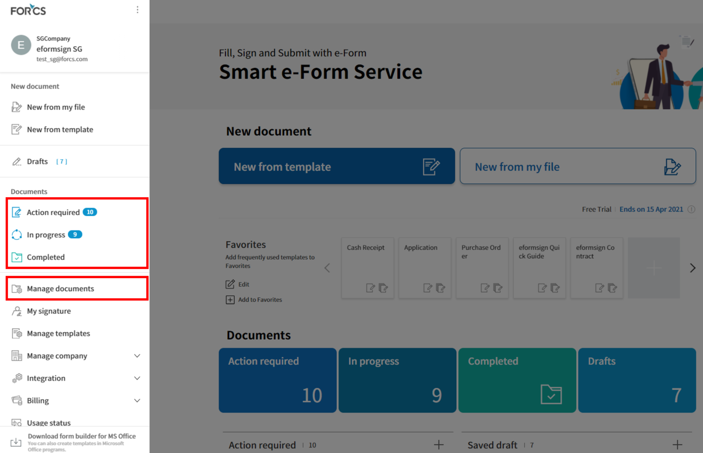
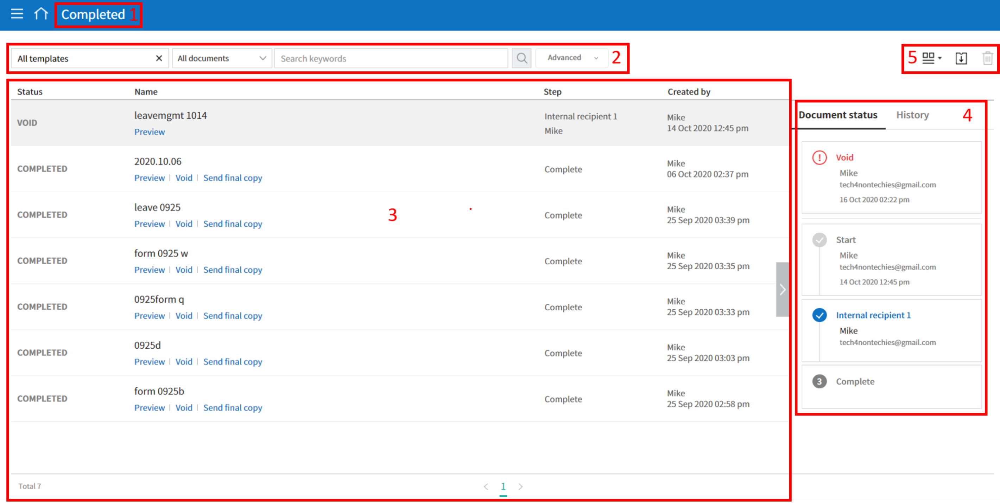
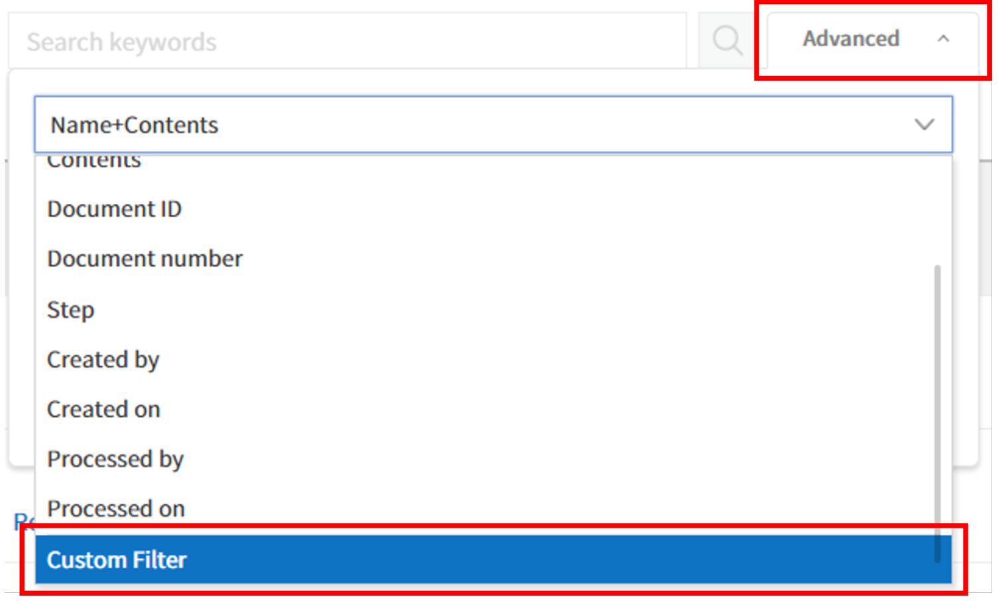
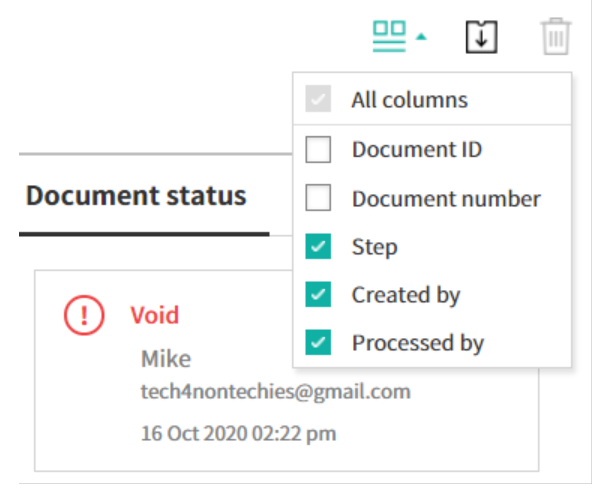
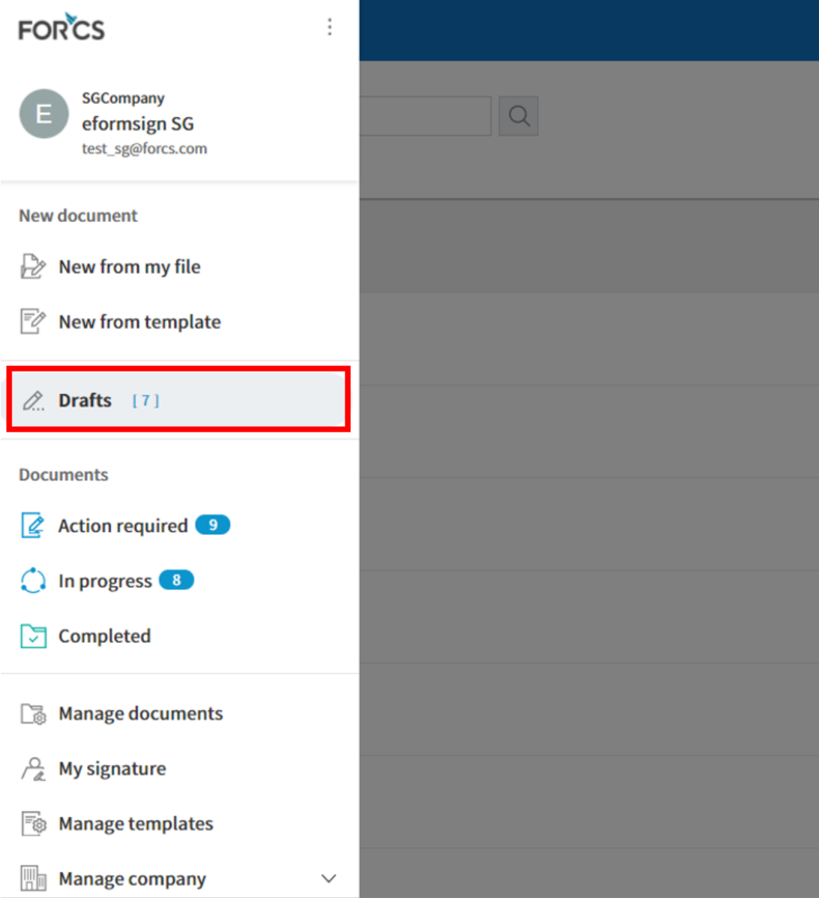

Document Menus
==================

Documents
------------

Documents are stored in the following three menus according to the document status:

-  **In progress:** View the list of documents you have created or signed/approved that are incomplete.

-  **Action required:** View the list of documents you have saved as a draft, requested by other members for
   you to sign or approve, or sent to external recipients but have yet to be signed.

-  **Completed:** View the list of completed documents among the documents created by you.

By using these menus, you can easily view the status and history of each document, find the documents you want by filtering and searching, resend
documents, void/reject documents that have yet to be completed in the workflow, and edit draft documents.

All documents and related activities are stored in the Documents menus, and you can view detailed information about the document status and
history.

Aside from the three document menus, there is another menu for managing documents.

-  **Manage documents:** View and manage all documents created from a template in which you have been given access permission.

.. note::

   The company administrator can view and manage all documents in the company.

The three Documents menus and the Manage documents menu are laid out almost the same.

.. note::

   The layout of the Documents menus are very similar to each other, but the documents that are displayed differ according to the document
   status or granted permission to users.

Each documents menu consists of the following five sections:

1. **Menu and home icon, and document menu name**

   You can go to another menu by clicking the menu icon (|image1|) or go to the dashboard by clicking the home icon (|image2|). You can also
   see the name of the documents menu you are currently viewing.

2. Template category combo box, document status filter combo box, and `search box <#category>`__

   You can view documents by the selected template category and filter documents by document status.

   In addition to performing searches using keywords, you can also use advanced methods such as searching by name + contents, document ID, date, and many more.

3. **Document list and**\ `actions <#additional_work>`__

   Up to 20 documents are listed per page and you can view the documents in other pages by clicking the page numbers at the bottom.

   The information of each document such as the document status, name, step, creator, created date, processed date, and document number is
   provided in columns in the document list. You can also change the column information displayed. Click the column icon (|image3|)
   displayed at the top right corner of the page, and then check the columns you want to display in the `column check box <#document_column>`__.

   You can also perform actions on a document such as reviewing, previewing, correcting, voiding, resending, and deleting a document.

4. `Document status and history <#history>`__

   You can check the documents status and history.

   In the **Document status** tab, you can see what happens to a document in each step of the workflow.

   In the **History** tab, you can see the activities of the document creator and recipients from document creation to completion.

5. `The column selection icon <#document_column>`__\ , \ `document download icon <#document_download>`__\ , \ `delete icon <#document_delete>`__\

   Clicking the column selection icon (|image4|) displays the column types which you can check to select which columns will be displayed in the document list.

   Clicking the download icon (|image5|) allows to select the documents in the list you want to download. You can select multiple documents
   to download at once and choose the file type including the PDF of the completed documents, audit certificate, and CSV of selected fields.

   Note that the delete icon (|image6|) is disabled in the three document menus, but is enabled in the **Manage documents** menu.

   .. note::

      Documents can be deleted only in the **Manage documents** menu and you can only delete documents in which you have document management permission. The company administrator or the template managers of a template can grant you document management
      permission for all documents created from a template in **Manage templates > Template settings > Set permissions > Document management** and selecting the groups/members you want to grant permission. Document management permission can be set for each template. Members with this permission can open, delete, and download the documents (PDF, CSV) created from this template in the **Manage documents** menu.

.. _category:

Template Category Combo Box, Document Status Filter Combo Box, and Search Box
~~~~~~~~~~~~~~~~~~~~~~~~~~~~~~~~~~~~~~~~~~~~~~~~~~~~~~~~~~~~~~~~~~~~~~~~~~~~~~

The template category combo box, document status filter combo box, and search box are located at the top left side of the **Documents** menus and the **Manage documents** menu.

-  **'In progress', 'Action required', and 'Completed' menus**

   In these menus, the template category combo box, document status
   filter combo box, and search box are also located at the top left
   side of the screen.

-  **'Manage documents'**

   In this menu, the template category combo box, document status filter
   combo box, and search box are located at the top left side of the
   screen. However, the document status filter combo box contains one
   additional menu, 'Voided', compared to the three documents menus.

**Template category combo box**

By using the template category combo box, you can display the list of
documents by template category by selecting the desired template
available in the **Manage templates** menu.

Clicking the **X** icon of the template category combo displays the
templates according to categories as shown below:

.. figure:: resources/category_search.png
   :alt: Template category combo box
   :width: 500px

**Searching by document status**

You can search for documents by document status in each document menu.

-  **Action required**

|image7|

-  **In progress**

|image8|

-  **Completed**

|image9|

-  **Manage documents**

|image10|

**Document status filter combo box**

In addition to doing searches using keywords, you can also use advanced methods such as searching by name + contents, document ID, date, and filtering by document status.

You can also search for field values in documents in detail by using a custom filter. As well, by using a custom filter, you can search for documents according to the range of numbers and dates.

The following table describes the filters that can be used for performing searches. However, custom filters can only be used in the **Manage documents** and **Completed** menus.

.. table:: 

   =============== =============== =============== ================
   Action required Action required Completed       Manage documents
   =============== =============== =============== ================
   Name + contents Name + contents Name + contents Name + contents
   Name            Name            Name            Name
   Contents        Contents        Contents        Contents
   Document ID     Document ID     Document ID     Document ID
   Document number Document number Document number Document number
   Template name   Template name   Step            Step
   Step            Step            Created by      Created by
   Created by      Created by      Created on      Created on
   Created on      Created on      Processed by    Processed by
   Requested by    Processed by    Processed on    Processed on
   Requested on    Processed on    Step status     Custom filter
   Days passed                     Custom filter   
   =============== =============== =============== ================

**Using the custom filter**

1. Select **Custom Filter** in the **Advanced** search combo box.

2. Select the field name, field type (keyword, range, or period), and search value.

The default value of the field name is an empty value.

Make sure to manually enter the Display name of the field in the document you want to search for. You can view the Display name for fields in the **Template settings > Field** setting menu.

.. note::

   1. Documents may not be searched if you search for a document by entering the display name of the field that does not exist.

   2. You cannot enter special characters in the display name (", ', ;, <, >, \\).

   3. Empty spaces before and after the display name are all removed. E.g. “ Time off ”  “Time off”

   4. When adding or editing a search value, if you enter a duplicate value in the custom filter, then the previously entered field type
   and field search value will be displayed. For example, when adding a custom filter again while 'years worked: 5~10' was entered in the
   custom filter, if you enter 'years worked' in the field name, then the previous value such as Range for Type, 5 for Min value, and 10 for Max value are displayed.

You can choose one of Keyword, Range, and Period for the field type.
Keyword is the default.

Note that the input boxes displayed differ according to the field type selected.

========== =========== ===========
Field type Input box 1 Input box 2
========== =========== ===========
Keyword    Text        
Range      Min         Max
Period     Start date  End date
========== =========== ===========

-  **Keyword**

   Used for searching multiple values by a comma (,) which is used as the delimeter. The default value is empty.

   When used, it searches for the text entered. In other words, it searches for documents that contain at least one of the multiple
   values entered. E.g. Field name: fruit / Field type: keyword / Value1: strawberries, apple → searches for documents that contain at least one of 'strawberries' and/or ' apple'.

-  **Range**

   Used for searching values of range such as numbers or dates. E.g. number: 100 ~ 200, period: 01/01/2019 ~ 06/30/2019

   When used, it searches for values between the min and max. If you only enter the min, then only the values larger than the min value are searched, while if you only enter the max then only the values smaller than the max are searched. E.g. salary: 1000 ~ , salary: ~ 5000

-  **Period**

   Selects the period in the calendar displayed. The default value of the period length is set to one week.

   Searches for the date between the start and end date selected.

3. Click the add search (|image11|) button to add the keyword entered and documents are searched according to the conditions set.

.. note::

   1. You can add multiple custom filters, and can modify/delete the custom filters you added.

   2. You cannot add multiple custom filters with duplicate field names.

   3. If you modify a predefined custom filter, then the field type and search values are updated with the most recently entered values.

**Displaying search keywords and modifying/deleting them**

1. The search keyword is added in the form of **field name: value**.

-  Keyword: “employment type: permanent, contract”

-  Range: “years worked: 5~10”

-  Period “contractperiod_yymmdd: 2018-01-01~2018-12-31”

2. Modify the custom filter by selecting a search keyword added. When modifying, the **Advanced** filter item is changed to **Customer filter**, and the selected filter's field name, field type, and search value are displayed.

3. Added keywords can be deleted by clicking the **X** icon on the right.

.. _additional_work:

Actions that Can Be Performed in the Document List by Documents Menu
~~~~~~~~~~~~~~~~~~~~~~~~~~~~~~~~~~~~~~~~~~~~~~~~~~~~~~~~~~~~~~~~~~~~

Actions on documents that can be performed in the document list include preview, correct, void, resend, send final copy, and download.

**In progress**

Can perform actions including preview, correct, void, send final copy, and download.

**Action required**

Can perform actions including preview, correct, void, review, resend, and download.

**Completed**

Can perform actions including preview, void, send final copy, and download.

**Manage documents**

Can perform actions including preview, void, send final copy, remove, download, and delete. Documents can only be deleted in the **Manage documents** menu.

.. _history:

Document Status and History
~~~~~~~~~~~~~~~~~~~~~~~~~~~

If you select a document in the document list, you can view the status and history of that document on the right side of the screen.

In the **Document status** tab, you can see when and what happens to a document in each step of the workflow. In the **History** tab, you can see the activities of the document creator and recipients from document creation to completion.

.. figure:: resources/document_status.png
   :alt: Document status tab
   :width: 300px

.. figure:: resources/document_history.png
   :alt: History tab
   :width: 300px

.. _document_download:

Document Download
~~~~~~~~~~~~~~~~~~~~~~~~~~~~~~~~~~~~~~~~~~~~~

Documents created in eformsign can be safely stored for long periods of time.

All documents are stored in a file format for long-term storage (PDF/A) and only members with document management permission can open and delete them.

1. Click the download icon (|image12|) on the right side of the document list.

2. Select the document to be downloaded, and then click the **Download** button.

.. figure:: resources/download_popup.png
   :alt: Document download pop-up
   :width: 400px

.. note::

   CSV files can also be downloaded in the **Download** pop-up where PDF files can be downloaded. Select **CSV download** in the pop-up and check the fields (columns) to be downloaded and then click the **Download** button.

.. _document_delete:

Deleting Documents
~~~~~~~~~~~~~~~~~~

In eformsign, only members with document management permission can delete documents.

1. Click the delete icon (|image13|) on the right side of the document list.

2. Select the document and then click the **Delete** button.

3. Click the **Yes** button in the Delete pop-up window to delete the document.

.. _document_column:

Document Menu Column Selection
~~~~~~~~~~~~~~~~~~~~~~~~~~~~~~

If you click the column (|image14|) icon on the right side of the document list, you can select which column to be displayed on the list.

.. _drafts:

Drafts
------

The Drafts menu stores the documents in the **New from my file** step that have been saved by clicking **Save as a draft** before sending the document. You can open the files stored in the **Drafts** menu anytime and proceed or delete.

1. Click **Drafts** in the sidebar menu to go to the Drafts page.

   |image15|

2. Select a document you want and click the **Continue** button next to it.

   |image16|

3. Edit the document in the **Create from my file** screen and send it.

.. |image1| image:: resources/menu_icon_2.png
   :width: 25px
.. |image2| image:: resources/home_icon_2.png
   :width: 25px
.. |image3| image:: resources/column_icon.png
   :width: 35px
.. |image4| image:: resources/column_icon.png
   :width: 35px
.. |image5| image:: resources/download-icon.PNG
   :width: 30px
.. |image6| image:: resources/delete_icon1.png
   :width: 30px

.. |image8| image:: resources/inprocessbox-status-search.png
   :width: 700px
.. |image9| image:: resources/completedbox-status-search.png
   :width: 700px
.. |image10| image:: resources/documentmanage_status_search.png
   :width: 700px
.. |image11| image:: resources/searchplus.png
.. |image12| image:: resources/download_icon.png
.. |image13| image:: resources/delete_icon1.png
.. |image14| image:: resources/column_icon.png
   :width: 35px

.. |image16| image:: resources/draftbox-documentlist.png
   :width: 700px
