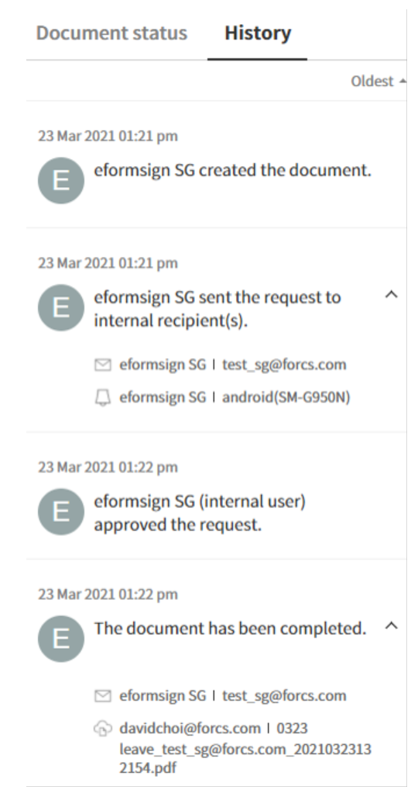
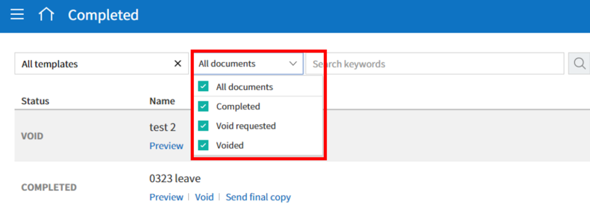
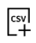
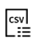

.. _documents:

==================
Document Inboxes
==================

-----------
Documents
-----------

Documents are stored in document menus (inboxes) according to their status. You can use these inboxes to easily view the status and history of each document, find the documents you want by filtering and searching, resend documents, void/reject documents that have yet to be completed in the workflow, and edit draft documents. Documents saved as a draft are shown in the Action required inbox in which you can select and send.

-  **In progress:** View the list of documents you created or signed/approved that are in progress.

-  **Action required:** View the list of documents you saved as a draft, requested by other members for you to sign or approve, or sent to non-member recipients but have yet to be signed.

-  **Completed:** View the list of completed documents among the documents created by you.

-  **Manage bulk sent documents:** View the list of documents you created in bulk. For more information, go to the section on Manage bulk sent documents inbox.

- **Shared:** If you share documents you own with other members or have access to a shared inbox, you can view the shared documents at-a-glance.

**Manage documents** and **Manage bulk sent documents**: These are inboxes for document managers and they can view documents in which they have permission.

.. note::

   For information on granting the document manager permission refer to the `Document manager <chapter2.html#document-manager>`_ section. Note that the company administrawtor can view and manage all documents in the company.

-  **Manage documents:** Only members with the document manager permission can access this inbox. They can view all documents created from templates in which they are given permission to view.

-  **Manage bulk sent documents:** Only members with the document manager permission can access this inbox. They can view all documents bulk created from templates in which they are given permission to view.

.. figure:: resources/new_document_inboxes_en.png
   :alt: Document inboxes
   :width: 700px

---------------
Documents menu
---------------

.. note::

   While the screen layout for the **Action required, In progress, and Completed inboxes** and the **Manage documents** page are almost identical, there are differences in the documents you see based on the document status or the permissions you have.

Each documents menu consists of the following five sections:

.. figure:: resources/document_inbox_layout.png
   :alt: Document inbox layout
   :width: 700px

1. **Menu and home icon, and document menu name**

   You can go to another menu by clicking the menu icon (|image1|) or go to the dashboard by clicking the home icon (|image2|). You can also see the name of the documents menu you are currently viewing.

2. **Template category combo box, document status filter combo box, and search box** 

   You can view documents by the selected template category and filter documents by document status.

   In addition to performing searches using keywords, you can also use advanced methods such as searching by name + contents, document ID, date, and many more.

3. **Document list and actions** 

   Up to 20 documents are listed per page and you can view the documents in other pages by clicking the page numbers at the bottom.

   The information of each document such as the document status, name, step, creator, created date, and document number is provided in columns in the document list. You can also change the column information displayed. Click the column icon (|image4|) displayed at the top right corner of the page, and then check the columns you want to display in the column check box.

   You can also perform actions on a document such as reviewing, previewing, correcting, voiding, resending, and deleting a document.

4. **Document status and history**

   You can check the documents status and history.

   In the **Document status** tab, you can see what happens to a document in each step of the workflow.

   In the **History** tab, you can see the activities of the document creator and recipients from document creation to completion.

5. **The share, column, download, and delete icons** 

   - Share (|image20|): Clicking the share icon allows you to select a document you want to share in a shared folder.

   - Column (|image21|): Clicking the column icon allows you to view the column types and select the columns in the document list that you want to be displayed.

   - Download (|image22|): Clicking the icons allows you to download documents in PDF or CSV format and view the list of CSV files that have been generated.
   .. note::

      **How to delete documents**

      In document inboxes, the delete icon is disabled.

      Documents can be deleted only in the **Manage documents** menu and you can only delete documents in which you have document manager permission. The company administrator or the template managers of a template can grant you document manager permission for all documents created from a template in **Manage templates > Template settings > Set permissions > Document management** and selecting the groups/members you want to grant permission. 

      The document manager permission can be set for each template. Members with this permission can open, delete, and download the documents (PDF, CSV) created from this template in the **Manage documents** menu.

.. _category:

Template Category Combo Box, Document Status Filter Combo Box, and Search Box
~~~~~~~~~~~~~~~~~~~~~~~~~~~~~~~~~~~~~~~~~~~~~~~~~~~~~~~~~~~~~~~~~~~~~~~~~~~~~~~

The template category combo box, document status filter combo box, and search box are located at the top left side of the **Documents** menus and the **Manage documents** menu.

-  **'In progress', 'Action required', and 'Completed' menus**

   In these menus, the template category combo box, document status
   filter combo box, and search box are also located at the top left
   side of the screen.

-  **Manage documents**

   In this menu, the template category combo box, document status filter
   combo box, and search box are located at the top left side of the
   screen. However, the document status filter combo box contains one
   additional menu, 'Voided', compared to the three documents menus.

**Template category combo box**

By using the template category combo box, you can display the list of
documents by template category by selecting the desired template
available in the **Manage templates** menu.

Clicking the **X** icon of the template category combo displays the
templates according to categories as shown below:

.. figure:: resources/category_search.png
   :alt: Template category combo box
   :width: 500px

**Searching by document status**
------------------------------------------

You can search for documents by document status in each document menu.

-  **Action required**

|image7|

-  **In progress**

|image8|

-  **Completed**

|image9|

-  **Manage documents**

|image10|

**Document status filter combo box**
----------------------------------------------

In addition to doing searches using keywords, you can also use advanced methods such as searching by name + contents, document ID, date, and filtering by document status.

You can also search for field values in documents in detail by using a custom filter. As well, by using a custom filter, you can search for documents according to the range of numbers and dates.

The following table describes the filters that can be used for performing searches. However, custom filters can only be used in the **Manage documents** and **Completed** menus.

.. table:: 

   =============== =============== =============== ====================
   Action required  In progress      Completed      Manage documents
   =============== =============== =============== ====================
   Name + contents Name + contents Name + contents Name + contents
   Name            Name            Name            Name
   Contents        Contents        Contents        Contents
   Document ID     Document ID     Document ID     Document ID
   Document number Document number Document number Document number
   Template name   Template name   Step            Step
   Step            Step            Created by      Created by
   Created by      Created by      Created on      Created on
   Created on      Created on      Recipient       Recipient
   Requested by    Days passed     Custom filter   Custom filter 
   Requested on    Recipient
   Recipient
   =============== =============== =============== ====================

**Using the custom filter**
^^^^^^^^^^^^^^^^^^^^^^^^^^^^^^^^^^

1. Select **Custom Filter** in the **Advanced** search combo box.

.. figure:: resources/custom_search.png
   :alt: Custom filter
   :width: 500px

2. Select the field name, field type (keyword, range, or period), and search value.

The default value of the field name is an empty value.

Make sure to manually enter the Display name of the field in the document you want to search for. You can view the Display name for fields in the **Template settings > Field** setting menu.

.. note::

   1. Documents may not be searched if you search for a document by entering the display name of the field that does not exist.

   2. You cannot enter special characters in the display name (", ', ;, <, >, \\).

   3. Empty spaces before and after the display name are all removed. E.g. “Time off ” -> “Time off”.

   4. When adding or editing a search value, if you enter a duplicate value in the custom filter, then the previously entered field typeand field search value will be displayed. For example, when adding a custom filter again while 'years worked: 5~10' was entered in the custom filter, if you enter 'years worked' in the field name, then the previous value such as Range for Type, 5 for Min value, and 10 for Max value are displayed.

You can choose one of Keyword, Range, and Period for the field type.
Keyword is the default.

Note that the input boxes displayed differ according to the field type selected.

========== =========== ===========
Field type Input box 1 Input box 2
========== =========== ===========
Keyword    Text        
Range      Min         Max
Period     Start date  End date
========== =========== ===========

-  **Keyword**

   Used for searching multiple values by a comma (,) which is used as the delimeter. The default value is empty.

   When used, it searches for the text entered. In other words, it searches for documents that contain at least one of the multiple
   values entered. E.g. Field name: fruit / Field type: keyword / Value1: strawberries, apple → searches for documents that contain at least one of 'strawberries' and/or ' apple'.

-  **Range**

   Used for searching values of range such as numbers or dates. E.g. number: 100 ~ 200, period: 01/01/2019 ~ 06/30/2019

   When used, it searches for values between the min and max. If you only enter the min, then only the values larger than the min value are searched, while if you only enter the max then only the values smaller than the max are searched. E.g. salary: 1000 ~ , salary: ~ 5000

-  **Period**

   Selects the period in the calendar displayed. The default value of the period length is set to one week.

   Searches for the date between the start and end date selected.

3. Click the add search (|image11|) button to add the keyword entered and documents are searched according to the conditions set.

.. note::

   1. You can add multiple custom filters, and can modify/delete the custom filters you added.

   2. You cannot add multiple custom filters with duplicate field names.

   3. If you modify a predefined custom filter, then the field type and search values are updated with the most recently entered values.

**Displaying search keywords and modifying/deleting them**
^^^^^^^^^^^^^^^^^^^^^^^^^^^^^^^^^^^^^^^^^^^^^^^^^^^^^^^^^^^^^^^^

1. The search keyword is added in the form of **field name: value**.

-  Keyword: “employment type: permanent, contract”

-  Range: “years worked: 5~10”

-  Period “contractperiod_yymmdd: 2018-01-01~2018-12-31”

2. Modify the custom filter by selecting a search keyword added. When modifying, the **Advanced** filter item is changed to **Customer filter**, and the selected filter's field name, field type, and search value are displayed.

3. Added keywords can be deleted by clicking the **X** icon on the right.

.. _additional_work:

Actions that Can Be Performed in the Document List by Documents Menu
~~~~~~~~~~~~~~~~~~~~~~~~~~~~~~~~~~~~~~~~~~~~~~~~~~~~~~~~~~~~~~~~~~~~~~~~

Actions on documents that can be performed in the document list include preview, correct, void, resend, forward, schedule forward final copy, remove, share, download, and create new document.

- **In progress**

Can perform actions including preview, correct, void, share, review, resend, schedule foward final copy, download, and create new document.

- **Action required**

Can perform actions including preview, correct, void, share, review, edit, resend, schedule forward final copy, download, and create new document.

- **Completed**

Can perform actions including preview, share, forward, create new document, set reminder and download.

- **Manage documents**

Can perform actions including preview, void (excluding completed documents), remove, download, schedule foward final copy (excluding completed documents), forward (only completed documents), and create new document. Documents can only be removed in the **Manage documents** menu.

.. _history:

Document Status and History
~~~~~~~~~~~~~~~~~~~~~~~~~~~~~~~

If you select a document in the document list, you can view the status and history of that document on the right side of the screen.

In the **Document status** tab, you can see when and what happens to a document in each step of the workflow. In the **History** tab, you can see the activities of the document creator and recipients from document creation to completion.

.. figure:: resources/document_status.png
   :alt: Document status tab
   :width: 300px

.. _document_download:

Document Download
~~~~~~~~~~~~~~~~

Documents created in eformsign can be downloaded in PDF as well as in CSV, which contains the data entered in the documents. 

.. note::

   💡 **What data is in a CSV file?**
 
   The CSV file you download contains data entered into a document as well as document metadata such as document title, document ID, recipients.

PDF Download
-------------------------------

1. Go to a document inbox or the **Manage documents** page and click the document download icon (|image12|).
2. Tick the check box to the left of the document(s) you want to download.
3. Click the **Download** button.
4. Decide whether to include the audit trail certifcate in the pop-up displayed and click the **Download** button.

   .. figure:: resources/download_popup.png
      :alt: Document downloaod pop-up
      :width: 400px

.. tip::

   💡 **How to Download More Than 20 PDF Documents**

   By default, only 20 documents are displayed in the document box, and downloads are also limited to 20 documents at a time. However, by using the method below, you can download up to 100 documents at once.

   1. At the bottom of the screen in the **Document inbox/Manage documents page**, you can select how many documents are displayed in the list.

   .. figure:: resources/document-list-100.png
      :alt: Download More Than 20 PDF Documents
      :width: 700px

   2. Select **Show 50 per page** or **Show 100 per page**. 

   3. Click the Download icon (|image12|) at the top right corner of the screen.
   4. Select all the check boxes and then click the **Download** button.
   5. In the pop-up, choose whether to tick the **Include audit certificate** pop-up, name the file, and then click the **Export** button.
   6. In the **Downloadable files list** pop-up, click  the **Refresh** button.
      :width: 600px

   7. You can see that the Download button is enabled. Click the **Download** button to download the document.

   .. figure:: resources/document-download-popup1.png
      :alt: Document download list
      :width: 600px

   ❗ If you are downloading more than 20 documents in PDF format, you can download them by clicking the **Downloadable files list** icon at the top right corner of the screen. 

Export to CSV file
-------------------------------

1. Click the Export to CSV file icon (|image14|) in the **Completed** inbox or the **Manage documents** page.
2. Tick the check box to the left of the document(s) you want to download.
3. Click the **Export to CSV file** button.
4. Select the columns and range in the **Export to CSV file** pop-up displayed. To include all fields in all templates, select **All results**.
5. Click the **Export** button.

   .. figure:: resources/cvs_file_popup.png
      :alt: Export to CSV file pop-up
      :width: 400px

6. Name the CSV file and click **Confirm**.

   .. figure:: resources/cvs_file_name_popup.png
      :alt: Export to CSV file pop-up
      :width: 400px

7. Check the status of the file in the **CSV files** pop-up and download the file once it is created.
 
   .. figure:: resources/cvs_file_list_popup.png
      :alt: CSV files pop-up
      :width: 600px

.. note::

   **CSV files**

   You can view the list of files that have been created or is being created by clicking the CSV files icon (|image17|). 
   You can cancel while the file is being created and the files that are created can be downloaded again or deleted. The files can be downloaded again within 7 days of creation and are automatically deleted after 7 days.

   .. figure:: resources/cvs_file_list_popup1.png
      :alt: CSV files pop-up
      :width: 400px

.. tip::

   **Downloading documents in the Bulk send inbox and Manage bulk sent documents inbox**

   You can download bulk sent documents in the Bulk send inbox.

   1. Click the **Detail view** button next to the document you want in the **Bulk send** inbox.

   2. Select the document(s) to download and then click either the **Download** or **Export to CSV file** button.

   .. figure:: resources/bulksend_download.png
      :alt: Export to CSV file pop-up
      :width: 700px

.. _document_delete:

Permanently Removing Documents
~~~~~~~~~~~~~~~~~~~~~~~~~~~~~~~

In eformsign, only members with document manager permission can permanently remove documents.

1. Click the remove icon (|image13|) on the right side of the document list.

2. Select the document and then click the **Remove** button.

3. Click the **Yes** button in the Remove pop-up window to permanently remove the document.

.. _document_column:

Document Menu Column Selection
~~~~~~~~~~~~~~~~~~~~~~~~~~~~~~~~~~~

If you click the column (|image14|) icon on the right side of the document list, you can select which column to be displayed on the list.

.. figure:: resources/column_type.png
   :alt: Document column selection icon
   :width: 400px

.. _my_saved_documents:

--------------------
My saved documents
--------------------

The My saved documents inbox stores the documents in the **New from my file** step that have been saved by clicking **Save** before sending the document. You can open the files stored in the **My saved documents** menu anytime and proceed or delete.

1. Click **My saved documents** in the sidebar menu to go to the My saved documents page.

.. figure:: resources/my-saved-documents-dashboard-en.png
   :alt: My saved documents in dashboard
2. Select a document you want and click the **Continue** button next to it.

   |image16|

3. Edit the document in the **Create from my file** screen and send it.

.. note::

   For more information about creating a new document from my file, please refer to `New from my file <chapter3.html#id2>`__.

.. _bulksend_documents:
-------------------------
Bulk send
-------------------------

In the **Bulk send** inbox, you can see all the documents sent in bulk. You can check the status of documents sent in bulk, cancel or change the date & time of scheduled sends, or resend bulk-sent documents.

.. figure:: resources/bulksend-documents.png
   :alt: Bulk send document box

In the list of bulk sent documents, click **Detail view** to see the detailed information of the documents such as response status, the step in the workflow of the sent document, etc.

- Check the response status of bulk-sent documents 
- Resend documents in bulk or individually
- Void documents (excluding completed ones)
- Download PDF or/and CSV files
- View the current document step, document status, and history of each document

.. figure:: resources/bulksend-documents-detail.png
   :alt: Bulk send-detail view

.. tip::

   When you are resending documents in bulk, you cannot change the recipients' contact information. The documents will be sent to the contact information that you entered previously.
   It you want to change the contact information, resend documents seperately. 

For documents scheduled to be sent later, you can change or cancel the scheduled send.

.. note::

   For more information about sending documents in bulk, please refer to `Send in bulk <chapter3.html#bulksend>`__.

----------------------------------------------

.. _shared_documents:

-------------------------
Shared
-------------------------

In the **Shared** inbox, you can share your documents with other members by creating shared folders and also access the documents other members shared with you.

.. figure:: resources/en-shared-documents-inbox.png
   :alt: Shared inbox

A member can create a shared folder and choose the members and groups that can access the folder.

If you have a document you want to added a shared folder, you can go to the Action required, In progress, or Completed inbox and add the document to a shared folder.

**Creating a shared folder**

1. Click **Shared** in the sidebar menu.
2. Click the **Add shared folder** button to create a shared folder.
3. Enter the folder name and description in the pop-up window displayed and select the members/groups you want to grant access permission.

.. figure:: resources/en-create-shared-document-inbox.png
   :alt: Creating a shared folder

4. Click the see more (⋯) button next to the shared folder you created to configure its settings.

.. figure:: resources/en-shared-document-inbox-settings.png
   :alt: Shared folder settings

- **General settings:** Sets the folder name, description, and access permission.

- **Set auto-sharing rule:** Sets the rules for auto-sharing documents in the shared folder.
    If you select the document type and words included in the document title, documents will be automatically shared in the shared folder according to the rule.

    For example, if you add the word "contract" in **Words included in the document title** and select documents created without a template in **Document type**, documents containing the word "contract" in the document title that were created without a template are shared in the shared folder.

- **Change owner:** Changes the owner of the shared folder.

   .. note::

      ❗A member who creates a shared folder automatically becomes the owner of the shared folder.

- **Delete:** Deletes a shared folder. If a shared folder is deleted, all documents shared in the shared folder are unshared.

.. tip::

   **Tip. How to set the auto-sharing rule.**

   1. Click the see more (⋯) button next to the desired shared folder and click the **Set auto-sharing rule** option.

   2. Set the rule for auto-sharing documents in the pop-up displayed. Adding words under **Words included in the document title** automatically adds the documents containing the words in the document title. Selecting a template under **Document type** automatically adds the documents created from the template in the shared folder.

   - **Words included in the document title:** If you add a word, documents containing that word in the document title are automatically shared in the shared document. You can add multiple words, and if a document contains any one of the words, it is shared in the shared folder.

   - **Document type:** If you select a template in the template list, when a document containing any of the words in **Words included in the document title** is created from that template, the document is automatically shared in the shared folder. If you select "Documents created without a template" in the template list, when a document containing any of the words in **Words included in the document title** is created from **New from my file**, the document is automatically shared in the shared folder.

      .. figure:: resources/en-shared-rule-setting.png
         :alt: Auto-sharing rule
         :width: 300px

**Adding a document in a shared folder**

1. Go to a document inbox (Action required, In progress, or Completed).
2. Click "Shared" under a document name to add a document to a shared folder of your choice.

   .. figure:: resources/en-share-document.png
      :alt: Sharing documents

.. tip::

   To share multiple documents at the same time, click the share icon at the top right corner of the screen. Then, select the documents you want to share and click the **Share** button at the top of the screen.

.. _trash:

-------------------------
Trash
-------------------------

In the **Trash** inbox, you can view the list of deleted documents that are not deleted permanently. Documents that are manually deleted and those that are automatically deleted according to the Document retention period are stored here.

.. figure:: resources/en-trash.png
   :alt: Trash inbox

- The **Trash** inbox is visible to all members, but the list of documents shown and the available actions differ depending on your permissions (company administrator, document manager, member).

- Documents sent to the **Trash** page are deleted permanently after 14 days, and members can manually restore or permanently delete them.

- Restoring documents is only possible for manually deleted ones.

- Documents in the **Trash** can be permanently deleted if they were deleted by you, while automatically deleted documents can only be fully deleted by the company administrator or a document admin. Permissions determine which articles can be fully deleted.

- Depending on your permissions, you can delete the following documents.

   - **Company administrator:** All documents created by company members that are shown on the **Manage documents** page.

   - **Document manager:** Documents in which you have been granted permission to delete that are shown in the **Manage documents** page.

   - **Member:** Your draft documents in your inbox and documents you created that have been rejected.

**Permanently deleting a document from Trash**

1. Click the **Trash** menu in the sidebar to navigate to the **Trash** inbox.

2. Click the **Delete permanently** button below the document you want to delete permanently. If you want to delete multiple documents, tick the boxes to the left of the documents and click the **Delete Permanently** button at the top of the screen.

3. In the pop-up displayed, click the **Delete permanently** button to delete the document permanently from the system.

.. figure:: resources/en-permanent-deletion.png
   :alt: Permanently deleting a document from Trash

.. Caution::

   Caution: Permanently deleted documents cannot be restored.

**Restoring a deleted document**

1. Click the **Trash** menu in the sidebar to navigate to the **Trash** page.

2. Click the **Restore** button below the document. If you want to restore multiple documents, tick the checkboxes to the left of the documents and click the **Restore** button on the top right corner of the screen.

3. In the pop-up displayed, click the **Restore** button to restore the document to its original inbox.

.. figure:: resources/en-document-restoration.png
   :alt: Sestoring a deleted document

.. note::

   Note that you cannot restore documents that have been automatically deleted after the retention period has ended.

.. |image1| image:: resources/menu_icon_2.png
   :width: 25px
.. |image2| image:: resources/home_icon_2.png
   :width: 25px
.. |image3| image:: resources/column_icon.png
   :width: 35px
.. |image4| image:: resources/column_icon1.png
   :width: 35px
.. |image5| image:: resources/download-icon.PNG
   :width: 30px
.. |image6| image:: resources/delete_icon1.png
   :width: 30px
.. |image7| image:: resources/actionrequiredbox-status-search.png
   :width: 700px
.. |image8| image:: resources/inprocessbox-status-search.png
   :width: 700px

.. |image10| image:: resources/documentmanage_status_search.png
   :width: 700px
.. |image11| image:: resources/searchplus.png
   :width: 50px
.. |image12| image:: resources/download_icon.png
.. |image13| image:: resources/delete_icon1.png

.. |image16| image:: resources/draftbox-documentlist.png
   :width: 700px

.. |image20| image:: resources/share_icon.png
   :width: 25px
.. |image21| image:: resources/column_icon1.png
   :width: 35px
.. |image22| image:: resources/download_icon1.png
   :width: 90px