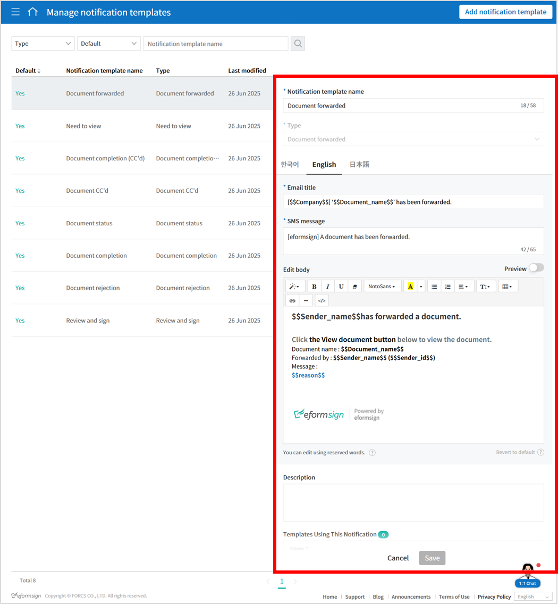
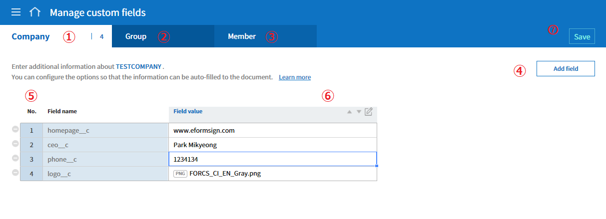
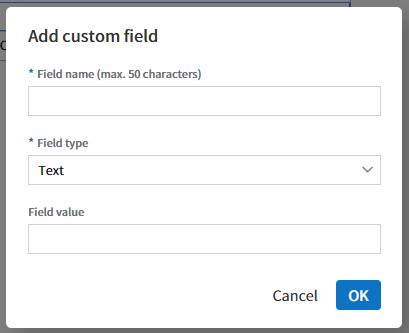

.. _Custumization:

========================
Customization
========================

---------------------------------------------
Manage Custom Fields
---------------------------------------------

You can add and edit fields for companies, groups, and members in the **Manage company > Manage custom fields** menu.

.. tip::

   By using custom fields, you can set frequently used companies, groups, and member information (e.g., company phone number, address,
   company representative name, etc.) to be added automatically in documents. After adding custom fields in the **Manage custom fields** menu, go to the **Template settings > Field settings** menu to set which information is to be entered automatically in the documents.

|image1|

**① Manage custom fields > Company**
   You can add fields related to the company such as the company representative name, company phone number, stamp and seal, and then set the values.

**② Manage custom fields > Group**
   You can add fields related to groups such as the department name and manager, and then set the values.

**③ Manage custom fields > Member**
   You can add fields related to members such as the job title, email address and phone number, and then set the values.

**④ Add field**
   If you click the **Add field** button, the **Add custom field** pop-up window will be displayed where you can add a new field. Enter the field name, field type (select from text or image), and field value, and then click the **OK** button to add the field to the custom field list.

|image2|

**⑤ Field list**
   The custom field list shows the field names and the field values that you added. You can also delete the fields and edit the field values.

   To delete a field, click the icon (|image3|) located to the left of the field list.

**⑥ Edit field**
   If you select a field to edit and then click the edit icon, the **Edit custom field** pop-up window will be displayed where you can edit the field name, field type, and field value.

   You can also change the field order. Select a field in which you want to change the order, and then click the arrow (|image4|) button.

   |image5|

**⑦ Save**
   After editing the custom field, click the **Save** button to save your changes.

------------------------------------
Notification Template Management
------------------------------------

You can customize the email and SMS notification messages to best suit the needs of your company.

Notification templates can be edited in the **Manage company > Notification template management** menu or in the **Manage templates > Template settings > Notification settings** menu.

Default templates are shown in the **Manage company > Notification template management** menu. You can change the contents of the default templates and add new notification templates.

**Basic template types (select from Mail or SMS)**
-----------------------------------------------------

- Notification for document completion
- Notification for document rejection
- Notification for document status 
- Notification for review and sign

.. tip::

   The header is set with the eformsign logo by default. If you upload your company's logo in the **Manage company > Company profile >**  `Company brand <#brand>`__ tab menu, the logo is applied to the email templates.
   

**How to add a new notification template**
~~~~~~~~~~~~~~~~~~~~~~~~~~~~~~~~~~~~~~~~~~~~~~~~~~~

In addition to the default templates, you can add a new notification template.

1. In the sidebar menu, click the **Manage company > Manage Notification Templates** menu.

2. Click the **Add notification template** button located at the top right corner of the **Notification template management** screen.

3. Select the appropriate **Type**.

   |image6|

4. Enter Email title and SMS message. 
   **SMS message**\ is sent for SMS notification with the URL link which connects to the body. 

5. Write a new notification message.

6. Click the **Save** button to add it as a notification template.

.. |image3| image:: resources/customfield-list-delete.png
.. |image4| image:: resources/customfield-list-order.PNG

.. |image6| image:: resources/notification-template-new.PNG
   :width: 700px
